# Report
<p align="center">
  
</p>

<div align="center">
  <h1>Universidad Peruana de Ciencias Aplicadas</h1>
  <p><strong>Carrera:</strong> Ingeniería de Software</p>
  <p><strong>Ciclo:</strong> 2025 - 2</p>
  <p><strong>Curso:</strong> Diseño de Experimentos de Ingeniería de Software</p>
  <p><strong>Sección: 7500</strong> </p>
  <p><strong>Profesor:</strong> Ivan Robles Fernández</p>
  <p><strong>"Informe de Trabajo Final"</strong></p>
  <p><strong>Startup: Vitalia</strong> </p>
  <p><strong>Producto: Plantita </strong> </p>
</div>

<table align="center">
  <tr>
    <th>Integrantes</th>
    <th>Código</th>
  </tr>
  <tr>
    <td>Andrea Cabanillas Gora</td>
    <td>U202211711</td>
  </tr>
  <tr>
    <td>Irving Allcca Guerrero</td>
    <td>u202213241</td>
  </tr>
  <tr>
    <td>Anderson Gonza Morales</td>
    <td>u202120836</td>
  </tr>
  <tr>
    <td>Hernan Emilio Morales Calderón</td>
    <td>u202216263</td>
  </tr>
  <tr>
  
  
</table>

<p align="center"><b>Septiembre 2025</b></p>


# Registro de versiones

| **Versión** | **Fecha** | **Autor** | **Descripción de modificación** |
|--------------|------------|------------|----------------------------------|
| **TB1** | 21/09/2025 | - Andrea Cabanillas Gora <br> - Irving Allcca Guerrero <br> - Anderson Gonza Morales <br> - Hernan Emilio Morales Calderón | Se realizaron los siguientes puntos: <br> - Capítulo I: Introducción <br> - Capítulo II: Requirements Elicitation & Analysis <br> - Capítulo III: Requirements Specification <br> - Capítulo IV: Product Design <br> - Capítulo V: Product Implementation |
| **TP1** | 07/10/2025 | - Andrea Cabanillas Gora <br> - Irving Allcca Guerrero <br> - Anderson Gonza Morales <br> - Hernan Emilio Morales Calderón | Se añadió el siguiente punto: <br> - Capítulo VI y desarrollo de la aplicación (app) |
| **TB2** | 15/10/2025 | - Andrea Cabanillas Gora <br> - Irving Allcca Guerrero <br> - Anderson Gonza Morales <br> - Hernan Emilio Morales Calderón | Se realizó lo siguiente: <br> - Revisión de estándares éticos, usabilidad y accesibilidad <br> - Ajustes en diagramas y mockups <br> - Validación del repositorio, estructura del proyecto y trazabilidad <br> - Refinamiento del diseño de la arquitectura y casos de uso |
| **TB3** | 28/10/2025 | - Andrea Cabanillas Gora <br> - Irving Allcca Guerrero <br> - Anderson Gonza Morales <br> - Hernan Emilio Morales Calderón | Se completaron los avances: <br> - Evaluación de viabilidad técnica y económica del sistema <br> - Revisión de flujos, modelos, arquitectura y consistencia técnica <br> - Verificación de sostenibilidad, escalabilidad y claridad del diseño <br> - Documentación y control de versiones del proyecto |
| **TB4** | 10/11/2025 | - Andrea Cabanillas Gora <br> - Irving Allcca Guerrero <br> - Anderson Gonza Morales <br> - Hernan Emilio Morales Calderón | Se desarrollaron las siguientes actividades: <br> - Validación final de arquitectura, diagramas y casos de uso <br> - Revisión de la interfaz asegurando accesibilidad, ética y usabilidad <br> - Evaluación del impacto social, global y ambiental de la solución <br> - Ajustes finales en diseño, flujo y documentación del sistema |
| **TF** | 25/11/2025 | - Andrea Cabanillas Gora <br> - Irving Allcca Guerrero <br> - Anderson Gonza Morales <br> - Hernan Emilio Morales Calderón | Se consolidó el producto final: <br> - Ensamblaje completo del documento final <br> - Validación final del funcionamiento de la aplicación <br> - Aseguramiento de calidad, ética y sostenibilidad en toda la solución <br> - Preparación final para entrega y presentación |


# Project Report Collaboration Insights

# Tabla de Contenido


[Registro de Versiones](#registro-de-versiones)

[Student Outcome](#student-outcome)

**Part I: As-Is Software Project**

[Capítulo I: Introducción](#Capítulo-I-Introducción)
  - [1.1. Startup Profile](#11-startup-profile)
    - [1.1.1. Descripción de la Startup](#111-descripción-de-la-startup)
    - [1.1.2. Perfiles de integrantes del equipo](#112-perfiles-de-integrantes-del-equipo)
  - [1.2. Solution Profile](#12-solution-profile)
    - [1.2.1. Antecedentes y problemática](#121-antecedentes-y-problemática)
    - [1.2.2. Lean UX Process](#122-lean-ux-process)
      - [1.2.2.1. Lean UX Problem Statements](#1221-lean-ux-problem-statements)
      - [1.2.2.2. Lean UX Assumptions](#1222-lean-ux-assumptions)
      - [1.2.2.3. Lean UX Hypothesis Statements](#1223-lean-ux-hypothesis-statements)
      - [1.2.2.4. Lean UX Canvas](#1224-lean-ux-canvas)
  - [1.3. Segmentos objetivo](#13-segmentos-objetivo)

[Capítulo II: Requirements Elicitation & Analysis](#Capítulo-II-Requirements-Elicitation--Analysis)
  - [2.1. Competidores](#21-competidores)
    - [2.1.1. Análisis competitivo](#211-análisis-competitivo)
    - [2.1.2. Estrategias y tácticas frente a competidores](#212-estrategias-y-tácticas-frente-a-competidores)
  - [2.2. Entrevistas](#22-entrevistas)
    - [2.2.1. Diseño de entrevistas](#221-diseño-de-entrevistas)
    - [2.2.2. Registro de entrevistas](#222-registro-de-entrevistas)
    - [2.2.3. Análisis de entrevistas](#223-análisis-de-entrevistas)
  - [2.3. Needfinding](#23-needfinding)
    - [2.3.1. ](#231-user-personas)
    - [2.3.2. User Task Matrix](#232-user-task-matrix)
    - [2.3.3. User Journey Mapping](#233-user-journey-mapping)
    - [2.3.4. Empathy Mapping](#234-empathy-mapping)
    - [2.3.5. As-is Scenario Mapping](#235-as-is-scenario-mapping)
  - [2.4 Ubiquitous Language](#24-ubiquitous-language)

[Capítulo III: Requirements Specification](#Capítulo-III-Requirements-Specification)
  - [3.1. To-Be Scenario Mapping](#31-to-be-scenario-mapping)
  - [3.2. User Stories](#32-user-stories)
  - [3.3. Product Backlog](#33-product-backlog)
  - [3.4. Impact Mapping](#34-impact-mapping)

[Capítulo IV: Product Design](#Capítulo-IV-Product-Design)
  - [4.1. Style Guidelines](#41-style-guidelines)
    - [4.1.1. General Style Guidelines](#411-general-style-guidelines)
    - [4.1.2. Web Style Guidelines](#412-web-style-guidelines)
    - [4.1.3. Mobile Style Guidelines](#413-mobile-style-guidelines)
        - [4.1.3.1. iOS Mobile Style Guidelines](#4131-ios-mobile-style-guidelines)
        - [4.1.3.2. Android Mobile Style Guidelines](#4132-android-mobile-style-guidelines)
  - [4.2. Information Architecture](#42-information-architecture)
    - [4.2.1. Organization Systems](#421-organization-systems)
    - [4.2.2. Labeling Systems](#422-labeling-systems)
    - [4.2.3. SEO Tags and Meta Tags](#423-seo-tags-and-meta-tags)
    - [4.2.4. Searching Systems](#424-searching-systems)
    - [4.2.5. Navigation Systems](#425-navigation-systems)
  - [4.3. Landing Page UI Design](#43-landing-page-ui-design)
    - [4.3.1. Landing Page Wireframe](#431-landing-page-wireframe)
    - [4.3.2. Landing Page Mock-up](#432-landing-page-mock-up)
  - [4.4. Mobile Applications UX/UI Design](#44-mobile-applications-uxui-design)
    - [4.4.1. Mobile Applications Wireframes](#441-mobile-applications-wireframes)
    - [4.4.2. Mobile Applications Wireflow Diagrams](#442-mobile-applications-wireflow-diagrams)
    - [4.4.3. Mobile Applications Mock-ups](#443-mobile-applications-mock-ups)
    - [4.4.4. Mobile Applications User Flow Diagrams](#444-mobile-applications-user-flow-diagrams)
  - [4.5. Mobile Applications Prototyping](#45-mobile-applications-prototyping)
    - [4.5.1. Android Mobile Applications Prototyping](#451-android-mobile-applications-prototyping)
    - [4.5.2. iOS Mobile Applications Prototyping](#452-ios-mobile-applications-prototyping)
  - [4.6. Web Applications UX/UI Design](#46-web-applications-uxui-design)
    - [4.6.1. Web Applications Wireframes](#461-web-applications-wireframes)
    - [4.6.2. Web Applications Wireflow Diagrams](#462-web-applications-wireflow-diagrams)
    - [4.6.3. Web Applications Mock-ups](#463-web-applications-mock-ups)
    - [4.6.4. Web Applications User Flow Diagrams](#464-web-applications-user-flow-diagrams)
  - [4.7. Web Applications Prototyping](#47-web-applications-prototyping)
  - [4.8. Domain-Driven Software Architecture](#48-domain-driven-software-architecture)
    - [4.8.1. Software Architecture Context Diagram](#481-software-architecture-context-diagram)
    - [4.8.2. Software Architecture Container Diagrams](#482-software-architecture-container-diagrams)
    - [4.8.3. Software Architecture Components Diagrams](#483-software-architecture-components-diagrams)
  - [4.9. Software Object-Oriented Design](#49-software-object-oriented-design)
    - [4.9.1. Class Diagrams](#491-class-diagrams)
    - [4.9.2. Class Dictionary](#492-class-dictionary)
  - [4.10. Database Design](#410-database-design)
    - [4.10.1. Relational/Non-Relational Database Diagram](#4101-relationalnon-relational-database-diagram)

[Capítulo V: Product Implementation](#Capítulo-V-Product-Implementation)
  - [5.1. Software Configuration Management](#51-software-configuration-management)
    - [5.1.1. Software Development Environment Configuration](#511-software-development-environment-configuration)
    - [5.1.2. Source Code Management](#512-source-code-management)
    - [5.1.3. Source Code Style Guide & Conventions](#513-source-code-style-guide--conventions)
    - [5.1.4. Software Deployment Configuration](#514-software-deployment-configuration)
  - [5.2. Product Implementation & Deployment](#52-product-implementation--deployment)
    - [5.2.1. Sprint Backlogs](#521-sprint-backlogs)
    - [5.2.2. Implemented Landing Page Evidence](#522-implemented-landing-page-evidence)
    - [5.2.3. Implemented Frontend-Web Application Evidence](#523-implemented-frontend-web-application-evidence)
    - [5.2.4. Implemented Native-Mobile Application Evidence](#524-implemented-native-mobile-application-evidence)
    - [5.2.5. Implemented RESTful API and/or Serverless Backend Evidence](#525-implemented-restful-api-andor-serverless-backend-evidence)
    - [5.2.6. RESTful API documentation](#526-restful-api-documentation)
    - [5.2.7. Team Collaboration Insights](#527-team-collaboration-insights)
  - [5.3. Video About-the-Product](#53-video-about-the-product)

**Part II: Verification, Validation & Pipeline**

[Capítulo VI: Product Verification & Validation](#Capítulo-VI-Product-Verification--Validation)
  - [6.1. Testing Suites & Validation](#61-testing-suites--validation)
    - [6.1.1. Core Entities Unit Tests](#611-core-entities-unit-tests)
    - [6.1.2. Core Integration Tests](#612-core-integration-tests)
    - [6.1.3. Core Behavior-Driven Development](#613-core-behavior-driven-development)
    - [6.1.4. Core System Tests](#614-core-system-tests)
  - [6.2. Static testing & Verification](#62-static-testing--verification)
    - [6.2.1. Static Code Analysis](#621-static-code-analysis)
        - [6.2.1.1. Coding standard & Code conventions](#6211-coding-standard--code-conventions)
        - [6.2.1.2. Code Quality & Code Security](#6212-code-quality--code-security)
    - [6.2.2. Reviews](#622-reviews)
  - [6.3. Validation Interviews](#63-validation-interviews)
    - [6.3.1. Diseño de Entrevistas](#631-diseño-de-entrevistas)
    - [6.3.2. Registro de Entrevistas](#632-registro-de-entrevistas)
    - [6.3.3. Evaluaciones según heurísticas](#633-evaluaciones-según-heurísticas)
  - [6.4. Auditoría de Experiencias de Usuario](#64-auditoría-de-experiencias-de-usuario)
    - [6.4.1. Auditoría realizada](#641-auditoría-realizada)
        - [6.4.1.1. Información del grupo auditado](#6411-información-del-grupo-auditado)
        - [6.4.1.2. Cronograma de auditoría realizada](#6412-cronograma-de-auditoría-realizada)
        - [6.4.1.3. Contenido de auditoría realizada](#6413-contenido-de-auditoría-realizada)
    - [6.4.2. Auditoría recibida](#642-auditoría-recibida)
        - [6.4.2.1. Información del grupo auditor](#6421-información-del-grupo-auditor)
        - [6.4.2.2. Cronograma de auditoría recibida](#6422-cronograma-de-auditoría-recibida)
        - [6.4.2.3. Contenido de auditoría recibida](#6423-contenido-de-auditoría-recibida)
        - [6.4.2.4. Resumen de modificaciones para subsanar hallazgos](#6424-resumen-de-modificaciones-para-subsanar-hallazgos)

[Capítulo VII: DevOps Practices](#Capítulo-VII-DevOps-Practices)
  - [7.1. Continuous Integration](#71-continuous-integration)
    - [7.1.1. Tools and Practices](#711-tools-and-practices)
    - [7.1.2. Build & Test Suite Pipeline Components](#712-build--test-suite-pipeline-components)
  - [7.2. Continuous Delivery](#72-continuous-delivery)
    - [7.2.1. Tools and Practices](#721-tools-and-practices)
    - [7.2.2. Stages Deployment Pipeline Components](#722-stages-deployment-pipeline-components)
  - [7.3. Continuous deployment](#73-continuous-deployment)
    - [7.3.1. Tools and Practices](#731-tools-and-practices)
    - [7.3.2. Production Deployment Pipeline Components](#732-production-deployment-pipeline-components)
  - [7.4. Continuous Monitoring](#74-continuous-monitoring)
    - [7.4.1. Tools and Practices](#741-tools-and-practices)
    - [7.4.2. Monitoring Pipeline Components](#742-monitoring-pipeline-components)
    - [7.4.3. Alerting Pipeline Components](#743-alerting-pipeline-components)
    - [7.4.4. Notification Pipeline Components](#744-notification-pipeline-components)

**Part III: Experiment-Driven Lifecycle**

[Capítulo VIII: Experiment-Driven Development](#Capítulo-VIII-Experiment-Driven-Development)
  - [8.1. Experiment Planning](#81-experiment-planning)
    - [8.1.1. As-Is Summary](#811-as-is-summary)
    - [8.1.2. Raw Material: Assumptions, Knowledge Gaps, Ideas, Claims](#812-raw-material-assumptions-knowledge-gaps-ideas-claims)
    - [8.1.3. Experiment-Ready Questions](#813-experiment-ready-questions)
    - [8.1.4. Question Backlog](#814-question-backlog)
    - [8.1.5. Experiment Cards](#815-experiment-cards)
  - [8.2. Experiment Design](#82-experiment-design)
    - [8.2.1. Hypotheses](#821-hypotheses)
    - [8.2.2. Measures](#822-measures)
    - [8.2.3. Conditions](#823-conditions)
    - [8.2.4. Scale Calculations and Decisions](#824-scale-calculations-and-decisions)
    - [8.2.5. Methods Selection](#825-methods-selection)
    - [8.2.6. Data Analytics: Goals, KPIs and Metrics Selection](#826-data-analytics-goals-kpis-and-metrics-selection)
    - [8.2.7. Web and Mobile Tracking Plan](#827-web-and-mobile-tracking-plan)
  - [8.3. Experimentation](#83-experimentation)
    - [8.3.1. To-Be User Stories](#831-to-be-user-stories)
    - [8.3.2. To-Be Product Backlog](#832-to-be-product-backlog)
    - [8.3.3. Pipeline-supported, Experiment-Driven To-Be Software Platform Lifecycle](#833-pipeline-supported-experiment-driven-to-be-software-platform-lifecycle)
        - [8.3.3.1. To-Be Sprint Backlogs](#8331-to-be-sprint-backlogs)
        - [8.3.3.2. Implemented To-Be Landing Page Evidence](#8332-implemented-to-be-landing-page-evidence)
        - [8.3.3.3. Implemented To-Be Frontend-Web Application Evidence](#8333-implemented-to-be-frontend-web-application-evidence)
        - [8.3.3.4. Implemented To-Be Native-Mobile Application Evidence](#8334-implemented-to-be-native-mobile-application-evidence)
        - [8.3.3.5. Implemented To-Be RESTful API and/or Serverless Backend Evidence](#8335-implemented-to-be-restful-api-andor-serverless-backend-evidence)
        - [8.3.3.6. Team Collaboration Insights](#8336-team-collaboration-insights)
  - [8.4. Experiment Aftermath & Analysis](#84-experiment-aftermath--analysis)
    - [8.4.1. Analysis and Interpretation of Results](#841-analysis-and-interpretation-of-results)
    - [8.4.2. Re-scored and Re-prioritized Question Backlog](#842-re-scored-and-re-prioritized-question-backlog)
  - [8.5. Continuous Learning](#85-continuous-learning)
    - [8.5.1. Shareback Session Artifacts: Learning Workflow](#851-shareback-session-artifacts-learning-workflow)
  - [8.6. To-Be Software Platform Pre-launch](#86-to-be-software-platform-pre-launch)
    - [8.6.1. About-the-Product Intro Video](#861-about-the-product-intro-video)

[Conclusiones](#conclusiones)
  - [Conclusiones y Recomendaciones](#conclusiones-y-recomendaciones)
  - [Video About the Team](#video-about-the-team)

[Bibliografía](#bibliografía)

[Anexos](#anexos)

# Student Outcome

**ABET – EAC - Student Outcome 4**

**Criterio:** La capacidad de reconocer responsabilidades éticas y profesionales en situaciones de ingeniería y hacer juicios informados, que deben considerar el impacto de las soluciones de ingeniería en contextos globales, económicos, ambientales y sociales.

| **Criterio específico** | **Acciones realizadas** | **Conclusiones** |
|--------------------------|--------------------------|------------------|
| **4.c.1 Reconoce responsabilidad ética y profesional en situaciones de ingeniería de software** | **Andrea Cabanillas**  <br> **TB1:** Elaboré el diagrama principal del sistema y participé en la validación de requerimientos. <br> **TB2:** Revisé estándares éticos y buenas prácticas para decisiones responsables. <br> **TB3:** Supervisé la trazabilidad y transparencia del repositorio. <br> **TB4:** Validé casos de uso alineados con privacidad y ética. <br> **TP1:** Lideré la redacción técnica asegurando coherencia ética. <br> **TF:** Verifiqué que la documentación final refleje responsabilidad profesional. <br><br> **Irving Allcca Guerrero**  <br> **TB1:** Diseñé wireframes con criterios éticos de accesibilidad. <br> **TB2:** Verifiqué estándares inclusivos en el diseño. <br> **TB3:** Validé consistencia del flujo y claridad visual. <br> **TB4:** Revisé integración visual y funcional según buenas prácticas. <br> **TP1:** Integré backend–frontend con enfoque en seguridad. <br> **TF:** Aseguré ética en la versión final del sistema. <br><br> **Anderson Gonza Morales** <br> **TB1:** Diseñé el diagrama de clases y verifiqué orden del repositorio. <br> **TB2:** Validé buenas prácticas estructurales del código. <br> **TB3:** Revisé consistencia técnica de modelos. <br> **TB4:** Aseguré cumplimiento ético en la estructura del sistema. <br> **TP1:** Mejoré diagramas y verifiqué el flujo del trabajo. <br> **TF:** Revisé documentación final garantizando responsabilidad profesional. <br><br> **Hernan Morales Calderón** <br> **TB1:** Implementé mockups garantizando ética de diseño. <br> **TB2:** Validé accesibilidad e inclusión visual. <br> **TB3:** Ajusté elementos visuales bajo estándares éticos. <br> **TB4:** Revisé interacciones transparentes para el usuario. <br> **TP:** Desarrollé diagramas C4 y colaboré en la documentación ética. <br> **TF:** Validé la arquitectura final cumpliendo principios profesionales. | **TB1:** La comunicación, transparencia y liderazgo compartido fortalecieron la responsabilidad ética del equipo. <br><br> **TB3:** El control de versiones y la trazabilidad permitieron mantener orden, claridad y profesionalismo en todas las entregas. <br><br> **TB4:** Las validaciones finales aseguraron que los flujos, interfaces y decisiones técnicas cumplieran criterios éticos y profesionales. <br><br> **TP:** La documentación y desarrollo técnico evidenciaron compromiso con la ética, la calidad y la rigurosidad profesional. <br><br> **TF:** El proyecto culminó con un entregable sólido, ético y bien fundamentado técnicamente. |
| **4.c.2 Emite juicios informados considerando el impacto de las soluciones de ingeniería de software en contextos globales, económicos, ambientales y sociales** | **Andrea Cabanillas**  <br> **TB1:** Analicé la problemática y necesidades de los usuarios. <br> **TB2:** Evalué impacto social y ambiental de la solución. <br> **TB3:** Analicé viabilidad económica y sostenibilidad del sistema. <br> **TB4:** Validé decisiones arquitectónicas considerando eficiencia e impacto ambiental. <br> **TP1:** Supervisé documentación técnica y checklist de cierre. <br> **TF:** Analicé impacto global y sostenibilidad del sistema. <br><br> **Irving Allcca Guerrero**  <br> **TB1:** Analicé necesidades y funcionalidades claves. <br> **TB2:** Evalué accesibilidad e inclusión social del diseño. <br> **TB3:** Revisé eficiencia del diseño para diversos contextos económicos. <br> **TB4:** Ajusté prototipo considerando impacto global y accesibilidad. <br> **TP1:** Validé experiencia de usuario y su impacto social. <br> **TF:** Evalué impacto del prototipo final en términos de sostenibilidad. <br><br> **Anderson Gonza Morales**  <br> **TB1:** Analicé la problemática y documenté recolección de datos. <br> **TB2:** Evalué impacto social y perfiles de usuario. <br> **TB3:** Verifiqué sostenibilidad técnica y relaciones del sistema. <br> **TB4:** Mejoré diagramas evaluando impacto global. <br> **TP1:** Validé el flujo de usuarios según adopción tecnológica. <br> **TF:** Revisé impacto del sistema en su versión final. <br><br> **Hernan Morales Calderón** <br> **TB1:** Analicé necesidades y propuse mejoras accesibles. <br> **TB2:** Evalué impacto social de cada elemento visual. <br> **TB3:** Ajusté diseño pensando en diversidad cultural y económica. <br> **TB4:** Optimicé interfaz priorizando sostenibilidad. <br> **TP:** Desarrollé diagramas C4 resaltando escalabilidad. <br> **TF:** Revisé impacto final del sistema en diferentes contextos. | **TB1:** El equipo logró comprender necesidades reales y formular soluciones con conciencia social y ambiental. <br><br> **TB3:** Se evaluó la viabilidad económica, el costo técnico y la sostenibilidad, permitiendo decisiones más responsables e informadas. <br><br> **TB4:** Las revisiones finales aseguraron que la arquitectura, diseño y funcionalidades generen bajo impacto ambiental y alta accesibilidad global. <br><br> **TP:** Se analizó el impacto del sistema en escenarios reales, priorizando eficiencia, sostenibilidad y responsabilidad social. <br><br> **TF:** El proyecto final refleja decisiones informadas, sostenibles y adecuadas a contextos diversos. |


### 1.1.2. Perfiles de integrantes del equipo

<table>
  <tr></tr>
    <th>
      
    </th>
    <td valign="top">
      <p><b>Andrea Cabanillas</b></p>
      <p>
       Ingeniería de Software – u202211711<br><br> Soy estudiante de ingieneria de software y me gusta trabajar en grupo
      </p>
    </td>
  </tr>
  <tr>
    <td valign="top">
      <p>
    </td>
  </tr>
    <tr>
    <th>
      
    </th>
    <td valign="top">
      <p><b>Irving Allcca Guerrero</b></p>
      <p> Ingeniería de Software – U20213241<br><br>Soy estudiante de Ingeniería de Software de mi carrera en la UPC y tengo 20 años. Soy una persona empática e intuitiva. Me gusta desarrollar los proyectos de manera secuencial y eficiente. En equipo, me esfuerzo por colaborar. Tengo experiencia en programación con C ++, c#, Python, así como en el diseño web con html, CSS y JavaScript.
      </p>
    </td>
  </tr>
  <tr>
    <td valign="top">
      <p>
    </td>
  </tr>
    <tr>
    <th>
      
    </th>
    <td valign="top">
      <p><b>Anderson Gonza Morales</b></p>
      <p> Ingeniería de Software – U202120836<br><br>Soy estudiante de Ingeniería de Software en la UPC, soy muy curioso y entusiasta.
      </p>
    </td>
  </tr>
  <tr>
    <td valign="top">
      <p>
    </td>
  </tr>
    <tr>
    <th>
      
    </th>
    <td valign="top">
      <p><b>Hernan Morales Calderón</b></p>
      <p> Ingeniería de Software – u202216263<br><br>Soy estudiante de Ingeniería de Software en la UPC, cursando el séptimo ciclo. Me apasiona el desarrollo web y me especializo en frontend y backend, con sólidos conocimientos en PHP y Python. 
      </p>
    </td>
  </tr>
  <tr>
    <td valign="top">
      <p>
    </td>
  </tr>
<tr>
  </tr>

  
| **Integrante** | **Descripción** |
|----------------|-----------------|
| **Andrea Cabanillas** | Estudiante de Ingeniería de Software con interés en el trabajo colaborativo y en el desarrollo de soluciones digitales. Destaca por su compromiso, capacidad de organización y disposición para contribuir al logro de los objetivos del equipo. |
| **Irving Allcca Guerrero** | Estudiante de Ingeniería de Software (UPC) con habilidades en programación (C++, C#, Python) y diseño web (HTML, CSS, JavaScript). Se caracteriza por su empatía, intuición y enfoque en el trabajo estructurado y eficiente, aportando tanto en la parte técnica como en la colaboración grupal. |
| **Anderson Gonza Morales** | Estudiante de Ingeniería de Software (UPC) con conocimientos en python, java, SQL y mainframe. Se caracteriza por ser una muy curioso, entusiasta, empatico y adaptable. |
| **Hernan Morales Calderón** | Estudiante de Ingeniería de Software (UPC) con sólidos conocimientos en PHP, Laravel, Angular, Vue.js, Python y C#. Destaca por su dominio en diseño y desarrollo web, integrando tanto la parte visual como la funcional para crear soluciones modernas y eficientes. |


<div id='1.'><h1>1. Capítulo I: Introducción.</h1></div>


## **1.1 Startup Profile**

<div id='1.1.1.'><h3> 1.1.1. Descripción de la Startup.</h3></div>
<div align="justify">
Vitalia es una startup conformada por estudiantes de Ingeniería de Software de la Universidad Peruana de Ciencias Aplicadas, comprometidos con atender las necesidades de quienes gestionan cultivos de mediana y gran escala.
Entendemos que muchos cuidadores y productores enfrentan desafíos importantes debido a la falta de información clara, herramientas eficientes y soluciones tecnológicas que permitan monitorear de manera adecuada el estado de sus cultivos. Problemas como la gestión del riego, el control de humedad, el diagnóstico de enfermedades y el seguimiento del crecimiento pueden volverse complejos cuando el área de cultivo es extensa.
Gracias a esta realidad, identificamos una oportunidad para desarrollar una solución innovadora que ayude a optimizar los procesos, mejorar la productividad y garantizar el bienestar de las plantas a gran escala. A través de tecnología inteligente, sensores especializados y una plataforma intuitiva, buscamos transformar la experiencia de manejo y monitoreo de cultivos, ofreciendo información precisa y acciones preventivas en tiempo real.
  
Tambien habra Servicios adicionales de pago como:

Asesorías técnicas especializadas

Mantenimiento de sistemas hidropónicos

Instalación de equipos

Actualizaciones o upgrades de hardware

</div>


## **1.2 Solution Profile**

En esta sección se describe el problema que el proyecto tiene como objetivo resolver. Se detalla el enunciado del problema, descripción de los puntos importantes a resolver y considerar de la solución, objetivos, restricción y aplicación del Lean UX Process describiendo el cómo se resolverá el problema mediante el uso de modelo de negocio

### **1.2.1 Antecedentes y problemática.**

<h5><b>Antecedentes:</b></h5>
<div align="justify">
El mundo de la hidroponía presenta actualmente desafíos que requieren soluciones creativas y eficientes. Uno de los principales retos radica en la creciente adopción de sistemas hidropónicos para cultivos de mayor escala, impulsada por la búsqueda de métodos más sostenibles, productivos y controlados. Esta tendencia exige comprender mejor las necesidades específicas de cada tipo de cultivo y adaptarse a condiciones altamente variables, desde el manejo de nutrientes hasta el control del pH y la calidad del agua.

Además, quienes gestionan cultivos hidropónicos se enfrentan a la constante necesidad de monitorear y optimizar el crecimiento de sus plantas, garantizando que los sistemas funcionen correctamente y que los factores ambientales se mantengan estables. A esto se suma la importancia de prevenir y detectar tempranamente plagas y enfermedades, que pueden propagarse rápidamente en instalaciones de gran escala.

---

### **Problemática (5Ws y 2Hs)**


##### WHAT/QUÉ 
  
En este proyecto, el problema central que abordamos es la dificultad que enfrentan las personas al cuidar las plantas , especialmente aquellas que recién comienzan. Esta dificultad se manifiesta en la falta de información clara, el desconocimiento de las necesidades específicas de cada cultivo y la gestión ineficiente de los recursos necesarios para su cuidado, lo que puede llevar a la frustración y al abandono de esta actividad. 

##### WHERE/DÓNDE 
  
Este problema se da en granjas o cualquier lugar donde las personas intentan cultivar y cuidar plantas, especialmente principiantes, pueden enfrentar estas dificultades. 

##### WHY/POR QUÉ 

Este problema surge porque cada vez más personas quieren cuidar sus plantas, pero no siempre saben cómo cuidarlas correctamente. Esto puede deberse a la falta de información clara y accesible, o a que las necesidades de cada planta son diferentes y pueden ser difíciles de entender al principio. Además, a veces no contamos con el tiempo o los recursos necesarios para darles a nuestras plantas la atención que requieren 

##### WHEN/CUANDO

Este problema se manifiesta desde el momento en que decidimos traer una planta . Al inicio, no estamos seguros de cómo cuidarla y pueden surgir dificultades. También ocurre cuando las plantas experimentan cambios en su entorno, como trasplantes o cambios de estación, y no sabemos cómo adaptarnos a sus nuevas necesidades.

##### WHO/QUIÉN

Personas interesadas en el mundo de las plantas con poco conocimiento acerca del cuidado adecuado.

##### HOW/CÓMO

Las personas podrán acceder a nuestra aplicación a través de sus teléfonos móviles o computadoras. Encontrarán información clara y fácil de entender sobre el cuidado de plantas, consejos, recordatorios de riego y fertilización, e incluso la posibilidad de identificar plantas y problemas comunes.

##### HOW MUCH/CUÁNTO

“El nivel de dificultad para cuidar una planta depende de factores como humedad, iluminación, riego y control de plagas. Las exigencias pueden variar según las condiciones del hogar y las tendencias del cuidador.” (Infobae, 2024)

El problema de no saber cómo cuidar correctamente las plantas se manifiesta en la cantidad de plantas que mueren o se enferman en hogares y espacios de cultivo. Esto puede significar una pérdida económica, pero también una frustración emocional para quienes intentan mantenerlas con vida. A menudo, las personas gastan dinero en plantas y suministros sin obtener los resultados deseados, lo que lleva a un ciclo de compra y pérdida.


### **1.2.2 Lean UX Process.**

#### **1.2.2.1 Lean UX Problem Statements.**

Vitalia se sitúa en la intersección del cuidado de plantas, enfocándose específicamente en el nicho de los aficionados a la jardinería que buscan soluciones prácticas. Este segmento combina el deseo de tener plantas saludables con la necesidad de información clara y herramientas de monitoreo.

**Aficionados a la jardinería:** Cuidadores novatos que luchan por optimizar el cuidado de sus plantas debido a la falta de herramientas y conocimientos.


---

#### **1.2.2.2 Lean UX Assumptions.**

**Features**
- Herramientas de monitorización del crecimiento de plantas: Sensores para recopilar datos sobre condiciones ambientales, humedad del suelo, y salud de los cultivos.
- Plataforma integrada de gestión: Suite de herramientas que abarca la planificación de cultivos, gestión de la mano de obra, programación de riego, y funcionalidades de análisis de datos para identificar áreas de mejora y optimizar la eficiencia operativa en todas las etapas de crecimiento de las plantas.

**Business Outcomes**

* **Mejora de la eficiencia operativa:** Reducción de los tiempos de inactividad y los costos asociados con la gestión de cuidado y la resolución de problemas mediante la automatización y la aplicación de datos en tiempo real para la toma de decisiones.

* **Aumento de la rentabilidad:** Reducción de las pérdidas debido a enfermedades que no son detectadas, mejora de la productividad y la calidad de las plantas, lo que puede traducirse en mayores márgenes de beneficio para los cuidadores.

* **Reducción de riesgos y cumplimiento normativo:** Mayor capacidad para responder rápidamente a problemas emergentes, como brotes de enfermedades o eventos climáticos extremos, minimizando el impacto en la producción y la distribución.

**Users**

Los usuarios son personas interesadas en el cuidado de plantas.

**User Outcomes & Benefits**

* **Aficionados al jardín:** Personas que empezaron a cultivar plantas y están aprendiendo a cuidarlos.

**User assumptions**

**¿Quién es el usuario?**
El usuario es típicamente un aficionado a la jardinería busca mejorar la eficiencia y calidad de sus plantas.

* **¿Dónde encaja nuestro producto en sus trabajos o vidas?**
Nuestra aplicación encaja perfectamente en su día a día al facilitar el cuidado de sus plantas, desde entender sus necesidades básicas hasta identificar problemas y recibir consejos personalizados, optimizando así su experiencia como amantes de las plantas.

* **¿Qué problema resuelve nuestro producto?*
Nuestro producto resuelve problemas como dificultad para monitorear el crecimiento de cultivos, mejorando la eficiencia operativa y mejorar de la calidad de la plantas

* **¿Cuándo y cómo es usado nuestro producto?**
Nuestro producto es utilizado a lo largo de todo el ciclo de vida de las plantas, desde su plantación y crecimiento, a través de una plataforma digital accesible desde dispositivos móviles o computadoras.

* **¿Qué características son importantes?**
Las características de seguimiento de la cadena de suministro en tiempo real, gestión automatizada de las necesidades de la plantas, herramientas de monitorización de cultivos y análisis de datos para la toma de decisiones informadas.

* **¿Cómo debería verse y comportarse nuestro producto?**
Nuestro producto debe ser una interfaz intuitiva y fácil de usar, con visualizaciones claras de datos y esto de las plantas. Debería ser confiable, escalable y adaptable a las necesidades específicas de cada usuario.

**Business Assumptions**
1. Creemos que nuestros clientes necesitan una solución que les permita gestionar eficientemente el cuidado de las plantas, mejorando la eficiencia y la calidad.
2. Estas necesidades pueden ser satisfechas por una plataforma digital que integre sensores. Estos sensores proporcionarían información sobre el clima, la humedad, el monitoreo de cultivos y el análisis de datos. Esto proporcionaría herramientas poderosas para la toma de decisiones informadas.
3. El valor #1 que mi cliente quiere de mi servicio es la mejora en la eficiencia y la calidad de sus plantas, lo que les permite maximizar los rendimientos.
4. El cliente obtiene beneficios al tener un mejor manejo de sus plantas ya que se detectara el estado del clima y plagas y el propio sistema sabrán cómo tratarlas.
5. Voy a adquirir la mayoría de mis clientes a través de campañas de marketing y redes sociales.
6. Haré dinero a través de modelos de suscripción mensual por el acceso a mejor información de nuestra plataforma.
7. Mi competencia principal en el mercado son otras soluciones de cuidado de plantas, tanto tradicionales como digitales.
8. Los venceremos debido a la simplicidad y facilidad de uso de nuestra plataforma, así como a su capacidad para ofrecer una solución integral y altamente personalizable que se adapte a las necesidades específicas de cada cliente.
9. El mayor riesgo es que los clientes no adopten nuestra solución debido a la resistencia al cambio o a la falta de conocimiento tecnológico.
10. Resolveremos esto a través de demostraciones y pruebas gratuitas de nuestra plataforma, y proporcionando un sólido soporte al cliente para garantizar una implementación exitosa y una experiencia positiva del usuario.

---

#### **1.2.2.3 Lean UX Hypothesis Statements.**

**Hipótesis 1:**
**Creemos que** al implementar un sistema que muestre las condiciones en las que se encuentran las plantas optimizará su cuidado y permitirá tomar medidas preventivas. **Sabremos que** hemos tenido éxito cuando se detecten problemas significativos que afecten a la planta y se pueda brindar un mejor cuidado.

**Hipótesis 2:**
**Creemos que** el uso de sensores en el sistema brindará información sobre las condiciones de las plantas. **Sabremos que** hemos tenido éxito cuando observemos un aumento significativo en la salud y vitalidad general de las plantas, obteniendo un mayor crecimiento.

#### **1.2.2.4 Lean UX Canvas.**

<table style="width: 100%; border-collapse: collapse; font-family: Arial, sans-serif;">
  <tbody>
    <tr>
      <td colspan="2" rowspan="2" style="font-weight: bold; text-align: justify;">Lean UX Canvas</td>
      <td style="text-align: right; font-weight: bold;">Fecha: 21/09/2025</td>
    </tr>
    <tr>
      <td style="text-align: right; font-weight: bold;">Iteración 1</td>
    </tr>
    <tr>
      <td style="text-align: justify;"><strong>1. Problema de negocios:</strong><br>Los usuarios enfrentan dificultades para mantener sus plantas saludables y prósperas debido a la falta de información y herramientas adecuadas para su cuidado.</td>
      <td rowspan="2" style="text-align: justify;"><strong>5. Ideas de solución:</strong><br>Desarrollar una aplicación que informe sobre el estado de la planta y proporcione recomendaciones o acciones personalizadas para el cuidado óptimo de la planta.</td>
      <td rowspan="2" style="text-align: justify;"><strong>2. Resultados comerciales:</strong><br>- Mejora en la calidad de crecimiento de las plantas.<br>- Reducción de pérdidas.<br>- Aumento de la satisfacción del cliente.</td>
    </tr>
    <tr>
      <td style="text-align: justify;"><strong>3. Usuarios y Clientes:</strong><br>Personas interesadas en el cuidado de plantas.</td>
    </tr>
    <tr>
      <td rowspan="2" style="text-align: justify;"><strong>6. Hipótesis</strong><br>- Creemos que al implementar un sistema que muestre las condiciones en las que se encuentran las plantas optimizará su cuidado y permitirá tomar medidas preventivas. Sabremos que hemos tenido éxito cuando se detecten problemas significativos que afecten a la planta y se pueda brindar un mejor cuidado.<br><br>- Creemos que el esta app brindará información sobre las condiciones de las plantas. Sabremos que hemos tenido éxito cuando observemos un aumento significativo en la salud y vitalidad general de las plantas, obteniendo un mayor crecimiento.</td>
      <td rowspan="2" style="text-align: justify;"><strong>7. ¿Qué es lo más importante que debemos aprender primero?</strong><br>Lo más importante que debemos aprender primero es comprender a fondo las necesidades y desafíos específicos de nuestros usuarios y clientes. Esto incluye entender sus procesos operativos, identificar los problemas más urgentes que enfrentan en el cuidado de plantas y conocer sus expectativas y prioridades en cuanto a soluciones tecnológicas.</td>
      <td style="text-align: justify;"><strong>4. Beneficios del usuario:</strong><br>- Optimización del cuidado de las plantas a través del monitoreo y recomendaciones personalizadas.<br>- Disminución de la pérdida de plantas debido a un cuidado inadecuado y a la falta de información.</td>
    </tr>
    <tr>
      <td style="text-align: justify;"><strong>8. ¿Cuál es la menor cantidad de trabajo que necesitamos para resolver las dudas y para hacer lo siguiente más importante?</strong><br>La menor cantidad de trabajo que necesitamos para resolver las dudas y avanzar en lo siguiente es realizar una investigación inicial centrada en los usuarios y clientes potenciales. Esto puede incluir entrevistas, encuestas u otros métodos de investigación para comprender mejor sus necesidades, desafíos y expectativas.<br><br>Una vez que tengamos una comprensión sólida de las necesidades de los usuarios, podemos priorizar el desarrollo de características y funcionalidades de nuestra solución que aborden directamente esos problemas identificados. Esto nos permitirá enfocarnos en lo más importante para nuestros usuarios y garantizar que nuestra solución sea relevante y útil desde el principio.</td>
    </tr>
  </tbody>
</table>

<div id='1.3.'><h2> 1.3. Segmentos objetivo.</h2></div>

<div align="justify">
  
* **Aficionados a la jardinería que buscan mejorar sus habilidades y el éxito de sus plantas (granjero y consultante) ** Los usuarios utilizarán "Plantita" para acceder a información personalizada, herramientas de monitoreo y una comunidad de apoyo, con el fin de mejorar la salud y el crecimiento de sus plantas.

* **Características Demográficas:** Personas entre 20 y 50 años, que viven en áreas urbanas y suburbanas, con un interés en la jardinería y el cuidado de plantas pero con conocimientos limitados.  Posiblemente con un nivel educativo medio o superior y con acceso a dispositivos móviles y tecnología.

* **Características Geográficas:** Inicialmente enfocado en áreas urbanas y suburbanas en Perú, con potencial de expansión a otras regiones y países con un interés similar en la jardinería doméstica y el cuidado de plantas.
</div>

<div id='2.'><h1><b>2. CAPÍTULO II: Needfinding</b></h1>

<div id='2.1.'><h2> 2.1. Competidores</h2>

<div align="justify">
En el mercado al que buscamos ofrecer nuestra solución, identificamos diversos competidores que presentan propuestas similares orientadas a la gestión agrícola. A continuación, se detalla un resumen de sus soluciones de software:
  
* **Agrobit** : Es una plataforma enfocada en la gestión agrícola y ganadera, orientada a grandes empresas. Su objetivo es promover formas sustentables y rentables de producción de alimentos. Entre sus funcionalidades destacan el control de actividades, el seguimiento del desarrollo de cultivos, el monitoreo predictivo, la trazabilidad y el cálculo de la huella de carbono.
  
* **Efemis** : Esta herramienta digital para la gestión agrícola utiliza imágenes satelitales, pronósticos meteorológicos y sensores para optimizar las operaciones y reducir costos. Desarrollada por Hispatec, Efemis es su solución principal dentro de una serie de herramientas especializadas para diferentes áreas del sector agrícola.
  
* **Agri** : Es un software diseñado específicamente para el sector agrícola, que facilita la gestión de órdenes de aplicación, labores agrícolas, cosechas y sistemas de riego, entre otros. Para utilizar sus servicios, es necesario realizar una evaluación del terreno agrícola, la cual determina su clasificación por tamaño. En base a ello, se establece una tarifa mensual que varía entre 320 dólares para pequeñas empresas y 715 dólares para grandes explotaciones agrícolas.
</div>

<div id='2.1.1.'><h3> 2.1.1. Análisis Competitivo</h3>
**¿Por qué realizar este análisis?**
<p>Es fundamental realizar este análisis para comprender las áreas en las que se enfocan nuestros competidores directos. Esto nos permitirá identificar oportunidades para diferenciarnos y destacar en aspectos que capten el interés de nuestro público objetivo.</p>

| Nombre | Plantita                         | Agrobit                                    | Afemis | Agri |
|--------|------------------------------|------------------------------------------------|--------|------|
| Overview   | Software de gestión agrícola centrado en la capacitación del usuario que puede adaptarse a sus necesidades | Software enfocado en la gestión de procesos agrícolas y ganaderos con ayuda de herramientas de alta gama | Software de hispatec que gestiona procesos agrícolas utilizando herramientas de alta gama | Agri es una solución de software latina que permite gestionar campos de cultivo de forma centralizada |
| Ventaja Competitiva   | Esta aplicación está entrada en el usuario y su adaptabilidad, brindándole a este una opción cómoda al alcance de sus manos | Uso de herramientas de alta gama como imágenes satelitales que son una alternativa que brinda una seguridad total | Este software modular, está diseñado para que el usuario quiera añadir más funcionalidades que se acoplen a sus necesidades | Empresa latinoamericana con la que los usuarios se sienten más cómodos |
| Mercado Objetivo   | Nos enfocaremos en los pequeños y grandes agricultores que no hayan implementado tecnología para aligerar su carga laboral | Se centra en el sector ganadero y agrícola que buscan implementar una solución tecnológica con herramientas de gama alta, como imágenes satelitales | Sector agrícola grande que busca una solución de software para agilizar procesos | Está centrado en pequeñas, medianas y grandes empresas agrícolas |
| Estrategias de Marketing   | Nos acercaremos a los empresarios agrícolas que no confían en la tecnología para que podamos demostrar la eficacia de esta | Se promociona mediante publicidad como google ads, correos,etc. | Utiliza publicidad y estrategias de marketing | Agri usa sus redes sociales como Instagram y Linkedin para poder difundir sus propuestas de valor |
| Productos y Servicios   | Ofrecemos una amplia variedad de recursos para el usuario como, control de inventario, predicciones del clima, sensores de humedad y temperatura, monitoreo de ventas, predicciones para las cosechas y un control de ventas | Cuenta con dos versiones, la ECO, una versión dedicada para una producción netamente sostenible, y la Enterprise, dedicada a conseguir el mayor beneficio económico para la empresa. Ambas opciones cuentan con planes de pago diferentes que varían, dando a las grandes empresas agrícolas más ventajas que a las más pequeñas | Efemis cuenta con un control de costos de operaciones, monitoreos de cumplimiento de normativas,gestión de actividades, tratamientos y riegos,entre otras | Agri cuenta con controles de faenas, compras y bodegaje, control de riego, entre otros. |
| Precios y Costos   | Planeamos cobrar una comisión por venta de productos, los usuarios podrán acceder a nuestros servicios sin mayor problema | Agrobit cuenta con planes mensuales que rondan los 250 hasta los 1100 dólares | Cuenta con planes principalmente desde los 300 hasta los 900 euros mensuales | Cuenta con 3 planes para los pequeños, medianos y grandes agricultores cuyos costos van desde los 320 hasta los 750 dólares |
| Fortalezas   | Contamos con un software ágil, que se verá sujetos a cambios rápidos para acomodarnos a las necesidades del usuario | Cuenta con una reputación y una clientela fiel | Es parte de una corporación grande que facilita acceso a herramientas de gama alta | Cuenta con clientes en todo latinoamérica sobre todo Chile y Perú |
| Debilidades   | Sujeta a pruebas | Está cerrada a sus clientes habituales y los clientes nuevos no parecen interesados en su producto  |No cuenta con una gran cantidad de clientes, las reseñas no son buenas y está siendo dejada de lado|No parece querer modernizarse más allá de su estado actual|
| Oportunidades   | Muchas de las gestiones agrícolas en nuestro país son deficientes y gran parte de las cosechas son desperdiciadas, por ello el Perú es un país ideal para implementar agroges  | Dadas sus herramientas presenta una estabilidad que les permitiría desarrollarse más  |Cuenta con acceso a herramientas de gama alta que permiten el recopilado de información detallada para beneficio del usuario|Cuenta con el apoyo de clientes de más de un país por ello pueden expandirse por todo latinoamérica|
| Amenazas   | La implementación de herramientas costosas por parte de la competencia | Dado que el proceso de cotización es lento, muchos clientes prefieren buscar otras opciones | Sus ventas se han visto reducidas |La creciente tecnología y el uso de la inteligencia artificial puede desplazar a muchas soluciones de software|


</table>

<div id='2.1.2.'><h3> 2.1.2. Estrategias y tácticas frente a competidores </h3>

<p>Nos dirigiremos al segmento del sector agrícola que aún no ha incorporado tecnología, ofreciendo una solución accesible y fácil de usar. El objetivo es que incluso quienes no tienen experiencia con herramientas tecnológicas puedan utilizarlas de forma eficaz para optimizar sus recursos.<br>
<br>
<b>Estrategia general:</b> Diferenciación<br>
<br>
<b>Objetivo principal:</b> Sobresalir frente a la competencia mediante un producto que responda a necesidades específicas de nuestros segmentos de mercado.<br>
<br>
<b>Estrategias clave:</b><br>
<ul>
  <li><strong>Enfoque en el usuario</strong>: Priorizar mejoras basadas en las necesidades y sugerencias de los clientes.</li>
  <li><strong>Gestión de usuarios</strong>: La aplicación contará con una red interconectada que permitirá al usuario administrador supervisar y gestionar a los trabajadores bajo su responsabilidad.</li>
</ul>
</p>
 
<div id='2.2.'><h2> 2.2. Entrevistas</h2>
<div id='2.2.1.'><h3> 2.2.1. Diseño de entrevistas</h3>
<p><strong>Segmento 1:</strong> Aficionados al jardín</p>
<p><strong>Pregunta general:</strong></p>
<ul>
  <li>¿Cuál es tu nombre, cuántos años tienes y a qué te dedicas?</li>
  <li>¿Cómo consideras que es tu personalidad (extrovertido, introvertido, racional, idealista, etc.)?</li>
</ul>

<p><strong>Preguntas:</strong></p>
<ul>
  <li>¿Qué te motivó a empezar a cuidar plantas?</li>
  <li>¿Cuáles son los mayores desafíos que enfrentas al cuidar tus plantas?</li>
  <li>¿Tienes algún problema recurrente con tus plantas? ¿Cómo saber cuándo regarlas o qué cantidad de luz necesitan?</li>
  <li>¿Actualmente usas alguna aplicación o herramienta para ayudarte a cuidar tus plantas? Si es asi, ¿Cuál es?</li>
  <li>¿Qué información te gustaría tener más clara o accesible sobre el cuidado de tus plantas?</li>
  <li>¿Te gustaría recibir notificaciones o recordatorios sobre el cuidado de tus plantas (por ejemplo, cuándo regarlas, cuándo podarlas)?</li>
  <li>Si pudieras tener una herramienta que te ayude a monitorear el estado de tus plantas, como la húmedad del suelo o la luz que reciben, ¿Te interesaría?</li>
  <li>¿Qué tan importante es para ti recibir consejos prácticos y fáciles de seguir sobre el cuidado de tus plantas?</li>
  <li>¿Qué funcionalidades te gustaría que tuviera una aplicación para facilitar el cuidado de tus plantas?</li>
  <li>¿Te sentirías cómodo utilizando sensores para monitorear las condiciones de tus plantas (por ejemplo, húmedad, temperatura, luz)?</li>
  <li>¿Qué tipo de apoyo o comunidad te gustaría encontrar dentro de una app para jardineros novatos?</li>
  <li>¿Qué tan importante es para ti que la aplicación sea fácil de usar y no requiera mucho tiempo para aprender?</li>
</ul>

<div id='2.2.2.'><h3> 2.2.2. Registro de entrevistas</h3>

### Segmento objetivo - Aficionados al jardín

### Entrevista 1: https://drive.google.com/drive/folders/1arzj1cuxP2zOGmwTyb6uJWcws5smoYzF

Resumen:
El usuario considera que brindar información más precisa dentro de una aplicación para el cuidado de plantas es fundamental, especialmente cuando se desea diagnosticar problemas en los cultivos. Señala que sería útil contar con un espacio o foro donde pueda subir fotos de sus plantas para recibir ayuda de otras personas con experiencia o que hayan pasado por situaciones similares. Además, destaca la importancia de que la aplicación sea intuitiva y visual, ya que colocar correctamente fotos complicadas puede resultar difícil. Finalmente, menciona que GeneXus es importante porque ayudaría en el desarrollo de interfaces y funcionalidades que faciliten la subida y análisis de imágenes dentro de la app.


### Entrevista 2: https://drive.google.com/file/d/16OVTi9H70ehYXRoyM_GTTVy8oNJL0jzy/view

Resumen:
El usuario valora la posibilidad de intercambiar información con otros cuidadores de plantas, especialmente sobre especies que desconoce, ya que esto facilitaría mejorar su mantenimiento. Considera muy importante que la aplicación sea fácil de usar y rápida de entender debido a sus múltiples actividades diarias. Si la app fuera complicada o demandara demasiado tiempo, sería probable que dejara de usarla, lo que afectaría tanto su rutina como el cuidado de sus plantas. En resumen, necesita una aplicación intuitiva, simple y eficiente para poder atender sus plantas sin afectar sus responsabilidades diarias.

### Entrevista 3:  https://drive.google.com/file/d/1RLscu2elUKj7_NeBrimIg_4-KcbLe1ZL/view

Resumen:
El usuario desea que, desde el momento en que ingrese a la aplicación, pueda recibir sugerencias personalizadas basadas en los problemas específicos que reporte sobre sus plantas. Considera valioso que los usuarios puedan publicar los problemas más comunes que enfrentan, de manera que la aplicación pueda ofrecer recomendaciones adaptadas a cada caso. Además, destaca que la facilidad de uso es extremadamente importante, ya que al adoptar una nueva herramienta es esencial que esta sea intuitiva y permita una rápida adaptación.


### Entrevista 4: https://drive.google.com/file/d/1-8lUwNBGObQRfc3t49UJP0Raytdzk0gt/view

Resumen:
El usuario desea recordatorios automáticos y reconocimiento de plantas mediante fotos. Busca recibir recomendaciones inmediatas sobre el estado de sus plantas. Considera esencial que la aplicación sea simple y rápida de usar debido al limitado tiempo que puede dedicarle diariamente.


### Entrevista 5: https://drive.google.com/drive/folders/1arzj1cuxP2zOGmwTyb6uJWcws5smoYzF

Resumen:
El usuario busca recursos educativos rápidos (tips o videos) y herramientas que ayuden a identificar problemas visuales como hojas amarillas. Requiere que la app sea directa, sin pasos innecesarios, ya que perder tiempo navegando lo desmotiva.

---

### Entrevista 6: https://drive.google.com/file/d/1p1jtIo70UHPi4DimgM6_pxEGnAHaXJ3S/view

Resumen:

El usuario quiere una aplicación que le brinde sugerencias personalizadas desde que ingresa, permitiéndole reportar problemas específicos de sus plantas y recibir recomendaciones claras y útiles. También desea que otros usuarios puedan publicar los problemas más comunes para así intercambiar información y aprender juntos. Para él es fundamental que la aplicación sea muy fácil de usar y que no requiera mucho tiempo para adaptarse, ya que una interfaz complicada lo desmotivaría y podría hacer que deje de utilizarla.


<div id='2.2.3.'><h3> 2.2.3. Análisis de entrevistas</h3>

Resumen general: 

**Segmento Objetivo:** Aficionados al jardín

**Características del segmento:**

* **Objetivas**

**1. Uso de tecnología**

- Norma enfatiza que no ha usaso alguna aplicación que la ayude con sus plantas, pero estaría dispuesta a probar alguna.
- Jorge señala que muchas aplicaciones actuales no están adaptadas para todo el público por la barrera del idioma y lo poco prácticos que son.
- Están dispuestos a usar sensores o aplicaciones que los ayuden al cuidado de plantas, pero con la condición de que sean accesibles, simples y funcionales.

**2. Necesidad de asistencia**

- Norma menciona que su inexperiencia con el cuidado de plantas ha afecta mucho al crecimiento de las mismas.
- Jorge enfrentan dificultades para cuidar adecuadamente sus plantas, especialmente en lo relacionado con el riego, enfermedades y condiciones del suelo o luz.

**3. Interés en aprender**

- Jorge menciona la utilidad de una sección para hacer preguntas y compartir experiencias.
- Norma valoran el aprendizaje continuo, desea el acompañamiento de un experto (como lo es su circulo cercano de amigos y vecinos) o una comunidad.
- Ambos desean una comunidad de usuarios o red de apoyo dentro de una aplicación para resolver dudas y aprender de otros.

* **Subjetivas**

**1. Experiencias**

- Norma se dedica al cuidado de plantas como una forma de aliviar el estrés y mejorar su bienestar personal.
- Jorge, aunque empezó por necesidad económica, ha desarrollado afecto al verla a sus plantas.
- Para los entrevistados, el cuidado vegetal representa algo más que una tarea práctica: es una fuente de satisfacción personal.

**2. Consideraciones**

- Norma ha buscado consejos de amigos, vecinos y cercanos, probando sus comendaciones y esperando que puedan ayudar al crecimiento de sus plantas.
- Jorge buscar ayuda externa para sentirse algo seguro en la toma de decisiones.
- No se consideran expertos y expresan dudas o limitaciones en su conocimiento, especialmente en aspectos como enfermedades, plagas o necesidades específicas de cada planta.

**3. Motivaciones**

- Norma pide una app sencilla que no requiera mucho tiempo de aprendizaje.
- Jorge quiere información clara y sin complicaciones.
- Los entrevistados desean aprender por sí mismos, pero con orientación práctica y comprensible, sin sentirse abrumados.

**Análisis por medio de herramientas estadísticas:**


<div id='2.3.'><h2> 2.3. Needfinding</h2>
<div id='2.3.1.'><h3> 2.3.1. User Personas</h3>

Los user persona que se muestran a continuación, fueron realizados a partir de la información recopilada de la sección de entrevistas. Estos nos ayudarán a describir de forma general nuestro segmento objetivo.
<br>

<b>Aficionados al jardín:</b>
<br>


<div id='2.3.2.'><h3> 2.3.2. User Task Matrix</h3>

| User Task | Frecuencia | Importancia |
|:---|:---|:---|
| Monitorear la humedad del suelo | Alta | Alta |
| Verificar condiciones de luz y temperatura | Alta | Alta |
| Recibir alertas sobre posibles plagas o enfermedades | Media | Alta |
| Consultar recomendaciones personalizadas de cuidado | Alta | Alta |
| Planificar calendario de riego y fertilización | Media | Alta |
| Revisar la evolución y crecimiento de las plantas | Alta | Alta |
| Interactuar con la comunidad de usuarios (foros, tips) | Media | Media |
| Configurar o revisar sensores IoT | Baja | Alta |

<div id='2.3.3.'><h3> 2.3.3. User Journey Mapping</h3>

<br>


<div id='2.3.4.'><h3> 2.3.4. Empathy Maping</h3>
<br>

<br>
<div id='2.3.5.'> <h3> 2.3.5. As-is Scenario Mapping</h3>


<div id='3.'><h1><b>3. Capítulo III: Requirements Specification</b></h1>

<div id='3.1.'><h2>3.1 To-Be Scenario Mapping</h2>

En esta sección se presenta el mapeo de los escenarios, realizando una tabla con la situación a mejorar del segmento objetivo, analizando que pasos se realizarán y cómo se siente.

<p><b>Para el segmento de aficionados a la jardinería que buscan mejorar sus habilidades y el éxito de sus plantas.:</b></p>


<div id='3.2.'><h2>3.2 User Stories</h2>

| Epic ID | Título                             | Descripción                                                                 | Criterios de Aceptación | Relacionado con (Epic ID) |
|--------|-------------------------------------|-----------------------------------------------------------------------------|-------------------------|---------------------------|
| EP01   | Registro y Configuración de Plantas | Como usuario quiero registrar mis plantas y configurarlas en la app para recibir ayuda personalizada sobre su cuidado. | No corresponde          | No corresponde            |
| EP02   | Monitoreo de Condiciones Ambientales| Como usuario quiero monitorear la humedad, temperatura y luz para saber si mi planta está en condiciones óptimas. | No corresponde          | No corresponde            |
| EP03   | Diagnóstico y Prevención de Problemas| Como usuario quiero identificar problemas en mis plantas (hojas, color, plagas) para solucionarlos a tiempo. | No corresponde          | No corresponde            |
| EP04   | Guías y Recomendaciones de Cuidado  | Como usuario quiero acceder a contenido educativo adaptado a mi tipo de planta para aprender a cuidarla mejor. | No corresponde          | No corresponde            |
| EP05   | Recordatorios y Notificaciones      | Como usuario quiero recibir recordatorios para regar o fertilizar mis plantas para no olvidarme de su cuidado. | No corresponde          | No corresponde            |

| User Story ID | Título                             | Descripción                                                                                   | Criterios de Aceptación                                           | Epic Relacionado |
|---------------|-------------------------------------|-----------------------------------------------------------------------------------------------|-------------------------------------------------------------------|------------------|
| US01          | Registro de Planta                 | Como usuario quiero registrar una planta indicando su especie y nombre para seguimiento.      | Buscar especie, asignar nombre, guardar en perfil.                | EP01             |
| US02          | Edición de Datos de Planta          | Como usuario quiero editar los datos de una planta registrada.                               | Modificar datos y actualizar correctamente.                      | EP01             |
| US03          | Integración de Sensor de Humedad    | Como usuario quiero conectar un sensor para saber cuándo regar.                              | Conexión vía Bluetooth/WiFi y ver nivel en tiempo real.            | EP02             |
| US04          | Alertas por Condiciones Críticas    | Como usuario quiero recibir alertas si humedad, luz o temperatura no son adecuadas.           | Notificación y recomendaciones básicas.                          | EP02             |
| US05          | Escaneo de Hojas                    | Como usuario quiero escanear hojas dañadas para diagnóstico.                                 | Subir foto y recibir diagnóstico preliminar.                     | EP03             |
| US06          | Historial de Salud de Planta        | Como usuario quiero ver el historial de problemas y tratamientos.                            | Almacena diagnósticos, permite revisión de fechas y acciones.     | EP03             |
| US07          | Recomendaciones Personalizadas     | Como usuario quiero recibir consejos personalizados.                                         | Generar sugerencias, marcar como leído o hecho.                   | EP04             |
| US08          | Biblioteca de Guías                 | Como usuario quiero consultar guías de jardinería.                                            | Organizadas por tipo, búsqueda por palabra clave.                 | EP04             |
| US09          | Recordatorios de Riego              | Como usuario quiero recibir recordatorios de riego según planta y clima.                      | Notificaciones y posibilidad de posponer o marcar como hecho.     | EP05             |
| US10          | Notificaciones de Fertilización     | Como usuario quiero saber cuándo fertilizar mis plantas.                                      | Notificaciones programadas según fase de crecimiento.             | EP05             |
| US11          | Sugerencias ante Problemas Comunes  | Como usuario quiero recibir sugerencias para plagas y enfermedades comunes.                   | Identificación de problema y soluciones propuestas.               | EP03             |
| US12          | Videos Educativos                   | Como usuario quiero ver videos educativos sobre jardinería.                                  | Clasificación por tema y guardar como favoritos.                  | EP04             |
| US13          | Guardar Plantas Favoritas           | Como usuario quiero guardar especies favoritas.                                               | Añadir a lista personal.                                           | EP04             |
| US14          | Buscar por Tipos de Planta          | Como usuario quiero buscar información por categorías.                                        | Filtrado por tipo de planta.                                       | EP04             |
| US15          | Personalización de Notificaciones   | Como usuario quiero ajustar qué notificaciones recibo.                                        | Activar/desactivar notificaciones, ajustar frecuencia.             | EP05             |
| US16          | Notificaciones por Temporada        | Como usuario quiero recibir tareas según la estación.                                          | Uso de calendario y ubicación.                                     | EP05             |
| US17          | Modo Sin Conexión                   | Como usuario quiero usar la app sin conexión.                                                  | Guarda datos localmente, sincroniza después.                      | EP06             |
| US18          | Modo Oscuro                         | Como usuario quiero activar modo oscuro.                                                       | Activable en ajustes, cambio completo de interfaz.                 | EP06             |
| US19          | Idioma de la App                    | Como usuario quiero elegir el idioma de la app.                                                 | Opción de cambiar idioma.                                          | EP06             |
| US20          | Soporte por Chat                    | Como usuario quiero chatear con soporte si tengo problemas.                                   | Acceso a chat de ayuda, horarios visibles.                        | EP06             |
| US21          | Comparar el Estado entre Plantas    | Como usuario quiero comparar la salud de mis plantas.                                          | Comparar humedad, luz y progreso.                                  | EP02             |
| US22          | Descargar Reportes Mensuales        | Como usuario quiero obtener reportes mensuales de mis plantas.                                 | Generar PDF y opción de compartir.                                 | EP06             |
| US23          | Reconocimiento Automático de Planta | Como usuario quiero identificar plantas con una foto.                                          | IA que muestra nombre, cuidados y origen.                         | EP01             |
| US24          | Progreso con Fotos                  | Como usuario quiero subir fotos para ver el progreso de mis plantas.                           | Agrupar fotos por fecha, generar animaciones.                      | EP03             |
| US25          | Añadir Comentarios por Planta       | Como usuario quiero agregar notas personales a cada planta.                                   | Campo de texto por planta.                                         | EP01             |
| US26          | Recordatorio de Poda                | Como usuario quiero recordatorios de poda.                                                     | Calendario de fechas por especie.                                  | EP05             |
| US27          | Calendario de Actividades           | Como usuario quiero ver calendario con mis tareas.                                             | Visualizar tareas, agregar eventos propios.                        | EP05             |
| US28          | Compatibilidad de Plantas           | Como usuario quiero saber si dos plantas son compatibles.                                      | Comparar necesidades y dar recomendación.                         | EP04             |
| US29          | Modo Vacaciones                     | Como usuario quiero programar cuidados en vacaciones.                                          | Activar modo vacaciones, alertas y cuidados delegados.             | EP06             |
| US30          | Sugerencias de Nuevas Plantas       | Como usuario quiero sugerencias de nuevas plantas según mi historial.                         | Mostrar recomendaciones basadas en cuidados exitosos.              | EP04             |


<div id='3.3.'><h2>3.3 Product Backlog</h2>

<p>Para elaborar nuestro Product Backlog hemos utilizado la secuencia de Fibonacci (1,2,3,5,8). Aplicamos esto con el objetivo de evaluar la complejidad de las tareas.

# Product Backlog

| #Orden | User Story ID | Título                                | Descripción                                                                                                                                                      | Story Points |
|--------|----------------|----------------------------------------|------------------------------------------------------------------------------------------------------------------------------------------------------------------|---------------|
| 1      | EP01           | Registro y Configuración de Plantas   | Como usuario, quiero un sistema que registre y configure las plantas iniciales para comenzar a gestionar su cuidado y estado.                                  | 8             |
| 2      | US01           | Registro de Planta                    | Como usuario, quiero poder registrar nuevas plantas en el sistema para realizar un seguimiento adecuado de su cuidado.                                         | 5             |
| 3      | US23           | Reconocimiento Automático de Planta  | Como usuario, quiero que el sistema identifique automáticamente las plantas mediante fotos para agilizar su registro y seguimiento.                           | 13            |
| 4      | US02           | Edición de Datos de Planta            | Como usuario, quiero editar los datos de las plantas registradas para mantener la información actualizada.                                                     | 3             |
| 5      | US25           | Añadir Comentarios por Planta         | Como usuario, quiero agregar comentarios y notas personales en cada planta para hacer un seguimiento detallado de su cuidado.                                 | 2             |
| 6      | EP02           | Monitoreo de Condiciones Ambientales  | Como usuario, quiero monitorear las condiciones ambientales (humedad, luz, temperatura) de las plantas para asegurarme de que se encuentren en condiciones óptimas. | 8         |
| 7      | US03           | Integración de Sensor de Humedad      | Como usuario, quiero conectar sensores para medir la humedad de las plantas y recibir alertas si se desvían de los valores recomendados.                      | 8             |
| 8      | US04           | Alertas por Condiciones Críticas      | Como usuario, quiero recibir alertas cuando las condiciones ambientales sean críticas para poder tomar acción inmediata.                                       | 5             |
| 9      | US21           | Comparar el Estado entre Plantas      | Como usuario, quiero comparar el estado ambiental entre diferentes plantas para tomar decisiones informadas sobre su cuidado.                                 | 5             |
| 10     | EP03           | Diagnóstico y Prevención de Problemas | Como usuario, quiero que el sistema diagnostique problemas tempranos en las plantas y sugiera acciones preventivas para mantener su salud.                     | 8             |
| 11     | US05           | Escaneo de Hojas                      | Como usuario, quiero escanear las hojas de las plantas para identificar daños o plagas y recibir recomendaciones para su tratamiento.                         | 8             |
| 12     | US11           | Sugerencias ante Problemas Comunes    | Como usuario, quiero recibir sugerencias sobre cómo tratar problemas comunes como plagas o enfermedades en las plantas.                                       | 5             |
| 13     | US06           | Historial de Salud de Planta          | Como usuario, quiero tener un historial de salud para cada planta, con información sobre su evolución, tratamientos y problemas previos.                      | 5             |
| 14     | US24           | Progreso con Fotos                    | Como usuario, quiero seguir el progreso de mis plantas mediante fotos para ver su evolución a lo largo del tiempo.                                             | 5             |
| 15     | EP04           | Guías y Recomendaciones de Cuidado    | Como usuario, quiero acceder a contenido educativo sobre el cuidado de las plantas, adaptado a cada especie, para mejorar su bienestar.                       | 8             |
| 16     | US07           | Recomendaciones Personalizadas        | Como usuario, quiero recibir recomendaciones personalizadas de cuidado para cada planta según sus necesidades específicas.                                    | 5             |
| 17     | US31           | Desarrollo de Landing Page            | Como visitante o potencial usuario, quiero ver una landing page atractiva y funcional del sistema para conocer sus beneficios y registrarme fácilmente.       | 5             |
| 18     | US08           | Biblioteca de Guías                   | Como usuario, quiero una biblioteca con guías categorizadas sobre cuidado de plantas, para acceder fácilmente a la información que necesito.                  | 3             |
| 19     | US12           | Videos Educativos                     | Como usuario, quiero ver videos educativos sobre jardinería y cuidado de plantas para mejorar mis habilidades.                                                 | 3             |
| 20     | US13           | Guardar Plantas Favoritas             | Como usuario, quiero guardar mis plantas favoritas en una lista para poder acceder a ellas fácilmente cuando las necesite.                                    | 2             |
| 21     | US14           | Buscar por Tipos de Planta            | Como usuario, quiero buscar plantas por tipos para encontrar fácilmente las que mejor se adapten a mi espacio o necesidades.                                  | 3             |
| 22     | US28           | Compatibilidad de Plantas             | Como usuario, quiero recibir recomendaciones de plantas compatibles para poder crear un entorno armonioso.                                                    | 5             |
| 23     | US30           | Sugerencias de Nuevas Plantas         | Como usuario, quiero que el sistema me sugiera nuevas plantas basadas en mis preferencias y el historial de plantas que he registrado.                        | 5             |
| 24     | EP05           | Recordatorios y Notificaciones        | Como usuario, quiero recibir recordatorios y notificaciones para cuidar mis plantas de acuerdo a sus necesidades.                                              | 8             |
| 25     | US09           | Recordatorios de Riego                | Como usuario, quiero recibir recordatorios automáticos de riego para asegurarme de que mis plantas siempre reciban la cantidad de agua adecuada.             | 3             |
| 26     | US10           | Notificaciones de Fertilización       | Como usuario, quiero recibir alertas cuando sea el momento adecuado para fertilizar mis plantas.                                                              | 3             |
| 27     | US26           | Recordatorio de Poda                  | Como usuario, quiero recibir recordatorios para realizar tareas de poda a tiempo y mantener mis plantas saludables.                                           | 3             |

<div id='3.4.'><h2>3.4 Impact Mapping</h2>

En esta sección se muestra un gráfico que incluye los business goals del negocio así como tiene un impacto en nuestras user personas.

#### Segmeto de aficionados a la jardinería que buscan mejorar sus habilidades y el éxito de sus plantas:


<br>
<div id='4.'><h1><b>4. Capítulo IV: Solution Software Design</b></h1>

<div id='4.1.'><h2><b>4.1. Style Guidelines</b></h2>

El branding de Llanteros refleja el espíritu innovador y comprometido de una startup tecnológica enfocada en el sector agrícola. Nuestra identidad visual y comunicacional está diseñada para transmitir confianza, eficiencia y conexión con las plantas.

<div id='4.1.1.'><h3><b>4.1.1. General Style Guidelines</b></h3>

A continuación, se mostrará la paleta general de colores para la aplicación, iconos, logo y tipografía que hemos escogido para nuestra aplicación web.


### Paleta de colores:


### Tipografía:
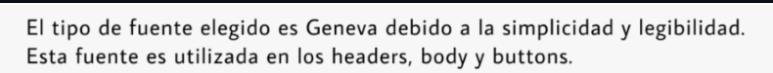

### Tamaño de fuente:

Decidimos que para nuestra aplicación apliquemos una interfaz simple y fácil de entender con colores vivos que capten la atención del usuario.

<div id='4.1.2.'><h3><b>4.1.2. Web Style Guidelines</b></h3>

<b> Principios generales de diseño </b> 

Coherencia visual: Se mantiene una identidad visual homogénea en todos los dispositivos mediante el uso de una paleta de colores, tipografía y componentes UI comunes.

Accesibilidad: Se consideran principios de accesibilidad como contraste suficiente, uso de íconos descriptivos, etiquetas claras y compatibilidad con tecnologías de asistencia.

Simplicidad y claridad: La interfaz evita la sobrecarga cognitiva, mostrando información clave de forma clara y evitando elementos decorativos innecesarios


<b> Estilo Web </b> 

Diseño responsivo: Compatible con múltiples tamaños de pantalla

Menú de navegación horizontal: Incluye secciones como “Inicio”, “Mis Plantas”, “Diagnóstico”, “Calendario” y “Ajustes”.

Componentes interactivos: Botones grandes, con íconos acompañantes.

Tipografía: Se usa una fuente legible y con buen tamaño 

Colores principales: Verde (para acciones positivas), blanco y gris claro (fondos neutros).


<b>  Estilo Mobile </b> 

Navegación inferior: Menú fijo con iconos para acceso rápido a funciones principales.

Notificaciones: Sistema de alertas push para recordatorios de riego, fertilización y monitoreo ambiental.

Modo oscuro: Opcional, con inversión de colores conservando la legibilidad.


<div id='4.1.2.'><h3><b>4.1.2. Web Style Guidelines.</b></h3>

Uno de los aspectos más importantes en el desarrollo web es el usocorrecto del responsive design para que la aplicación se visualiceperfectamente sin importar el tamaño de la pantalla o dispositivo. Por esta razón, se decidió realizar el desarrollo de nuestra solucióntomando en cuenta los siguientes breakpoints para que el responsivedesign se muestre correctamente.

<div id='4.1.3.'><h3><b>4.1.3. Mobile Style Guidelines.</b></h3>

Con respecto a los estándares visuales, se utilizarán los mismoselementos presentados en la sección anterior para lograr uniformidad entodo el uso de nuestra aplicación. Igualmente, las medidas y propiedadespresentadas son escalables, manejables y compatibles con el desarrollode responsive design.

<div id='4.1.3.1'><h3><b>4.1.3.1. iOS Mobile Style Guidelines.</b></h3>


<div id='4.1.3.2'><h3><b>4.1.3.2. Android Mobile Style Guidelines.</b></h3>

<div id='4.2.'><h3><b>4.2. Information Architecture.</b></h3>

<div id='4.2.1'><h3><b>4.2.1. Organization Systems.</b></h3>

En lo referente a la disposición visual del contenido dentro de nuestro proyecto, se implementará el principio de jerarquía visual para estructurar la información en las diferentes secciones de la aplicación. Esto implica que la importancia de cada enunciado se reflejará mediante el tamaño de la fuente: los elementos más relevantes se destacarán con un tamaño de 32px (equivalente a 2rem), mientras que los de menor importancia utilizarán tamaños más reducidos. Asimismo, se adoptará un esquema de organización en forma de matriz ordenada para mostrar las características del producto, lo que permitirá una presentación clara y bien estructurada.

Respecto a la clasificación del contenido, se aplicará una categorización orientada a la audiencia, ya que el proyecto está dirigido a dos tipos de usuarios: clientes y administradores. Cada grupo tendrá acceso a secciones y funcionalidades diseñadas específicamente para sus necesidades. Además, se incorporará una organización cronológica para el manejo de registros, especialmente cuando los usuarios consulten bases de datos con información temporal. En estos casos, se dará prioridad a las entradas más recientes, mostrándolas primero para facilitar su consulta en orden temporal.

<div id='4.2.2'><h3><b>4.2.2. Labeling Systems.</b></h3>

1. Principios de etiquetado

Claridad: Evitar tecnicismos; usar términos comprensibles para el usuario promedio (ej. “Regar” en vez de “Humedad de sustrato”).

Consistencia: Usar el mismo término para la misma función en toda la aplicación (por ejemplo, si se usa “Mi planta” no alternar con “Planta registrada”).

2. Tipos de etiquetas utilizadas

Etiquetas de navegación: “Inicio”, “Mis plantas”, “Diagnóstico”, “Guías”, “Configuración”.

Etiquetas de funciones: “Agregar planta”, “Escanear hoja”, “Ver historial”, “Programar riego”.

Etiquetas informativas: “Humedad actual”, “Nivel de luz”, “Último riego”.

3. Convenciones lingüísticas

Idioma base: Español neutro.

Tono: Amigable y orientado a principiantes.

Verbos en infinitivo o sustantivos simples: “Agregar”, “Escanear”, “Diagnóstico”.

4. Adaptabilidad

Compatibilidad multilingüe (ej. posibilidad de cambiar el idioma de las etiquetas).

Inclusión de íconos junto con etiquetas para facilitar el reconocimiento visual.

5. Justificación de diseño

Las etiquetas están pensadas para usuarios sin conocimientos técnicos de jardinería.

Se realizaron entrevistas para determinar qué términos son más intuitivos (por ejemplo, “hojas dañadas” en vez de “signos de clorosis”).

<div id='4.2.3'><h3><b> </b>4.2.3. SEO Tags and Meta Tags</b></h3>

Para mejorar la visibilidad de la plataforma “Plantita” en motores de búsqueda, se implementaron etiquetas SEO y meta tags clave:

Título (Meta Title): Plantita

Descripción (Meta Description): App para cuidar plantas con sensores, recordatorios y guías personalizadas.

Palabras clave (Meta Keywords): jardinería, plantas, sensores, app de plantas, cuidado de plantas

<div id='4.2.4'><h3><b> 4.2.4. Searching Systems</b></h3>

La plataforma “Plantita” incluye un sistema de búsqueda para facilitar el acceso rápido a información relevante.

Botones de búsqueda: Disponible en la parte superior del menu .

Búsqueda por palabras clave: Permite buscar plantas, guías, problemas comunes, y funciones de la app.

Filtros: Se pueden aplicar filtros por tipo de planta (interior, exterior), nivel de cuidado, o categoría (riego, plagas, luz).

Sugerencias automáticas: A medida que el usuario escribe, se muestran resultados sugerid

<div id='4.2.5'><h3><b> 4.2.5. Navigation Systems.</b></h3>
  
Menú principal: Incluye secciones como funciones, Registro de plantas, Diagnóstico, Guías, Calendario y Ajustes.

Botones de acción rápida: Como “Agregar planta” o “Escanear hoja”, siempre visibles.

Navegación por tarjetas: Cada planta registrada se muestra como una tarjeta con acceso a detalles y acciones.

<div id='4.3'><h3><b> 4.3. Landing Page UI Design.</b></h3>

En esta parte, damos a conocer nuestra propuesta de diseño para la interfaz de usuario (UI) de la página de inicio. Detallamos cómo nuestras elecciones en cuanto al diseño y la estructura de la información se transforman en una experiencia visual atractiva y funcional. La página de inicio representa la primera impresión de nuestro sitio web, por lo que es fundamental que proyecte nuestra identidad de marca, comunique de manera clara los mensajes principales y oriente a los usuarios hacia las acciones que buscamos. Asimismo, resaltaremos los principios de diseño y los enfoques estratégicos que guiaron la creación de una experiencia de usuario eficaz y memorable

<div id='4.3.1'><h3><b> 4.3.1. Landing Page Wireframe</b></h3>

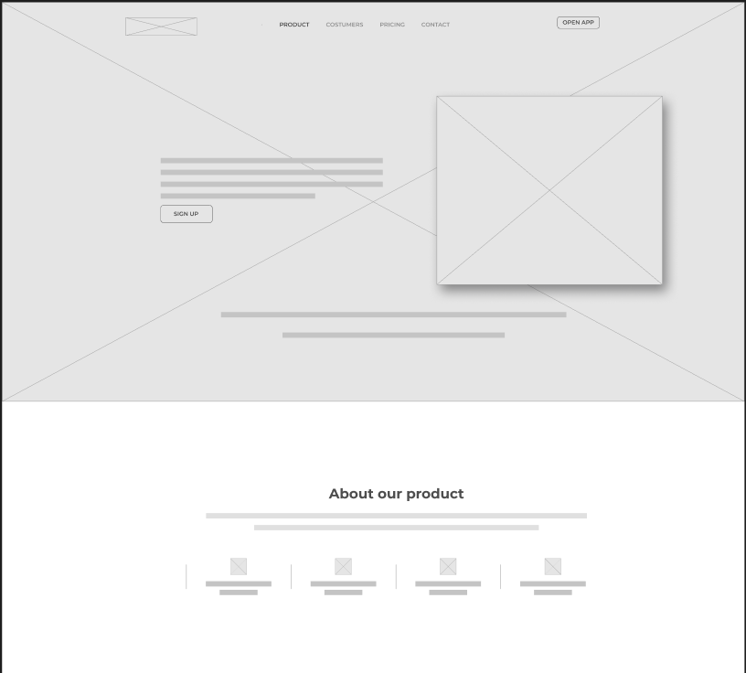
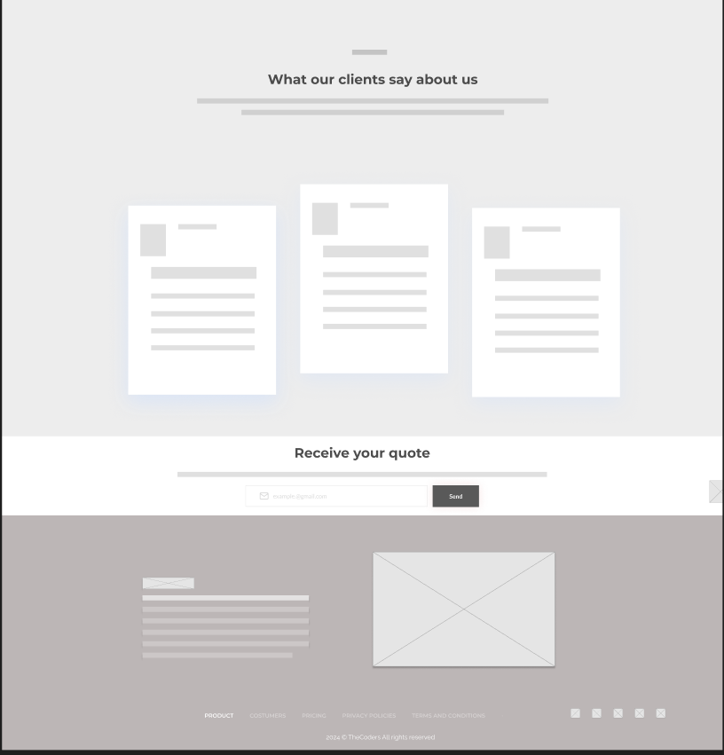


https://www.figma.com/design/43rOS1ADEUThlJXkrNxqQQ/Wireframe-landing-IOT?node-id=0-1&t=YtFMl95aoZ6wJgbk-1

<div id='4.3.2'><h3><b> 4.3.2. Landing Page Mock-up.</b></h3>

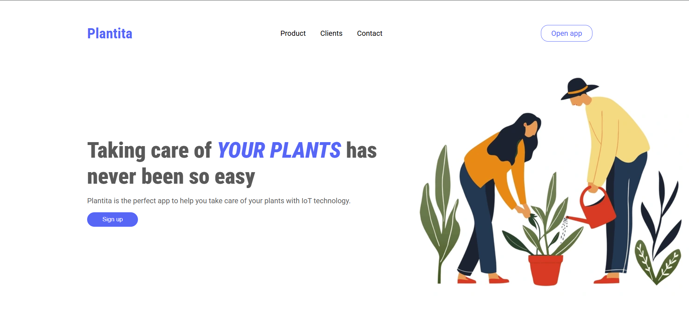
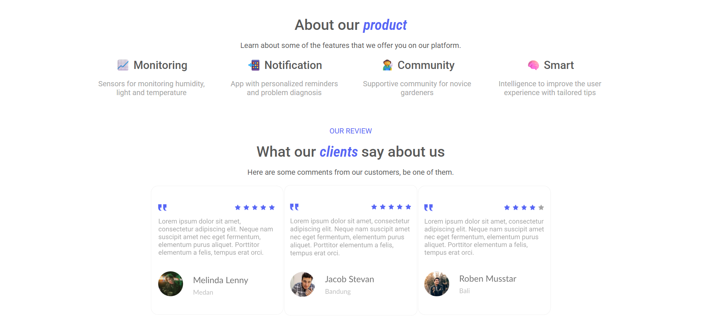
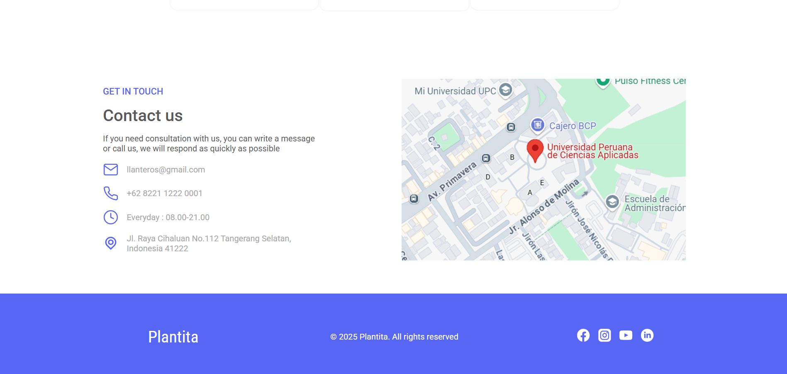


https://www.figma.com/design/43rOS1ADEUThlJXkrNxqQQ/Wireframe-landing-IOT?node-id=0-1&t=YtFMl95aoZ6wJgbk-1

<div id='4.4'><h3><b> 4.4. Mobile Applications UX/UI Design</b></h3>

<div id='5.4.1'><h3><b> 5.4.1. Mobile Applications Wireframes </b></h3>

Menú principal: Incluye secciones como funciones, Registro de plantas, Diagnóstico, Guías, Calendario y Ajustes.

Botones de acción rápida: Como “Agregar planta” o “Escanear hoja”, siempre visibles.

Navegación por tarjetas: Cada planta registrada se muestra como una tarjeta con acceso a detalles y accione

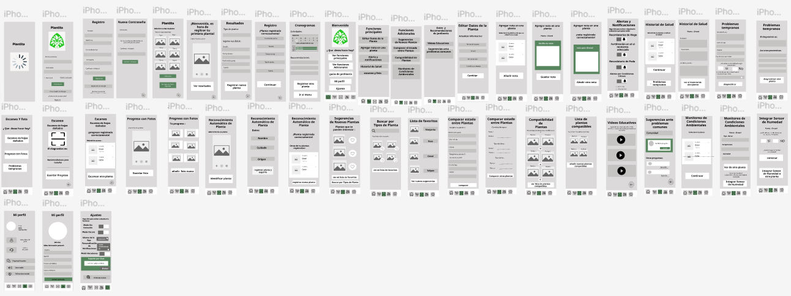

https://www.figma.com/design/h4H5bIZ22u1xrqhN0pGTsY/Untitled?node-id=0-1&p=f&t=iodvAit2xepMAZSM-0

<div id='4.4.2'><h3><b> 4.4.2. Mobile Applications Wireflow Diagrams.</b></h3>


https://www.figma.com/design/9P1UhGBP4ANiAl7ScpFSNj/wireflow?node-id=0-1&t=8fEeshhCXpyFgKIP-1

<div id='4.4.3'><h3><b> 4.4.3. Mobile Applications Mock-ups</b></h3>

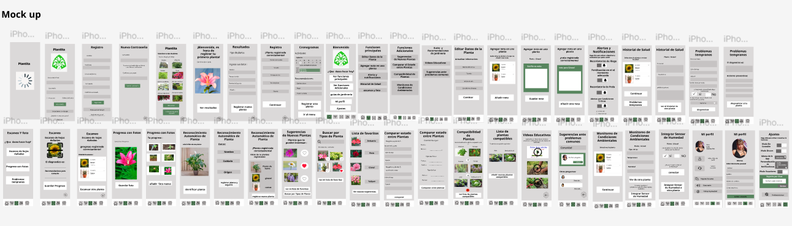

https://www.figma.com/design/h4H5bIZ22u1xrqhN0pGTsY/Untitled?node-id=0-1&p=f&t=TkmWs9iKVckTPA0v-0

<div id='4.4.4'><h3><b>4.4.4. Mobile Applications User Flow Diagrams. </b></h3>


https://www.figma.com/design/9P1UhGBP4ANiAl7ScpFSNj/wireflow?node-id=0-1&t=8fEeshhCXpyFgKIP-1

<div id='4.5'><h3><b> 4.5. Mobile Applications Prototyping. </b></h3>

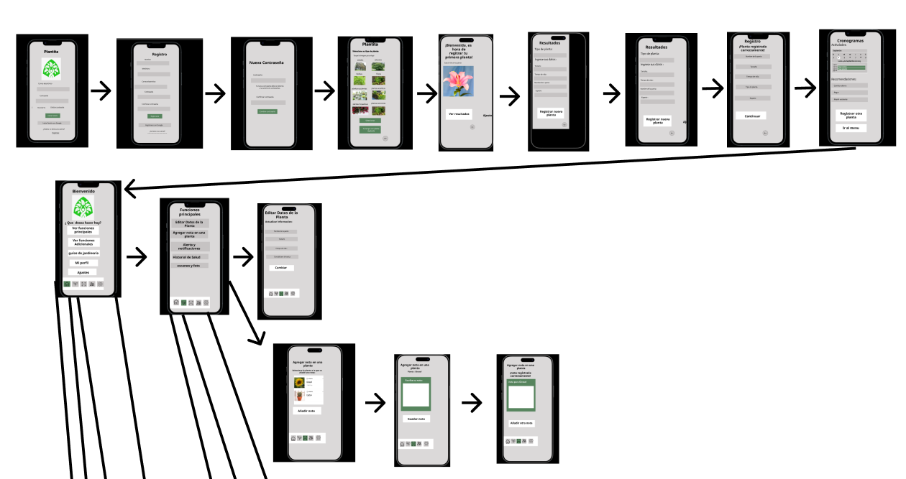
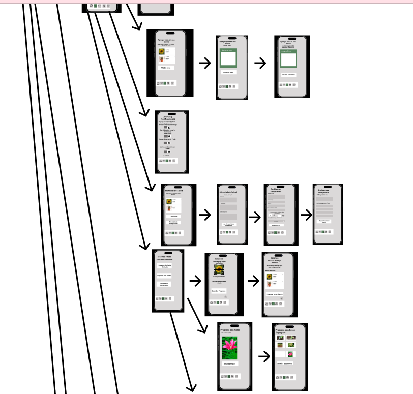
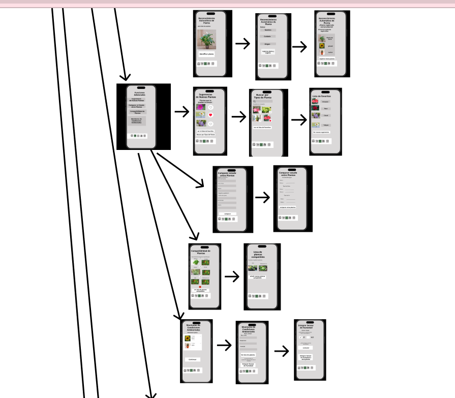
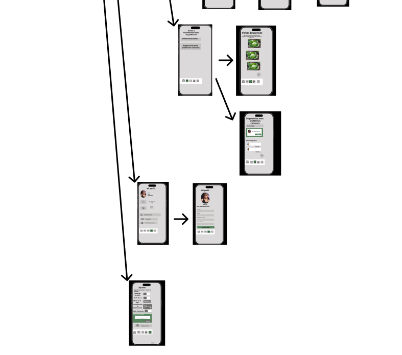

<br>

**Prototipo Completo**

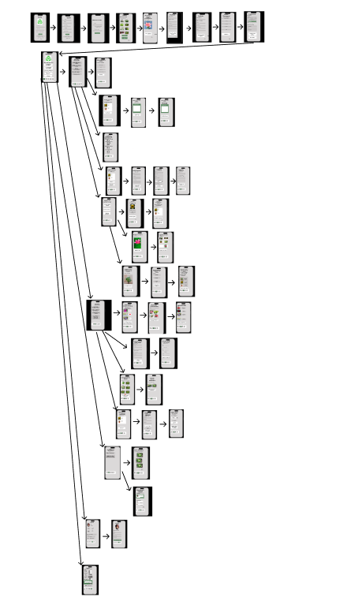


https://www.figma.com/design/FSdzGLrBhZPdrn6TDVch6n/prototipo?node-id=0-1&p=f&t=A680re8dypf6NtQz-0

<div id='4.5.1'><h3><b>4.5.1. Android Mobile Applications Prototyping.</b></h3>
  
<div id='4.5.2'><h3><b>4.5.2. iOS Mobile Applications Prototyping.</b></h3>


## 4.6. Web Applications UX/UI Design.
### 4.6.1. Web Applications Wireframes.
### 4.6.2. Web Applications Wireflow Diagrams.
### 4.6.3. Web Applications Mock-ups.

En esta sección se mostrára los mock-ups de nuestra web application y para ello se enseñará algunos ejemplos

**Home**


**Cronograma**


**Registrar planta**


**Listado de historial de salud**


**Historial de salud de la planta**


**Videos educativos**


**Progreso de a planta**


**Resultado diagnostico**


### 4.6.4. Web Applications User Flow Diagrams.

## 4.7. Web Applications Prototyping.
<div id='4.8'><h3><b>4.8. Domain-Driven Software Architecture.</b></h3>
<div id='4.8.1'><h3><b>4.8.1. Software Architecture Context Diagram.</b></h3>

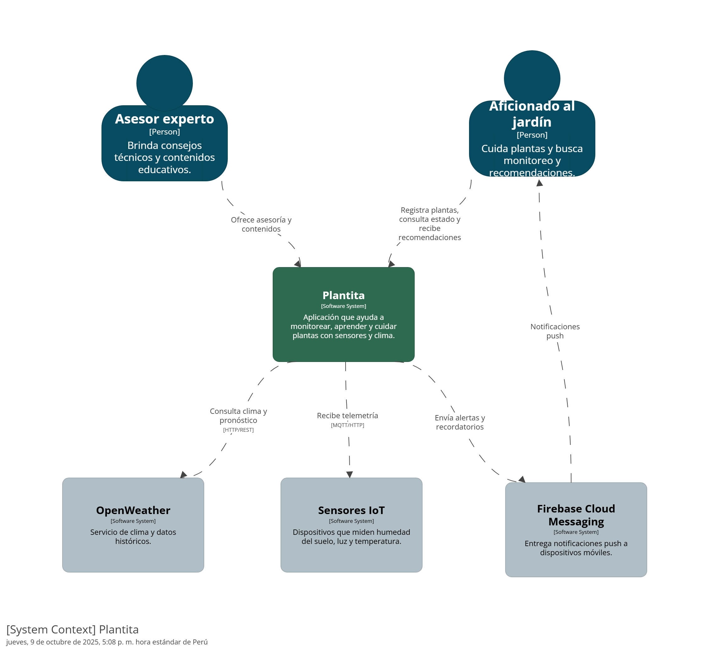

<div id='4.8.2'><h3><b>4.8.2. Software Architecture Container Diagrams.</b></h3>

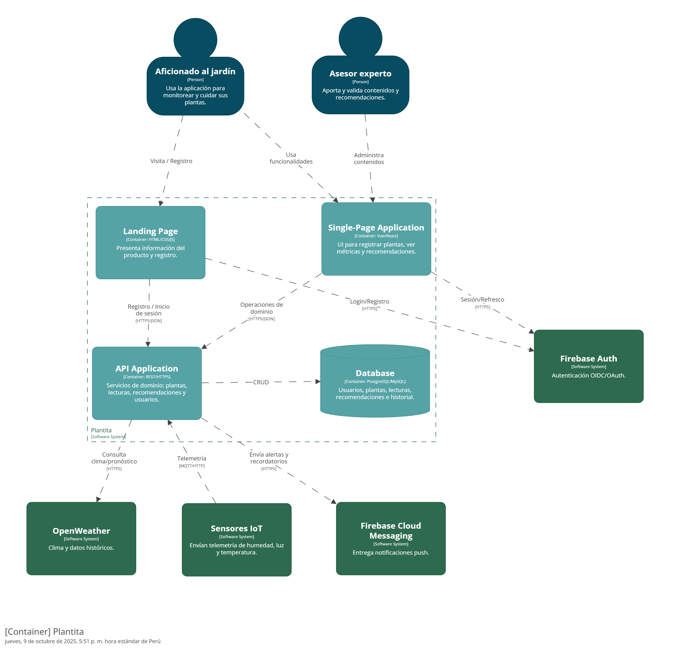

<div id='4.8.3'><h3><b>4.8.3. Software Architecture Components Diagrams.</b></h3>

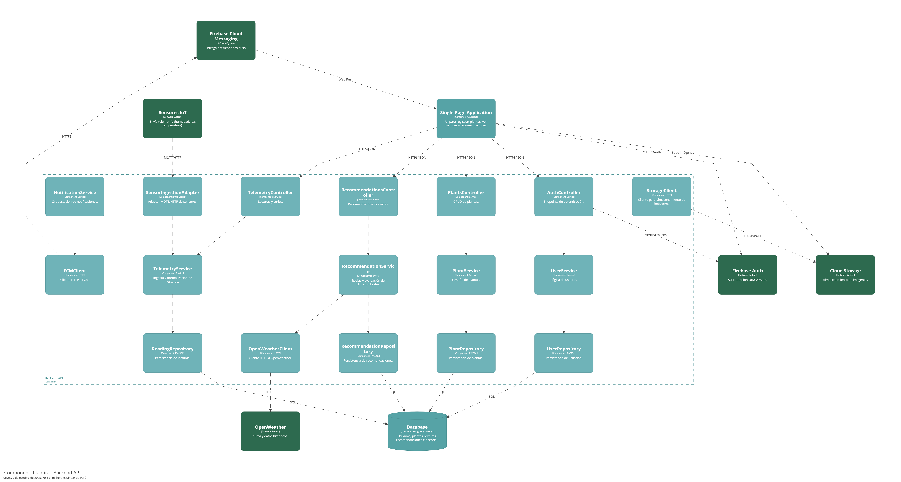

<div id='4.9'><h3><b>4.9. Software Object-Oriented Design</b></h3>
<div id='4.9.1'><h3><b>4.9.1. Class Diagrams.</b></h3>

En esta sección se mostrará el diagrama de clases de nuestra aplicación


<div id='4.9.2'><h3><b>4.9.2. Class Dictionary.</b></h3>

company: Empresas a las que se les brinda el servicio. -ruc: Código de la empresa -password: Contraseña con la que se accede a la cuenta -companyName: El nombre de una compañía -phone: Teléfono de la empresa -mail: Correo de la empresa -createCompany(): Es el método por el cual se crea las nuevas empresas -updateData(): El método por el cual se actualizan los datos de una empresa

crop: Es el cultivo al cual se le monitorea y administra. -cropCode: Código del cultivo -area: Área del terreno -product: Alimento que produce el cultivo -state: El estado en que se encuentra el alimento -cost: Costo de producir ese cultivo -location: El lugar geográfico donde se encuentra el producto -return: El costo aproximado que se espera ganar por el cultivo -updateStatus(): Actualización del estado -addExpense(): Registra un nuevo gasto para el cultivo -decreaseExpenditure(): Elimina un gasto

worker: Personas que trabajan en las diferentes compañías agrícolas. -dni: Documento de identificación de los trabajadores -name: Nombre del trabajador -lastName: Apellido -post: Cargo dentro de la empresa -salary: Dinero que gana el trabajador -phone: Teléfono de la empresa -age: Edad -estado: Dentro de la empresa -hireEmployee(): Contrata a los empleados -vacations(): Para cuando un empleado salga de vacaciones -updateData(): Permite actualizar los datos de los trabajadores

equipment: Conjunto de Workers encargados de un Crop -equipmentCode: Código del equipo -numberMembers: Dice la cantidad de integrantes de un equipo -canagerCode: Indica quién es el líder del equipo -cropCode: El código del cultivo en que trabaja el equipo -createTeam(): Crea un nuevo equipo -addMember(): Agrega a un nuevo miembro -removeMember(): Quitar a un miembro del equipo

<div id='4.10'><h3><b>4.10. Database Design</b></h3>
<div id='4.10.1'><h3><b>4.10.1. Relational/Non-Relational Database Diagram.</b></h3>

En esta sección se mostrará el diagrama de clases de nuestra aplicación
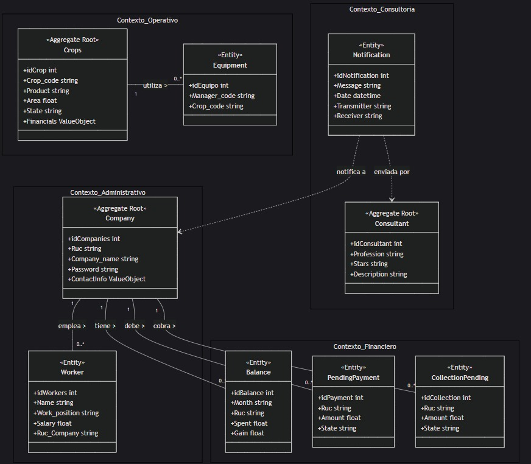

<div id='5.'><h1><b>3. Capítulo V: Requirements Specification</b></h1>
  
<div id='5.1'><h3><b>5.1. Software Configuration Management.</b></h3>

<div id='5.1.1'><h3><b>5.1.1. Software Development Environment Configuration.</b></h3>

Miro : Es una plataforma en línea que permite la colaboración en tiempo real y la creación de tableros virtuales, diagramar procesos, crear mapas mentales, hacer lluvias de ideas, diseñar wireframes y mucho más. Utilizamos esta herramienta para poder realizar mapas de escenarios As-Is y To-Be.

Figma : Figma es una herramienta de diseño colaborativo basada en la nube que permite a los equipos crear, colaborar y prototipar interfaces de usuario de manera eficiente, Nuestro equipo lo utilizo para el desarrollo Wireframes, Mock-ups y Prototypes.

**Structurizi :**ayuda a dibujar y documentar la arquitectura de tu software. Te permite crear diagramas que muestran cómo funcionan tus sistemas y cómo están conectados entre sí. Nosotros lo utilizamos para la creacion de diagramas c4.

IntelliJ IDEA : Como entorno de desarrollo integrado (IDE) para el desarrollo de aplicaciones de software, especialmente para el desarrollo en Java y otras tecnologías JVM como Kotlin y Groovy. También ofrece soporte para una amplia gama de lenguajes de programación y tecnologías, incluidas las relacionadas con el desarrollo web, como HTML, CSS, JavaScript y frameworks como Spring.

Java : Para el desarrollo del backend de la aplicación.

Uxspresia : Para el desarrollo de los impact, empathy mappings y los user persona https://uxpressia.com

MySQL Como sistema de gestión de bases de datos relacionales para almacenar y manejar los datos de la aplicación.

WebStorm : Como entorno de desarrollo integrado (IDE) para el desarrollo de aplicaciones web, especialmente para el trabajo con tecnologías como JavaScript, HTML, CSS y frameworks como React, Angular y Vue.js.

Git y GitHub: Para el control de versiones y la colaboración en el desarrollo del proyecto.

Angular Un framework de desarrollo web para facilitar el front end

HTML (HyperText Markup Language): Para estructurar el contenido de la página web.

CSS (Cascading Style Sheets): Para diseñar y dar estilo al contenido HTML.

JavaScript: Para agregar interactividad y funcionalidad a la página web.

<div id='5.1.2'><h3><b>5.1.2. Source Code Management.</b></h3>

en el marco de este proyecto, se implementarán tres ramas principales: "master", "develop" y "feature branches".

La primera rama se destinará específicamente para la creación de nuevas funcionalidades, clases u otros elementos que añadirán nuevas capacidades al proyecto. Esta rama servirá como un entorno aislado para el desarrollo de estas características, permitiendo un trabajo paralelo sin afectar la estabilidad del código principal.

La rama 2da rama funcionará como el entorno de integración continua, donde se unificarán y probarán los cambios provenientes de las ramas de características. En este entorno, los cambios deben ser integrados y asegurados para garantizar el funcionamiento cohesivo del proyecto.

Finalmente, la ultima rama  será la rama principal y estable del repositorio. Aquí se fusionarán todos los cambios provenientes de la rama "develop", generando así nuevas versiones del sistema. Esta rama representa el estado más actualizado y confiable del proyecto, adecuado para su despliegue en entornos de producción.

Este enfoque de ramificación permite una gestión eficiente del desarrollo, facilitando la colaboración entre equipos y asegurando la estabilidad y calidad del software en cada etapa del ciclo de vida del proyecto.


<div id='5.1.3'><h3><b>5.1.3. Source Code Style Guide & Conventions.</b></h3>

en el proceso de realizar commits, hemos optado por seguir el estándar de "Conventional Commits". Esta práctica nos brinda una estructura definida para nuestros mensajes de commit, lo que facilita la comprensión y la gestión de cambios en el repositorio.

Además, hemos establecido el uso de terminología en inglés para las diferentes declaraciones en nuestras líneas de código en todos los lenguajes de programación empleados en el proyecto. Esta decisión busca promover la coherencia y la claridad en la comunicación del código, facilitando la colaboración entre miembros del equipo y mejorando la legibilidad del código fuente en general.
  
<div id='5.1.4'><h3><b>5.1.4. Software Deployment Configuration.</b></h3>

La aplicación deberá cumplir con las guías de estilo oficiales de cada sistema operativo móvil (iOS y Android) con el fin de asegurar consistencia, usabilidad y accesibilidad en ambas plataformas.

Criterios de aceptación:

En iOS, la aplicación deberá implementar componentes nativos y cumplir con las Apple Human Interface Guidelines (HIG).

En Android, la aplicación deberá implementar componentes de Material Design y cumplir con las recomendaciones de Material You para Android 12 o superior.

La aplicación deberá soportar Light Mode y Dark Mode en ambas plataformas.

La tipografía deberá adaptarse al sistema (San Francisco en iOS, Roboto en Android).

Los íconos deberán estar basados en librerías nativas (SF Symbols para iOS, Material Icons para Android).

La aplicación deberá cumplir con las pautas de accesibilidad de cada plataforma (VoiceOver en iOS y TalkBack en Android).

El diseño deberá ser responsive, adaptándose a distintos tamaños y resoluciones de pantalla (smartphones y tablets).


<div id='5.2'><h3><b>5.2. Product Implementation & Deployment.</b></h3>
  
<div id='5.1.2'><h3><b>5.2.1. Sprint Backlogs.</b></h3>

| Historia de Usuario | Tareas Técnicas                                                                 | Estimación | Estado |
|----------------------|---------------------------------------------------------------------------------|------------|--------|
| **US-01:** Registro con email y contraseña | - Diseñar pantalla de registro en Figma<br>- Implementar formulario de registro (frontend)<br>- Validar campos obligatorios<br>- Implementar API de autenticación (backend)<br>- Conectar frontend con backend<br>- Configurar BD para credenciales<br>- Pruebas de flujo de registro | 5 pts | Pendiente |
| **US-03:** Agregar plantas con nombre, especie y foto | - Diseñar pantalla de “Agregar planta”<br>- Implementar formulario en frontend<br>- Crear servicio API en backend<br>- Configurar BD para datos de plantas<br>- Implementar carga de imágenes (galería/cámara)<br>- Probar flujo de creación y edición | 8 pts | Pendiente |

---


<div id='5.1.2'><h3><b>5.2.2. Implemented Landing Page Evidence</b></h3>


---

## Implemented Features
- Responsive design (desktop, tablet, mobile)  
- Hero section with app tagline and CTA button  
- Features section highlighting plant care benefits  
- Testimonials placeholder for future user feedback  
- Footer with contact information and social media links  

---


<div id='5.1.2'><h3><b>5.2.3. Implemented Frontend-Web Application Evidence</b></h3>

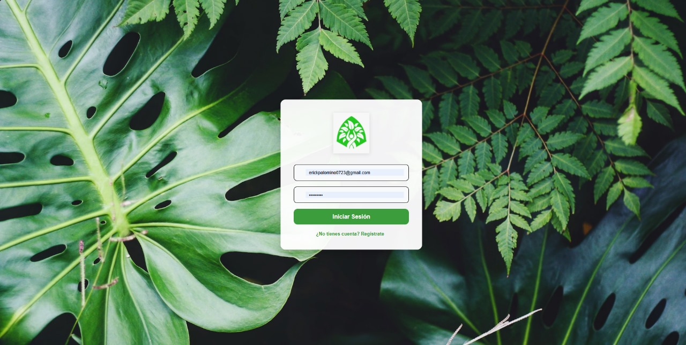


**Link Deploy:** https://plantita-web.netlify.app/

<div id='5.1.2'><h3><b>5.2.4. Implemented Native-Mobile Application Evidence</b></h3>


  
<div id='5.1.2'><h3><b>5.2.5. Implemented RESTful API and/or Serverless Backend Evidence</b></h3>

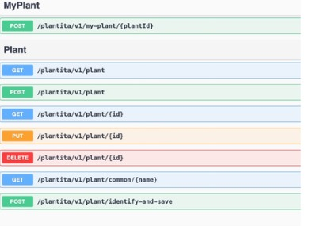

<div id='5.1.2'><h3><b>5.2.6. RESTful API documentation</b></h3>


1 General Information
2  Endpoints
3 Plants
4 Reminders
5 Diagnosis
6 Error Handling
7 Rate Limiting
8 Versioning

<div id='5.1.2'><h3><b>5.2.7. Team Collaboration Insights</b></h3>

| Integrante                      | Participación en el capítulo                                                                 |
|---------------------------------|----------------------------------------------------------------------------------------------|
| Andrea Cabanillas Gora          | Capítulo I: Introducción → 1.1 Startup Profile (Descripción de la Startup y Perfiles del equipo) |
| Anderson Gonza Morales          | Capítulo I: Introducción → 1.2 Solution Profile (Antecedentes, problemática y Lean UX Process)  |
| Joan Fernando Teves Samaniego   | Capítulo II: Requirements Elicitation & Analysis (Competidores y Entrevistas)                  |
| Irving Allcca Guerrero          | Capítulo II: Requirements Elicitation & Analysis (Needfinding y Ubiquitous Language)           |
| Hernan Emilio Morales Calderón  | Capítulo III: Requirements Specification (To-Be Scenario Mapping, User Stories y Backlog)       |


<div id='5.1.2'><h3><b>5.3. Video About-the-Product.</b></h3>

https://drive.google.com/file/d/1zIzRnSw4ZvaEzJqjAD4uf4PQLtNqEbjh/view?usp=sharing

<div id='6'><h3><b>Capítulo VI: Product Verification & Validation</b></h3>
  
<div id='6.1'><h3><b>6.1. Testing Suites & Validation</b></h3>

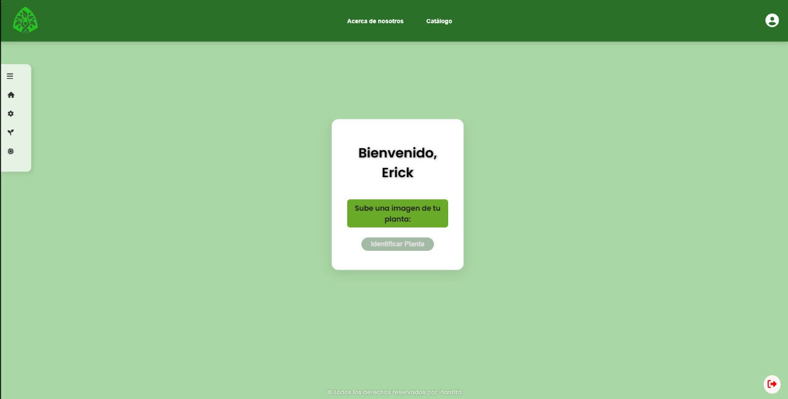
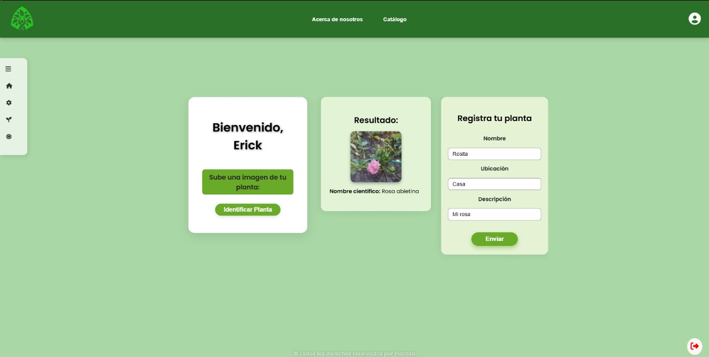
  
### 6.1.1.1. Entidad: AuthUser (Usuario)

#### Casos de Prueba: Creación y Validación de Usuario

**TC-USER-001: Creación de usuario con datos válidos**
- **Precondiciones**: Ninguna
- **Datos de entrada**: 
  - Email: "usuario@ejemplo.com"
  - Password: "Password123!"
  - Name: "Juan"
  - LastName: "Pérez"
  - TimeZone: "America/Lima"
  - PreferredLanguage: "es"
  - Role: "User"
- **Acción**: Instanciar `AuthUser` con constructor completo
- **Resultado esperado**: 
  - Usuario creado con `Id` generado automáticamente (Guid)
  - `Email` = "usuario@ejemplo.com"
  - `PasswordHash` no es igual al password en texto plano
  - `RegisteredAt` = DateTime.UtcNow (aproximadamente)
  - `Role` = "User"
  - `RefreshTokens` es una lista vacía

**TC-USER-002: Validación de email duplicado**
- **Precondiciones**: Usuario con email "test@ejemplo.com" existe en repositorio
- **Datos de entrada**: Email "test@ejemplo.com"
- **Acción**: Llamar `userRepository.ExistsByEmail("test@ejemplo.com")`
- **Resultado esperado**: Retorna `true`

**TC-USER-003: Hash de contraseña con BCrypt**
- **Precondiciones**: Ninguna
- **Datos de entrada**: Password "MiPassword123!"
- **Acción**: Llamar `hashingService.HashPassword("MiPassword123!")`
- **Resultado esperado**: 
  - Retorna string hash diferente al password original
  - Hash comienza con "$2a$" o "$2b$" (formato BCrypt)
  - Longitud del hash >= 60 caracteres

**TC-USER-004: Verificación de contraseña correcta**
- **Precondiciones**: Password hash generado previamente
- **Datos de entrada**: 
  - Password: "MiPassword123!"
  - PasswordHash: hash generado previamente
- **Acción**: Llamar `hashingService.VerifyPassword("MiPassword123!", passwordHash)`
- **Resultado esperado**: Retorna `true`

**TC-USER-005: Verificación de contraseña incorrecta**
- **Precondiciones**: Password hash generado para "Password123!"
- **Datos de entrada**: 
  - Password: "PasswordIncorrecto"
  - PasswordHash: hash de "Password123!"
- **Acción**: Llamar `hashingService.VerifyPassword("PasswordIncorrecto", passwordHash)`
- **Resultado esperado**: Retorna `false`

**TC-USER-006: Actualización de email**
- **Precondiciones**: Usuario existente con email "viejo@ejemplo.com"
- **Datos de entrada**: Nuevo email "nuevo@ejemplo.com"
- **Acción**: Llamar `authUser.updateEmail("nuevo@ejemplo.com")`
- **Resultado esperado**: 
  - `Email` = "nuevo@ejemplo.com"
  - Método retorna la misma instancia de `AuthUser`

**TC-USER-007: Actualización de contraseña con SetPassword**
- **Precondiciones**: Usuario existente
- **Datos de entrada**: Nueva contraseña "NuevaPassword456!"
- **Acción**: Llamar `authUser.SetPassword("NuevaPassword456!")`
- **Resultado esperado**: 
  - `PasswordHash` es diferente al hash anterior
  - `PasswordHash` es un hash BCrypt válido
  - `VerifyPassword("NuevaPassword456!", PasswordHash)` retorna `true`

**TC-USER-008: Asignación de roles**
- **Precondiciones**: Ninguna
- **Datos de entrada**: Role "Admin"
- **Acción**: Crear usuario con `role = "Admin"`
- **Resultado esperado**: 
  - `Role` = "Admin"
  - Usuario puede tener permisos diferentes según el rol

**TC-USER-009: Constructor por defecto**
- **Precondiciones**: Ninguna
- **Datos de entrada**: Ninguna
- **Acción**: Instanciar `new AuthUser()`
- **Resultado esperado**: 
  - Todas las propiedades string son `string.Empty`
  - `RegisteredAt` = DateTime.UtcNow
  - `Role` = "User"


---

### 6.1.1.2. Entidad: Plant (Especie de Planta)

#### Casos de Prueba: Registro y Validación de Especies

**TC-PLANT-001: Creación de especie con datos completos**
- **Precondiciones**: Ninguna
- **Datos de entrada**:
  - ScientificName: "Ficus benjamina"
  - CommonName: "Ficus"
  - Description: "Planta de interior popular..."
  - Watering: "Average"
  - Sunlight: "Full sun, Partial shade"
  - WikiUrl: "https://en.wikipedia.org/wiki/Ficus_benjamina"
  - ImageUrl: "https://example.com/ficus.jpg"
- **Acción**: Crear instancia de `Plant` con todos los atributos
- **Resultado esperado**:
  - `PlantId` es un Guid generado
  - Todos los atributos se asignan correctamente
  - `CreatedAt` = DateTime.UtcNow
  - `MyPlants` es una lista vacía

**TC-PLANT-002: Validación de ScientificName requerido**
- **Precondiciones**: Configuración de Entity Framework con `ScientificName.IsRequired()`
- **Datos de entrada**: `ScientificName = null` o `string.Empty`
- **Acción**: Intentar persistir `Plant` con `ScientificName` vacío
- **Resultado esperado**: 
  - Entity Framework lanza `DbUpdateException` o validación falla
  - Mensaje de error indica que `ScientificName` es requerido

**TC-PLANT-003: Validación de longitud máxima de ScientificName**
- **Precondiciones**: Configuración con `HasMaxLength(255)`
- **Datos de entrada**: `ScientificName` con 256 caracteres
- **Acción**: Intentar persistir `Plant` con `ScientificName` excediendo límite
- **Resultado esperado**: 
  - Validación falla o truncamiento según configuración
  - Error indica límite de 255 caracteres

**TC-PLANT-004: Validación de longitud máxima de Description**
- **Precondiciones**: Configuración con `HasMaxLength(2000)`
- **Datos de entrada**: `Description` con 2001 caracteres
- **Acción**: Intentar persistir `Plant` con `Description` excediendo límite
- **Resultado esperado**: Validación falla o truncamiento

**TC-PLANT-005: Asociación con MyPlant**
- **Precondiciones**: `Plant` y `MyPlant` existentes
- **Datos de entrada**: `MyPlant` con `PlantId` referenciando `Plant.PlantId`
- **Acción**: Agregar `MyPlant` a la colección `Plant.MyPlants`
- **Resultado esperado**: 
  - `Plant.MyPlants` contiene el `MyPlant` agregado
  - Relación bidireccional se mantiene

---

### 6.1.1.3. Entidad: MyPlant (Instancia de Planta del Usuario)

#### Casos de Prueba: Registro y Validación de Plantas del Usuario

**TC-MYPLANT-001: Creación de MyPlant con datos válidos**
- **Precondiciones**: `AuthUser` y `Plant` existentes
- **Datos de entrada**:
  - UserId: Guid de usuario existente
  - PlantId: Guid de especie existente
  - CustomName: "Mi Ficus Favorito"
  - AcquiredAt: DateTime.UtcNow.AddMonths(-2)
  - Location: "Sala de estar"
  - Note: "Regalo de cumpleaños"
  - PhotoUrl: "https://example.com/my-plant.jpg"
  - CurrentStatus: "Healthy"
- **Acción**: Crear instancia de `MyPlant`
- **Resultado esperado**:
  - `MyPlantId` es un Guid generado
  - Todos los atributos se asignan correctamente
  - `HealthLogs`, `CareTasks`, `Alerts`, `IoTDevices` son listas vacías

**TC-MYPLANT-002: Validación de UserId requerido**
- **Precondiciones**: Configuración de Entity Framework
- **Datos de entrada**: `UserId = Guid.Empty`
- **Acción**: Intentar persistir `MyPlant` sin `UserId` válido
- **Resultado esperado**: 
  - Validación falla o Foreign Key constraint error
  - Error indica que `UserId` debe referenciar un usuario existente

**TC-MYPLANT-003: Validación de PlantId requerido**
- **Precondiciones**: Configuración de Entity Framework
- **Datos de entrada**: `PlantId = Guid.Empty`
- **Acción**: Intentar persistir `MyPlant` sin `PlantId` válido
- **Resultado esperado**: 
  - Validación falla o Foreign Key constraint error
  - Error indica que `PlantId` debe referenciar una especie existente

**TC-MYPLANT-004: Asociación con PlantHealthLog**
- **Precondiciones**: `MyPlant` existente
- **Datos de entrada**: `PlantHealthLog` con `MyPlantId` referenciando `MyPlant`
- **Acción**: Agregar `PlantHealthLog` a `MyPlant.HealthLogs`
- **Resultado esperado**: 
  - `MyPlant.HealthLogs` contiene el log agregado
  - Relación se mantiene correctamente

**TC-MYPLANT-005: Asociación con CareTask**
- **Precondiciones**: `MyPlant` existente
- **Datos de entrada**: `CareTask` con `MyPlantId` referenciando `MyPlant`
- **Acción**: Agregar `CareTask` a `MyPlant.CareTasks`
- **Resultado esperado**: 
  - `MyPlant.CareTasks` contiene la tarea agregada
  - Relación se mantiene correctamente

**TC-MYPLANT-006: Asociación con Alert**
- **Precondiciones**: `MyPlant` existente
- **Datos de entrada**: `Alert` con `PlantInstanceId` referenciando `MyPlant`
- **Acción**: Agregar `Alert` a `MyPlant.Alerts`
- **Resultado esperado**: 
  - `MyPlant.Alerts` contiene la alerta agregada
  - `Alert.PlantInstance` referencia a `MyPlant`

---

### 6.1.1.4. Entidad: CareTask (Recordatorio/Tarea de Cuidado)

#### Casos de Prueba: Creación y Actualización de Recordatorios

**TC-CARETASK-001: Creación de CareTask con datos válidos**
- **Precondiciones**: `MyPlant` existente
- **Datos de entrada**:
  - MyPlantId: Guid de `MyPlant` existente
  - TaskType: "Riego"
  - ScheduledFor: DateTime.UtcNow.AddDays(2)
  - Status: "Pending"
  - Notes: "Regar con agua filtrada"
- **Acción**: Crear instancia de `CareTask`
- **Resultado esperado**:
  - `TaskId` es un Guid generado
  - Todos los atributos se asignan correctamente
  - `CompletedAt` es `null`
  - `Status` = "Pending"

**TC-CARETASK-002: Validación de fecha programada en el futuro**
- **Precondiciones**: `MyPlant` existente
- **Datos de entrada**: 
  - ScheduledFor: DateTime.UtcNow.AddDays(-1) (fecha pasada)
- **Acción**: Crear `CareTask` con fecha pasada
- **Resultado esperado**: 
  - Según regla de negocio: puede permitirse o rechazarse
  - Si se rechaza: lanza excepción indicando que la fecha debe ser futura
  - Si se permite: `CareTask` se crea pero puede marcarse como "Overdue"

**TC-CARETASK-003: Validación de TaskType válido**
- **Precondiciones**: `MyPlant` existente
- **Datos de entrada**: 
  - TaskType: "Riego", "Fertilizar", "Poda", "Trasplante"
- **Acción**: Crear `CareTask` con diferentes tipos
- **Resultado esperado**: 
  - Todos los tipos válidos se aceptan
  - Si hay validación de enum: solo tipos permitidos se aceptan

**TC-CARETASK-004: Marcar tarea como completada**
- **Precondiciones**: `CareTask` existente con `Status = "Pending"`
- **Datos de entrada**: `TaskId` de tarea pendiente
- **Acción**: Llamar `MarkCareTaskCompletedAsync(taskId)`
- **Resultado esperado**: 
  - `Status` = "Completed"
  - `CompletedAt` = DateTime.UtcNow (aproximadamente)
  - Cambios se persisten en base de datos

**TC-CARETASK-005: Actualización de notas**
- **Precondiciones**: `CareTask` existente
- **Datos de entrada**: `Notes = "Actualización: usar fertilizante orgánico"`
- **Acción**: Actualizar `CareTask.Notes`
- **Resultado esperado**: 
  - `Notes` se actualiza correctamente
  - Cambios se persisten en base de datos

**TC-CARETASK-006: Generación automática de tareas de cuidado**
- **Precondiciones**: `MyPlant` existente asociado a `Plant` con datos de cuidado
- **Datos de entrada**: `MyPlantId`
- **Acción**: Llamar `GenerateCareTasksAsync(myPlantId)`
- **Resultado esperado**: 
  - Se crean múltiples `CareTask` (al menos "Riego" y "Fertilizar")
  - Cada tarea tiene `ScheduledFor` calculado según tipo
  - Todas las tareas tienen `Status = "Pending"`
  - Tareas se persisten en base de datos

**TC-CARETASK-007: Consulta de tareas pendientes por MyPlant**
- **Precondiciones**: `MyPlant` con múltiples `CareTask` (algunas completadas, algunas pendientes)
- **Datos de entrada**: `MyPlantId`
- **Acción**: Llamar `GetPendingTasksAsync(myPlantId)`
- **Resultado esperado**: 
  - Retorna solo tareas con `Status.ToLower() == "pending"`
  - No incluye tareas completadas
  - Lista ordenada por `ScheduledFor` (ascendente)

---

### 6.1.1.5. Entidad: PlantHealthLog (Historial de Cuidado)

#### Casos de Prueba: Registro Automático de Acciones

**TC-HEALTHLOG-001: Creación de log con datos válidos**
- **Precondiciones**: `MyPlant` existente
- **Datos de entrada**:
  - MyPlantId: Guid de `MyPlant` existente
  - HealthStatus: "Healthy"
  - Notes: "Planta en buen estado, hojas verdes"
  - Source: "Manual"
- **Acción**: Crear instancia de `PlantHealthLog`
- **Resultado esperado**:
  - `HealthLogId` es un Guid generado
  - `Timestamp` = DateTime.UtcNow (aproximadamente)
  - Todos los atributos se asignan correctamente

**TC-HEALTHLOG-002: Registro automático de log al crear MyPlant**
- **Precondiciones**: `AuthUser` y `Plant` existentes
- **Datos de entrada**: Datos para crear `MyPlant`
- **Acción**: Crear `MyPlant` y llamar `LogPlantHealthAsync(myPlantId, log)`
- **Resultado esperado**: 
  - Se crea `PlantHealthLog` asociado a `MyPlant`
  - `Source` = "System" o "Manual" según origen
  - Log se persiste en base de datos

**TC-HEALTHLOG-003: Registro de log con diferentes HealthStatus**
- **Precondiciones**: `MyPlant` existente
- **Datos de entrada**: 
  - HealthStatus: "Healthy", "Warning", "Critical", "Recovering"
- **Acción**: Crear múltiples logs con diferentes estados
- **Resultado esperado**: 
  - Todos los estados se aceptan y persisten
  - Logs se ordenan por `Timestamp` descendente

**TC-HEALTHLOG-004: Consulta de historial por MyPlant**
- **Precondiciones**: `MyPlant` con múltiples `PlantHealthLog`
- **Datos de entrada**: `MyPlantId`
- **Acción**: Consultar `MyPlant.HealthLogs` o repositorio
- **Resultado esperado**: 
  - Retorna todos los logs asociados a `MyPlant`
  - Logs ordenados por `Timestamp` descendente (más recientes primero)
  - Incluye `HealthStatus`, `Notes`, `Source`, `Timestamp`

**TC-HEALTHLOG-005: Registro de log desde fuente IoT**
- **Precondiciones**: `MyPlant` con `IoTDevice` asociado
- **Datos de entrada**: 
  - Source: "IoT"
  - HealthStatus: Calculado desde datos de sensores
- **Acción**: Crear `PlantHealthLog` desde sistema IoT
- **Resultado esperado**: 
  - Log se crea con `Source = "IoT"`
  - `HealthStatus` refleja estado calculado desde sensores
  - Log se asocia correctamente a `MyPlant`

---

### 6.1.1.6. Entidad: Notification (Notificaciones)

#### Casos de Prueba: Sistema de Notificaciones

**TC-NOTIFICATION-001: Creación de notificación con datos válidos**
- **Precondiciones**: `AuthUser` existente
- **Datos de entrada**:
  - UserId: Guid de usuario existente
  - Type: "task"
  - Message: "Tienes una tarea de riego pendiente para 'Mi Ficus'"
  - SentAt: DateTime.UtcNow
- **Acción**: Crear instancia de `Notification`
- **Resultado esperado**:
  - `NotificationId` es un Guid generado
  - `IsRead` = `false` por defecto
  - Todos los atributos se asignan correctamente

**TC-NOTIFICATION-002: Marcar notificación como leída**
- **Precondiciones**: `Notification` existente con `IsRead = false`
- **Datos de entrada**: `NotificationId`
- **Acción**: Actualizar `IsRead = true`
- **Resultado esperado**: 
  - `IsRead` = `true`
  - Cambios se persisten en base de datos

**TC-NOTIFICATION-003: Diferentes tipos de notificaciones**
- **Precondiciones**: `AuthUser` existente
- **Datos de entrada**: 
  - Type: "task", "alert", "forum", "diagnosis"
- **Acción**: Crear notificaciones con diferentes tipos
- **Resultado esperado**: 
  - Todos los tipos se aceptan y persisten
  - Tipo determina comportamiento de UI/UX

**TC-NOTIFICATION-004: Consulta de notificaciones no leídas**
- **Precondiciones**: Usuario con múltiples notificaciones (algunas leídas, algunas no)
- **Datos de entrada**: `UserId`
- **Acción**: Consultar notificaciones con `IsRead = false`
- **Resultado esperado**: 
  - Retorna solo notificaciones no leídas
  - Ordenadas por `SentAt` descendente
  - Incluye `Type`, `Message`, `SentAt`


---

## 6.1.2. Pruebas de Integración Core

### 6.1.2.1. Escenario: Registro de Usuario + Asociación de Planta

**TC-INT-001: Flujo completo de registro y primera planta**
- **Precondiciones**: Base de datos limpia, API disponible
- **Pasos**:
  1. **Registro de usuario**: 
     - POST `/api/auth/sign-up`
     - Body: `{ "email": "nuevo@test.com", "password": "Password123!", "name": "Test", "lastName": "User", "timeZone": "America/Lima", "preferredLanguage": "es" }`
     - **Validar**: Status 200, mensaje de éxito
  2. **Autenticación**:
     - POST `/api/auth/sign-in`
     - Body: `{ "email": "nuevo@test.com", "password": "Password123!" }`
     - **Validar**: Status 200, retorna JWT token
  3. **Consulta de especies disponibles**:
     - GET `/api/plants` (con token JWT)
     - **Validar**: Status 200, lista de especies disponibles
  4. **Registro de MyPlant**:
     - POST `/api/my-plants` (con token JWT)
     - Body: `{ "plantId": "<guid-especie>", "customName": "Mi Primera Planta", "location": "Sala", "acquiredAt": "2024-01-01T00:00:00Z" }`
     - **Validar**: Status 201, retorna `MyPlant` creado con `MyPlantId`
  5. **Verificación en base de datos**:
     - Consultar `AuthUsers` → usuario existe con email correcto
     - Consultar `MyPlants` → planta asociada con `UserId` correcto
     - Consultar `PlantHealthLogs` → log inicial creado automáticamente
- **Resultado esperado**: 
  - Usuario creado y autenticado exitosamente
  - Planta asociada correctamente al usuario
  - Historial inicial generado automáticamente
  - Relaciones en base de datos son consistentes

**TC-INT-002: Múltiples plantas asociadas a un usuario**
- **Precondiciones**: Usuario autenticado con token JWT válido
- **Pasos**:
  1. Registrar primera planta (PlantId: A)
  2. Registrar segunda planta (PlantId: B)
  3. Registrar tercera planta (PlantId: A, misma especie)
  4. Consultar todas las plantas del usuario: GET `/api/my-plants`
- **Resultado esperado**: 
  - Status 200
  - Retorna lista con 3 `MyPlant`
  - Cada una tiene `UserId` correcto
  - Cada una tiene `PlantId` correspondiente
  - Todas tienen logs de salud iniciales

**TC-INT-003: Validación de permisos: usuario solo puede ver sus propias plantas**
- **Precondiciones**: Dos usuarios autenticados (UserA, UserB), UserA tiene plantas registradas
- **Pasos**:
  1. UserA consulta sus plantas: GET `/api/my-plants` (token UserA)
  2. UserB intenta consultar plantas: GET `/api/my-plants` (token UserB)
  3. UserB intenta acceder a planta de UserA: GET `/api/my-plants/{myPlantId-de-UserA}` (token UserB)
- **Resultado esperado**: 
  - UserA ve sus plantas correctamente
  - UserB ve lista vacía o solo sus propias plantas
  - UserB recibe 403 Forbidden o 404 Not Found al intentar acceder a planta de UserA

---

### 6.1.2.2. Escenario: Recordatorios + Notificaciones

**TC-INT-004: Creación de CareTask y generación de notificación**
- **Precondiciones**: `MyPlant` existente, sistema de notificaciones activo
- **Pasos**:
  1. **Crear CareTask**:
     - POST `/api/care-tasks` (con token JWT)
     - Body: `{ "myPlantId": "<guid>", "taskType": "Riego", "scheduledFor": "2024-12-25T08:00:00Z", "notes": "Regar con agua filtrada" }`
     - **Validar**: Status 201, `CareTask` creado con `TaskId`
  2. **Verificar en base de datos**:
     - Consultar `CareTasks` → tarea existe con `Status = "Pending"`
     - Consultar `Notifications` → notificación creada con `Type = "task"`
  3. **Simular llegada de fecha programada**:
     - Ejecutar job/proceso que verifica `CareTask` con `ScheduledFor <= DateTime.UtcNow`
     - **Validar**: Notificación enviada al usuario
- **Resultado esperado**: 
  - `CareTask` se crea y persiste correctamente
  - Notificación se genera automáticamente
  - Notificación tiene `UserId` correcto
  - Notificación tiene `Message` descriptivo con nombre de planta y tipo de tarea
  - Notificación tiene `IsRead = false`

**TC-INT-005: Notificación automática al llegar fecha/hora de CareTask**
- **Precondiciones**: `CareTask` existente con `ScheduledFor` en el pasado, job de notificaciones configurado
- **Pasos**:
  1. Ejecutar job que consulta `CareTasks` con `ScheduledFor <= DateTime.UtcNow AND Status = "Pending"`
  2. Para cada tarea encontrada:
     - Crear `Notification` para el usuario propietario
     - Opcionalmente: enviar push notification o email
  3. Verificar en base de datos:
     - `Notifications` contiene nueva notificación
     - `Notification.UserId` = `MyPlant.UserId`
     - `Notification.Type` = "task"
- **Resultado esperado**: 
  - Notificación se crea automáticamente
  - Notificación contiene información de la tarea (tipo, planta, fecha)
  - Si hay sistema de push: notificación se envía al dispositivo
  - Job se ejecuta periódicamente sin errores

**TC-INT-006: Marcar CareTask como completada y actualizar notificación**
- **Precondiciones**: `CareTask` existente con notificación asociada
- **Pasos**:
  1. Marcar tarea como completada: PUT `/api/care-tasks/{taskId}/complete` (con token JWT)
  2. Verificar en base de datos:
     - `CareTasks.Status` = "Completed"
     - `CareTasks.CompletedAt` = DateTime.UtcNow
  3. Verificar que se crea log en historial:
     - `PlantHealthLogs` contiene nuevo log con `Source = "Manual"` y `HealthStatus` apropiado
- **Resultado esperado**: 
  - Tarea se marca como completada
  - Historial se actualiza automáticamente
  - Notificaciones relacionadas se pueden marcar como "resueltas" o eliminarse

---

### 6.1.2.3. Escenario: Historial + Acciones del Usuario

**TC-INT-007: Registro automático de acción de riego en historial**
- **Precondiciones**: `MyPlant` existente, usuario autenticado
- **Pasos**:
  1. Usuario marca tarea de riego como completada: PUT `/api/care-tasks/{taskId}/complete`
  2. Sistema automáticamente crea `PlantHealthLog`:
     - `MyPlantId` = ID de la planta
     - `HealthStatus` = "Healthy" (o calculado)
     - `Notes` = "Riego completado"
     - `Source` = "Manual"
     - `Timestamp` = DateTime.UtcNow
  3. Consultar historial: GET `/api/my-plants/{myPlantId}/health-logs`
- **Resultado esperado**: 
  - `PlantHealthLog` se crea automáticamente
  - Historial contiene la acción registrada
  - Log aparece en consulta de historial ordenado por fecha descendente

**TC-INT-008: Registro de múltiples acciones en historial**
- **Precondiciones**: `MyPlant` existente
- **Pasos**:
  1. Completar tarea de riego → log creado
  2. Completar tarea de fertilización → log creado
  3. Registrar diagnóstico manual → log creado
  4. Consultar historial completo
- **Resultado esperado**: 
  - Historial contiene 3+ logs (incluyendo log inicial)
  - Cada log tiene `Timestamp` único
  - Logs ordenados por `Timestamp` descendente
  - Cada log tiene `Source` apropiado ("Manual", "System", "IoT", "Diagnosis")

**TC-INT-009: Consulta de historial con filtros**
- **Precondiciones**: `MyPlant` con múltiples logs de diferentes fechas y fuentes
- **Pasos**:
  1. Consultar historial completo: GET `/api/my-plants/{myPlantId}/health-logs`
  2. Consultar historial filtrado por fuente: GET `/api/my-plants/{myPlantId}/health-logs?source=Manual`
  3. Consultar historial filtrado por rango de fechas: GET `/api/my-plants/{myPlantId}/health-logs?from=2024-01-01&to=2024-12-31`
- **Resultado esperado**: 
  - Filtros funcionan correctamente
  - Resultados se ordenan por fecha descendente
  - Paginación funciona si hay muchos registros

---

### 6.1.2.4. Escenario: Diagnóstico + Base de Datos de Especies

**TC-INT-010: Procesamiento de imagen y diagnóstico de planta**
- **Precondiciones**: `MyPlant` existente, servicio de diagnóstico configurado
- **Pasos**:
  1. **Subir imagen de planta**:
     - POST `/api/diagnosis/analyze` (con token JWT)
     - Body: FormData con archivo de imagen
     - **Validar**: Status 200, retorna análisis
  2. **Verificar identificación de especie**:
     - Sistema consulta API externa (Plant.id) o base de datos local
     - **Validar**: Especie identificada con confianza > 80%
  3. **Verificar detección de problemas**:
     - Sistema compara imagen con `ProblemPlants` en base de datos
     - **Validar**: Problemas detectados (si existen) con nivel de confianza
  4. **Verificar generación de recomendaciones**:
     - Sistema consulta `Recommendations` asociadas a problemas detectados
     - **Validar**: Lista de recomendaciones retornada
  5. **Verificar registro en historial**:
     - `PlantHealthLog` creado con `Source = "Diagnosis"`
     - `HealthStatus` actualizado según problemas detectados
- **Resultado esperado**: 
  - Imagen se procesa correctamente
  - Especie se identifica con alta confianza
  - Problemas se detectan y categorizan
  - Recomendaciones se generan y asocian
  - Historial se actualiza automáticamente
  - `MyPlant.CurrentStatus` se actualiza si es necesario

**TC-INT-011: Diagnóstico con múltiples problemas detectados**
- **Precondiciones**: Base de datos con `ProblemPlants` y `Recommendations` configurados
- **Pasos**:
  1. Subir imagen que muestra múltiples síntomas (hojas amarillas, manchas, etc.)
  2. Sistema detecta múltiples problemas
  3. Sistema genera recomendaciones para cada problema
  4. Verificar respuesta del diagnóstico
- **Resultado esperado**: 
  - Múltiples problemas se detectan correctamente
  - Cada problema tiene `Recommendation` asociada
  - Recomendaciones se priorizan por severidad
  - Usuario recibe lista ordenada de problemas y soluciones

**TC-INT-012: Actualización de CurrentStatus basado en diagnóstico**
- **Precondiciones**: `MyPlant` con `CurrentStatus = "Healthy"`
- **Pasos**:
  1. Ejecutar diagnóstico que detecta problema crítico
  2. Sistema actualiza `MyPlant.CurrentStatus` = "Critical"
  3. Sistema genera `Alert` con `Level = AlertLevel.crítica`
  4. Sistema crea `Notification` para el usuario
- **Resultado esperado**: 
  - `CurrentStatus` se actualiza correctamente
  - `Alert` se crea y asocia a `MyPlant`
  - `Notification` se envía al usuario
  - Historial registra el cambio de estado


---

 ## 6.1.3. Pruebas BDD (Behavior-Driven Development)

### 6.1.3.1. Escenario: Registro de Usuario

**Feature**: Registro de nuevos usuarios
```gherkin
Feature: Registro de usuario
  Como visitante
  Quiero registrarme en la aplicación
  Para poder gestionar mis plantas

  Scenario: Registro exitoso con datos válidos
    Given un visitante accede al endpoint de registro
    When completa el formulario con:
      | Campo              | Valor                |
      | email              | nuevo@ejemplo.com    |
      | password           | Password123!         |
      | name               | Juan                 |
      | lastName           | Pérez                |
      | timeZone           | America/Lima         |
      | preferredLanguage  | es                   |
    And envía la solicitud POST a /api/auth/sign-up
    Then el sistema responde con status 200
    And el mensaje indica "Usuario creado exitosamente"
    And un nuevo usuario se crea en la base de datos con:
      | Campo              | Valor                |
      | Email              | nuevo@ejemplo.com    |
      | Name               | Juan                 |
      | LastName           | Pérez                |
      | Role               | User                 |
      | RegisteredAt       | DateTime.UtcNow      |
    And el PasswordHash es diferente al password en texto plano
    And el PasswordHash es un hash BCrypt válido
    And el usuario puede autenticarse con sus credenciales

  Scenario: Registro fallido por email duplicado
    Given un usuario con email "test@ejemplo.com" ya existe
    When un visitante intenta registrarse con email "test@ejemplo.com"
    Then el sistema responde con status 400
    And el mensaje indica "El usuario ya existe" o "Email is already taken"
    And no se crea un nuevo usuario en la base de datos

  Scenario: Registro fallido por contraseña inválida
    Given un visitante accede al endpoint de registro
    When intenta registrarse con contraseña "123" (muy corta)
    Then el sistema responde con status 400
    And el mensaje indica error de validación de contraseña
    And no se crea un nuevo usuario en la base de datos

  Scenario: Registro con campos opcionales
    Given un visitante accede al endpoint de registro
    When completa solo los campos obligatorios (email, password, name, lastName)
    And deja timeZone y preferredLanguage con valores por defecto
    Then el sistema crea el usuario exitosamente
    And timeZone tiene un valor por defecto
    And preferredLanguage tiene un valor por defecto
```

---

### 6.1.3.2. Escenario: Asociación de Planta

**Feature**: Registro de plantas del usuario
```gherkin
Feature: Asociación de planta a usuario
  Como usuario autenticado
  Quiero registrar una nueva planta en mi perfil
  Para poder gestionar su cuidado

  Scenario: Registro exitoso de planta
    Given un usuario autenticado con token JWT válido
    And existe una especie de planta en la base de datos con PlantId = "<guid>"
    When envía POST a /api/my-plants con:
      | Campo       | Valor                    |
      | plantId     | <guid-especie>           |
      | customName  | Mi Ficus Favorito        |
      | location    | Sala de estar           |
      | acquiredAt  | 2024-01-01T00:00:00Z    |
      | note        | Regalo de cumpleaños     |
    Then el sistema responde con status 201
    And retorna MyPlant con:
      | Campo        | Validación                    |
      | MyPlantId    | Guid generado                 |
      | UserId       | Id del usuario autenticado    |
      | PlantId      | Guid de especie correcto      |
      | CustomName   | "Mi Ficus Favorito"          |
      | Location     | "Sala de estar"              |
      | AcquiredAt   | Fecha correcta               |
    And la planta queda vinculada a la cuenta del usuario
    And la planta es visible en GET /api/my-plants
    And se crea un PlantHealthLog inicial automáticamente con Source = "System"
    And se generan CareTasks iniciales (Riego, Fertilizar) automáticamente

  Scenario: Registro fallido por especie inexistente
    Given un usuario autenticado
    And NO existe una especie con PlantId = "<guid-inexistente>"
    When intenta registrar una planta con ese PlantId
    Then el sistema responde con status 404 o 400
    And el mensaje indica que la especie no existe
    And no se crea MyPlant en la base de datos

  Scenario: Registro con datos mínimos
    Given un usuario autenticado
    And existe una especie de planta
    When registra una planta solo con plantId y customName (campos requeridos)
    Then el sistema crea la planta exitosamente
    And location, note, photoUrl tienen valores por defecto o null
    And CurrentStatus = "Healthy" por defecto
```

---

### 6.1.3.3. Escenario: Recordatorios Automáticos

**Feature**: Sistema de recordatorios y notificaciones
```gherkin
Feature: Recordatorios automáticos de cuidado
  Como usuario con plantas registradas
  Quiero recibir notificaciones cuando llegue el momento de cuidar mis plantas
  Para no olvidar las tareas de mantenimiento

  Scenario: Notificación automática al llegar fecha de riego
    Given una MyPlant con id = "<guid-planta>"
    And existe un CareTask con:
      | Campo         | Valor                    |
      | TaskType      | Riego                    |
      | ScheduledFor  | 2024-12-25T08:00:00Z    |
      | Status        | Pending                  |
      | MyPlantId     | <guid-planta>            |
    And el usuario propietario tiene UserId = "<guid-usuario>"
    And el sistema de jobs está configurado para ejecutarse cada hora
    When la fecha y hora actual alcanza o supera 2024-12-25T08:00:00Z
    And el job de notificaciones se ejecuta
    Then el sistema crea una Notification con:
      | Campo      | Valor                                    |
      | UserId     | <guid-usuario>                          |
      | Type       | task                                     |
      | Message    | Contiene nombre de planta y tipo de tarea |
      | SentAt     | DateTime.UtcNow                         |
      | IsRead     | false                                    |
    And la notificación es visible en GET /api/notifications
    And si hay sistema de push: se envía notificación al dispositivo del usuario

  Scenario: Múltiples recordatorios para la misma planta
    Given una MyPlant con múltiples CareTasks pendientes
    When llega la fecha programada de todas las tareas
    Then se crean múltiples Notification (una por tarea)
    And cada notificación tiene información específica de su tarea
    And el usuario puede ver todas las notificaciones agrupadas

  Scenario: Recordatorio completado antes de la fecha
    Given un CareTask programado para 2024-12-25T08:00:00Z
    And la fecha actual es 2024-12-24T10:00:00Z
    When el usuario marca la tarea como completada
    Then el CareTask.Status = "Completed"
    And el CareTask.CompletedAt = DateTime.UtcNow
    And cuando llegue la fecha programada, NO se genera notificación
    And se crea un PlantHealthLog registrando la acción
```

---

### 6.1.3.4. Escenario: Diagnóstico de Planta

**Feature**: Diagnóstico automático mediante imagen
```gherkin
Feature: Diagnóstico de planta mediante imagen
  Como usuario
  Quiero tomar una foto de mi planta y obtener un diagnóstico
  Para identificar problemas y recibir recomendaciones

  Scenario: Diagnóstico exitoso con identificación de especie
    Given un usuario autenticado
    And una MyPlant registrada con id = "<guid-planta>"
    When el usuario sube una imagen de su planta mediante POST /api/diagnosis/analyze
    And la imagen es válida (formato JPG/PNG, tamaño < 10MB)
    Then el sistema procesa la imagen
    And el sistema identifica la especie con confianza > 80%
    And el sistema muestra:
      | Información        | Detalle                                    |
      | Especie            | Nombre científico y común                  |
      | Confianza          | Porcentaje de certeza                      |
      | Imagen referencia  | URL de imagen de la especie                |
    And si la especie identificada difiere de la registrada:
      Then el sistema sugiere actualizar PlantId de MyPlant
    And se crea un PlantHealthLog con Source = "Diagnosis"

  Scenario: Diagnóstico con detección de problemas
    Given un usuario sube una imagen de planta con síntomas visibles
    When el sistema procesa la imagen
    Then el sistema compara con ProblemPlants en base de datos
    And detecta problemas con:
      | Problema           | Severidad    | Confianza |
      | Hojas amarillas     | Warning      | 85%       |
      | Manchas en hojas    | Critical     | 72%       |
    And para cada problema detectado:
      Then el sistema consulta Recommendations asociadas
      And muestra recomendaciones con:
        | Recomendación     | Tipo         | Prioridad |
        | Ajustar riego     | Watering     | Alta      |
        | Tratar hongos     | Treatment    | Crítica   |
    And se actualiza MyPlant.CurrentStatus según severidad del problema más crítico
    And se crea un Alert si el problema es crítico
    And se crea una Notification para el usuario

  Scenario: Diagnóstico sin problemas detectados
    Given un usuario sube una imagen de planta saludable
    When el sistema procesa la imagen
    Then el sistema identifica la especie correctamente
    And NO detecta problemas significativos
    And el sistema muestra mensaje: "Tu planta parece estar en buen estado"
    And MyPlant.CurrentStatus se mantiene o se actualiza a "Healthy"
    And se crea PlantHealthLog con HealthStatus = "Healthy"

  Scenario: Diagnóstico fallido por imagen inválida
    Given un usuario intenta subir una imagen
    When la imagen es inválida (formato incorrecto, corrupta, o muy grande)
    Then el sistema responde con status 400
    And el mensaje indica el error específico
    And no se procesa ningún diagnóstico
    And no se crean registros en base de datos
```

---

## 6.1.4. Pruebas de Sistema (System Tests)

### 6.1.4.1. Funcionalidad Completa End-to-End

**TC-SYS-001: Flujo completo de usuario nuevo**
- **Objetivo**: Validar que un usuario nuevo puede usar todas las funcionalidades principales
- **Precondiciones**: Sistema desplegado, base de datos limpia
- **Pasos**:
  1. **Registro**: Crear cuenta nueva
  2. **Autenticación**: Iniciar sesión y obtener token
  3. **Explorar especies**: Consultar catálogo de plantas disponibles
  4. **Registrar planta**: Agregar primera planta a perfil
  5. **Ver dashboard**: Consultar plantas del usuario
  6. **Crear recordatorio**: Programar tarea de riego
  7. **Completar tarea**: Marcar recordatorio como completado
  8. **Ver historial**: Consultar logs de cuidado
  9. **Diagnóstico**: Subir imagen y obtener análisis
  10. **Ver notificaciones**: Consultar notificaciones recibidas
- **Resultado esperado**: 
  - Todos los pasos se completan sin errores
  - Datos se persisten correctamente
  - Relaciones entre entidades se mantienen
  - Tiempo total de ejecución < 2 minutos

**TC-SYS-002: Flujo de mantenimiento diario**
- **Objetivo**: Simular uso diario típico del sistema
- **Precondiciones**: Usuario con 5 plantas registradas, múltiples recordatorios activos
- **Pasos**:
  1. Usuario inicia sesión
  2. Consulta dashboard con resumen de plantas
  3. Ve notificaciones de tareas pendientes
  4. Completa 3 tareas de cuidado
  5. Consulta historial de una planta específica
  6. Actualiza información de una planta
  7. Cierra sesión
- **Resultado esperado**: 
  - Todas las operaciones se completan exitosamente
  - Performance aceptable (< 500ms por operación promedio)
  - Datos se actualizan en tiempo real

---

### 6.1.4.2. Compatibilidad Multi-Dispositivo

**TC-SYS-003: Compatibilidad con navegadores web**
- **Objetivo**: Validar funcionamiento en diferentes navegadores
- **Navegadores a probar**: Chrome, Firefox, Safari, Edge (últimas 2 versiones)
- **Funcionalidades a probar**:
  - Registro e inicio de sesión
  - Navegación del dashboard
  - Subida de imágenes para diagnóstico
  - Visualización de gráficos y estadísticas
- **Resultado esperado**: 
  - Todas las funcionalidades funcionan en todos los navegadores
  - UI se renderiza correctamente
  - No hay errores de JavaScript en consola
  - Responsive design funciona en diferentes tamaños de pantalla

**TC-SYS-004: Compatibilidad móvil (iOS y Android)**
- **Objetivo**: Validar funcionamiento en dispositivos móviles
- **Dispositivos**: iPhone (iOS 15+), Android (Android 10+)
- **Funcionalidades críticas**:
  - Autenticación con biometría (si está implementada)
  - Notificaciones push
  - Cámara para diagnóstico
  - Navegación táctil
- **Resultado esperado**: 
  - App funciona correctamente en ambos sistemas operativos
  - Notificaciones push se reciben
  - Cámara se integra correctamente
  - UI es usable en pantallas pequeñas

**TC-SYS-005: Compatibilidad con tablets**
- **Objetivo**: Validar experiencia en tablets
- **Dispositivos**: iPad, Android tablets
- **Resultado esperado**: 
  - UI se adapta a pantallas más grandes
  - Funcionalidades de escritorio disponibles
  - Navegación optimizada para tablets

---

### 6.1.4.3. Performance y Escalabilidad

**TC-SYS-006: Tiempos de respuesta de endpoints críticos**
- **Objetivo**: Medir performance de operaciones principales
- **Métricas a medir**:
  - POST `/api/auth/sign-up`: < 500ms
  - POST `/api/auth/sign-in`: < 300ms
  - GET `/api/my-plants`: < 200ms
  - POST `/api/my-plants`: < 400ms
  - POST `/api/care-tasks`: < 300ms
  - GET `/api/my-plants/{id}/health-logs`: < 250ms
  - POST `/api/diagnosis/analyze`: < 5000ms (procesamiento de imagen)
- **Condiciones**: 
  - Base de datos con 1000 usuarios, 5000 plantas, 10000 tareas
  - Carga normal del sistema
- **Resultado esperado**: 
  - Todos los endpoints cumplen con los tiempos objetivo
  - P95 (percentil 95) también cumple con los objetivos
  - No hay degradación significativa bajo carga

**TC-SYS-007: Carga concurrente de usuarios**
- **Objetivo**: Validar comportamiento bajo carga
- **Escenario**: 
  - 100 usuarios concurrentes realizando operaciones simultáneas
  - Operaciones: registro, consulta, creación de plantas, completar tareas
- **Resultado esperado**: 
  - Sistema maneja la carga sin errores
  - Tiempos de respuesta se mantienen aceptables
  - No hay memory leaks
  - Base de datos no se bloquea

**TC-SYS-008: Procesamiento de imágenes en lote**
- **Objetivo**: Validar performance del módulo de diagnóstico
- **Escenario**: 
  - 10 usuarios suben imágenes simultáneamente para diagnóstico
  - Imágenes de diferentes tamaños (500KB - 5MB)
- **Resultado esperado**: 
  - Todas las imágenes se procesan correctamente
  - Tiempo promedio de procesamiento < 5 segundos por imagen
  - Sistema no se satura
  - Resultados se retornan correctamente

**TC-SYS-009: Consultas con grandes volúmenes de datos**
- **Objetivo**: Validar performance de consultas con muchos registros
- **Escenario**: 
  - Usuario con 100 plantas registradas
  - Cada planta con 50+ logs de historial
  - Consultar historial completo de todas las plantas
- **Resultado esperado**: 
  - Consulta se completa en < 2 segundos
  - Paginación funciona correctamente
  - Datos se ordenan correctamente
  - No hay timeouts

---

### 6.1.4.4. Seguridad

**TC-SYS-010: Protección de contraseñas**
- **Objetivo**: Validar que las contraseñas están protegidas
- **Pruebas**:
  1. **Hash BCrypt**: Verificar que contraseñas se hashean con BCrypt
  2. **No almacenamiento en texto plano**: Verificar que `PasswordHash` nunca contiene el password original
  3. **Salt único**: Verificar que cada hash tiene salt único (mismo password genera hash diferente)
  4. **Verificación correcta**: Verificar que `VerifyPassword` funciona correctamente
- **Resultado esperado**: 
  - Contraseñas nunca se almacenan en texto plano
  - Hashes son únicos incluso para contraseñas idénticas
  - Verificación funciona correctamente

**TC-SYS-011: Autenticación y autorización**
- **Objetivo**: Validar que solo usuarios autenticados pueden acceder a recursos
- **Pruebas**:
  1. **Sin token**: Intentar acceder a endpoints protegidos sin token → 401 Unauthorized
  2. **Token inválido**: Intentar con token malformado → 401 Unauthorized
  3. **Token expirado**: Intentar con token expirado → 401 Unauthorized
  4. **Token válido**: Acceder con token válido → 200 OK
  5. **Autorización**: Usuario A no puede acceder a recursos de Usuario B → 403 Forbidden
- **Resultado esperado**: 
  - Todos los endpoints protegidos requieren autenticación
  - Tokens JWT se validan correctamente
  - Autorización funciona según roles y ownership

**TC-SYS-012: Protección contra inyección SQL**
- **Objetivo**: Validar que Entity Framework protege contra SQL injection
- **Pruebas**:
  1. Intentar inyección SQL en parámetros de búsqueda
  2. Intentar inyección en campos de texto
  3. Verificar logs de base de datos para queries parametrizadas
- **Resultado esperado**: 
  - No se ejecuta código SQL malicioso
  - Entity Framework usa parámetros en todas las queries
  - Sistema rechaza inputs maliciosos

**TC-SYS-013: Validación de inputs**
- **Objetivo**: Validar que todos los inputs se validan correctamente
- **Pruebas**:
  1. Email inválido → 400 Bad Request
  2. Contraseña muy corta → 400 Bad Request
  3. Campos requeridos faltantes → 400 Bad Request
  4. Tipos de datos incorrectos → 400 Bad Request
  5. Valores fuera de rango → 400 Bad Request
- **Resultado esperado**: 
  - Todos los inputs se validan antes de procesarse
  - Mensajes de error son descriptivos pero no exponen información sensible
  - Validación ocurre tanto en cliente como en servidor

**TC-SYS-014: Protección de datos personales**
- **Objetivo**: Validar que datos sensibles no se exponen
- **Pruebas**:
  1. Verificar que `PasswordHash` nunca se retorna en respuestas API
  2. Verificar que tokens de refresh no se exponen en logs
  3. Verificar que emails no se exponen en errores públicos
- **Resultado esperado**: 
  - Datos sensibles nunca se exponen
  - Logs no contienen información sensible
  - Respuestas API solo incluyen datos necesarios

---

### 6.1.4.5. Usabilidad

**TC-SYS-015: Interfaz intuitiva para usuarios principiantes**
- **Objetivo**: Validar que la UI es fácil de usar
- **Criterios**:
  1. **Navegación clara**: Usuarios pueden encontrar funcionalidades principales sin ayuda
  2. **Mensajes descriptivos**: Errores y confirmaciones son claros y accionables
  3. **Feedback visual**: Acciones muestran indicadores de progreso
  4. **Ayuda contextual**: Tooltips y ayuda disponible donde sea necesario
- **Resultado esperado**: 
  - Usuarios nuevos pueden completar flujo básico sin documentación
  - Tiempo para primera planta registrada < 3 minutos
  - Tasa de abandono en registro < 10%

**TC-SYS-016: Accesibilidad básica**
- **Objetivo**: Validar accesibilidad para usuarios con discapacidades
- **Criterios**:
  1. **Contraste de colores**: Cumple con WCAG AA (ratio 4.5:1)
  2. **Navegación por teclado**: Todas las funcionalidades accesibles sin mouse
  3. **Screen readers**: Elementos tienen labels apropiados
  4. **Tamaño de texto**: Texto es legible y escalable
- **Resultado esperado**: 
  - Aplicación es usable con tecnologías de asistencia
  - Cumple con estándares básicos de accesibilidad

**TC-SYS-017: Mensajes de error claros**
- **Objetivo**: Validar que errores son comprensibles
- **Escenarios**:
  1. Usuario intenta registrarse con email existente
  2. Usuario intenta acceder a recurso no autorizado
  3. Usuario sube imagen inválida
  4. Conexión a internet se pierde durante operación
- **Resultado esperado**: 
  - Mensajes de error son claros y específicos
  - Mensajes sugieren acciones correctivas
  - Mensajes están en el idioma preferido del usuario

---

### 6.1.4.6. Recuperación de Fallos

**TC-SYS-018: Manejo de caídas de red**
- **Objetivo**: Validar comportamiento cuando se pierde conexión
- **Escenarios**:
  1. Usuario está completando formulario y se pierde conexión
  2. Usuario está subiendo imagen y se pierde conexión
  3. Usuario está consultando datos y se pierde conexión
- **Resultado esperado**: 
  - Sistema detecta pérdida de conexión
  - Mensajes informan al usuario
  - Datos locales se preservan si es posible
  - Sistema se recupera automáticamente cuando conexión se restaura

**TC-SYS-019: Manejo de errores del servidor**
- **Objetivo**: Validar comportamiento ante errores del servidor
- **Escenarios**:
  1. Servidor retorna 500 Internal Server Error
  2. Base de datos no está disponible
  3. Servicio externo (diagnóstico) no está disponible
- **Resultado esperado**: 
  - Usuario recibe mensaje de error apropiado
  - Sistema no se corrompe
  - Logs registran el error para debugging
  - Sistema se recupera cuando el problema se resuelve

**TC-SYS-020: Timeouts y operaciones largas**
- **Objetivo**: Validar manejo de operaciones que toman mucho tiempo
- **Escenarios**:
  1. Procesamiento de imagen muy grande (> 10MB)
  2. Consulta de historial con muchos registros
  3. Generación de reporte completo
- **Resultado esperado**: 
  - Operaciones muestran indicadores de progreso
  - Timeouts son apropiados (no muy cortos, no muy largos)
  - Usuario puede cancelar operaciones largas
  - Sistema maneja timeouts gracefully

**TC-SYS-021: Recuperación después de interrupción**
- **Objetivo**: Validar que el sistema se recupera correctamente
- **Escenario**: 
  1. Sistema se detiene durante operación crítica
  2. Sistema se reinicia
  3. Verificar integridad de datos
- **Resultado esperado**: 
  - Datos no se corrompen
  - Transacciones incompletas se revierten
  - Sistema vuelve a estado consistente
  - Usuarios pueden continuar trabajando normalmente

**TC-SYS-022: Backup y restauración**
- **Objetivo**: Validar que backups funcionan y se pueden restaurar
- **Pruebas**:
  1. Ejecutar backup de base de datos
  2. Simular pérdida de datos
  3. Restaurar desde backup
  4. Verificar integridad de datos restaurados
- **Resultado esperado**: 
  - Backups se ejecutan automáticamente
  - Backups contienen todos los datos necesarios
  - Restauración funciona correctamente
  - Datos restaurados son consistentes

---

## 6.1.5. Criterios de Aceptación

### Cobertura de Pruebas
- **Cobertura de código**: Mínimo 80% de cobertura en entidades core
- **Cobertura de funcionalidades**: 100% de funcionalidades críticas probadas
- **Cobertura de integración**: Todos los flujos principales probados

### Métricas de Calidad
- **Tasa de errores**: < 1% de requests resultan en errores 5xx
- **Tiempo de respuesta**: P95 < 1 segundo para operaciones normales
- **Disponibilidad**: > 99.5% uptime
- **Tasa de éxito de pruebas**: > 95% de tests pasan en CI/CD

### Criterios de Aprobación
- Todas las pruebas unitarias pasan
- Todas las pruebas de integración pasan
- Todas las pruebas BDD pasan
- Todas las pruebas de sistema pasan (excepto casos conocidos documentados)
- No hay vulnerabilidades de seguridad críticas
- Performance cumple con objetivos
- Documentación de pruebas está completa y actualizada

---

## 6.2. Pruebas Estáticas y Verificación

### Descripción

Las pruebas estáticas son técnicas de análisis que se realizan sin ejecutar el código. Estas pruebas examinan el código fuente, la documentación y otros artefactos del proyecto para detectar problemas potenciales, violaciones de estándares, vulnerabilidades de seguridad y oportunidades de mejora antes de que el código llegue a producción.

A diferencia de las pruebas dinámicas (unitarias, integración, sistema), las pruebas estáticas no requieren compilar o ejecutar el código, lo que permite detectar problemas en etapas muy tempranas del desarrollo.

### Propósito

1. **Detección Temprana de Problemas**: Identificar errores, vulnerabilidades y problemas de calidad antes de que el código se ejecute
2. **Cumplimiento de Estándares**: Asegurar que el código sigue convenciones y estándares establecidos
3. **Mejora de Mantenibilidad**: Identificar código complejo, duplicado o difícil de mantener
4. **Prevención de Vulnerabilidades**: Detectar patrones de código inseguro y vulnerabilidades conocidas
5. **Consistencia del Código**: Garantizar que todo el equipo sigue las mismas convenciones de codificación

---

## 6.2.1. Análisis Estático de Código

### 6.2.1.1. Estándares de Codificación y Convenciones


#### Criterios de Validación

- **0 errores de StyleCop**: Todos los errores de StyleCop deben resolverse
- **Máximo 5 warnings de StyleCop**: Warnings menores pueden mantenerse si están justificados
- **100% de clases públicas documentadas**: Todas las clases públicas deben tener documentación XML
- **Complejidad ciclomática promedio < 5**: Métodos no deben ser excesivamente complejos
- **Cobertura de convenciones > 95%**: 95% del código debe seguir las convenciones establecidas

#### Integración en CI/CD

- Ejecutar análisis estático en cada Pull Request
- Bloquear merge si hay errores críticos de convenciones
- Generar reporte de calidad de código en cada build
- Mantener dashboard de métricas de calidad

---

### 6.2.1.2. Calidad y Seguridad del Código

#### Objetivo

Identificar problemas de calidad de código, vulnerabilidades de seguridad, code smells, bugs potenciales y áreas de mejora mediante análisis estático automatizado.

#### Herramientas Recomendadas

1. **SonarQube / SonarCloud**
   - Análisis completo de calidad y seguridad
   - Detección de vulnerabilidades OWASP Top 10
   - Code smells y bugs
   - Duplicación de código
   - Cobertura de código

2. **Security Code Scan**
   - Análisis específico de seguridad para .NET
   - Detección de vulnerabilidades conocidas

3. **OWASP Dependency Check**
   - Análisis de dependencias vulnerables
   - Base de datos CVE

4. **Roslyn Security Analyzers**
   - Analizadores de seguridad integrados en el compilador

#### Áreas de Análisis


  }
  ```

**Inefficient Database Queries**
- Usar proyecciones para seleccionar solo campos necesarios
- Evitar `ToList()` antes de filtrar
- Usar índices en campos de búsqueda frecuente

**Memory Leaks**
- Dispose de recursos (DbContext, FileStreams, etc.)
- Evitar capturas de closures innecesarias
- Usar `using` statements para recursos IDisposable

**TC-STATIC-014: Problemas de Mantenibilidad**

**Inconsistencias en el Código**
- Mismo patrón para operaciones similares
- Nombres consistentes en todo el proyecto
- Estructura de carpetas consistente

**Falta de Abstracción**
- Usar interfaces para dependencias
- Implementar Repository Pattern correctamente
- Usar Dependency Injection

**Acoplamiento Alto**
- Clases no deben depender de implementaciones concretas
- Usar interfaces y abstracciones
- Evitar referencias circulares

**TC-STATIC-015: Análisis de Dependencias**

**Dependencias Vulnerables**
- Escanear dependencias NuGet con OWASP Dependency Check
- Mantener dependencias actualizadas
- Revisar y actualizar regularmente:
  - `BCrypt.Net-Next`
  - `Microsoft.EntityFrameworkCore`
  - `System.IdentityModel.Tokens.Jwt`
  - Todas las dependencias de Microsoft.AspNetCore.*

**Dependencias Obsoletas**
- Identificar paquetes con versiones antiguas
- Planificar actualizaciones regulares
- Verificar compatibilidad antes de actualizar

**Dependencias No Utilizadas**
- Eliminar paquetes NuGet no utilizados
- Reducir tamaño de la aplicación
- Mejorar tiempos de build

#### Métricas de Calidad

**SonarQube Quality Gate**
- **Reliability Rating**: A (0 bugs)
- **Security Rating**: A (0 vulnerabilidades)
- **Maintainability Rating**: A (code smells < 5% del código)
- **Coverage**: > 80% en código core
- **Duplications**: < 3%

**Métricas Específicas**
- **Bugs**: 0 bugs críticos o mayores
- **Vulnerabilities**: 0 vulnerabilidades críticas o altas
- **Code Smells**: < 50 code smells por 1000 líneas
- **Technical Debt**: < 5% del tiempo de desarrollo
- **Duplicación**: < 3% de código duplicado

#### Criterios de Validación

- **0 vulnerabilidades críticas o altas**: Todas las vulnerabilidades críticas y altas deben resolverse antes de merge
- **0 bugs críticos**: Bugs críticos deben resolverse inmediatamente
- **Code smells < 50 por 1000 LOC**: Mantener bajo número de code smells
- **Duplicación < 3%**: Código duplicado debe refactorizarse
- **Dependencias actualizadas**: Sin dependencias con vulnerabilidades conocidas (CVSS > 7.0)

#### Integración en CI/CD

**Pipeline de Análisis Estático**
1. **Pre-commit Hooks** (opcional):
   - Ejecutar analizadores básicos antes de commit
   - Validar formato básico

2. **Pull Request**:
   - Ejecutar SonarQube analysis
   - Ejecutar OWASP Dependency Check
   - Generar reporte de calidad
   - Bloquear merge si hay vulnerabilidades críticas

3. **Build Principal**:
   - Análisis completo de calidad
   - Generar dashboard de métricas
   - Notificar si métricas empeoran

4. **Reportes**:
   - Dashboard de SonarQube actualizado
   - Reporte de dependencias vulnerables
   - Métricas de calidad históricas

#### Ejemplos de Configuración

**SonarQube Quality Gate (Ejemplo)**
```yaml
quality_gate:
  reliability:
    bugs: 0
    rating: A
  security:
    vulnerabilities: 0
    rating: A
  maintainability:
    code_smells: < 50 per 1000 LOC
    rating: A
  coverage:
    minimum: 80%
  duplications:
    maximum: 3%
```

**OWASP Dependency Check Threshold**
- **Critical**: 0 vulnerabilidades
- **High**: Máximo 2 vulnerabilidades (con plan de remediación)
- **Medium**: Máximo 10 vulnerabilidades
- **Low**: Información solamente

---

### 6.2.2. Verificación de Documentación

**TC-STATIC-016: Documentación de Código**
- Todas las clases públicas tienen documentación XML
- Todos los métodos públicos tienen documentación XML
- Parámetros y valores de retorno documentados
- Ejemplos de uso en documentación compleja

**TC-STATIC-017: Documentación de API**
- Swagger/OpenAPI actualizado
- Todos los endpoints documentados
- Ejemplos de requests/responses
- Códigos de error documentados

**TC-STATIC-018: Documentación de Arquitectura**
- Diagramas de arquitectura actualizados
- Documentación de decisiones de diseño (ADRs)
- Guías de desarrollo para nuevos miembros del equipo

---

### 6.2.3. Criterios de Aceptación para Pruebas Estáticas

- **0 errores de análisis estático críticos**: Todos los errores críticos deben resolverse
- **Quality Gate de SonarQube pasa**: Todas las métricas cumplen con los umbrales
- **0 vulnerabilidades críticas o altas**: Todas las vulnerabilidades deben resolverse o tener plan de remediación
- **Dependencias actualizadas**: Sin dependencias con vulnerabilidades conocidas sin parches disponibles
- **Código sigue convenciones**: 95%+ del código cumple con las convenciones establecidas
- **Documentación completa**: Todas las APIs públicas y clases públicas documentadas

  

</div>
<!-- ============================ -->
<!--        6.3 Validation        -->
<!-- ============================ -->

<div id="6.3">
  <h2><b>6.3. Validation Interviews</b></h2>
</div>

<div id="6.3.1">
  <h3><b>6.3.1. Diseño de Entrevistas</b></h3>
</div>

## Preguntas para Validar la App de Cuidado de Plantas

1. ¿La interfaz inicial de la aplicación te resultó clara y fácil de entender?
2. ¿Pudiste registrar una planta sin dificultad? Si no, ¿qué parte te confundió?
3. ¿La información mostrada por los sensores (humedad, luz, temperatura) te pareció útil y comprensible?
4. ¿Las alertas y recordatorios sobre el cuidado de las plantas fueron claras y oportunas?
5. ¿Las recomendaciones o diagnósticos que ofrece la app te parecieron útiles y aplicables?
6. ¿Consideras que la navegación entre pantallas es intuitiva y fácil de usar?
7. ¿Qué mejorarías del diseño visual o la distribución de los elementos?
8. ¿Recomendarías esta aplicación a otras personas que cuidan plantas? ¿Por qué?


<div id="6.3.2">
  <h3><b>6.3.2. Registro de Entrevistas</b></h3>
</div>

<div id="6.3.3">
  <h3><b>6.3.3. Evaluaciones según heurísticas</b></h3>
</div>

## TAREAS A EVALUAR
El alcance de esta evaluación incluye la revisión de la usabilidad de las siguientes tareas dentro de la aplicación:

1. Registro de un usuario nuevo.
2. Registro de una planta (nombre, tipo, ubicación, foto).
3. Visualización del estado de la planta (humedad, temperatura, luz).
4. Revisión del tablero de sensores en tiempo real.
5. Recepción y comprensión de alertas o notificaciones (riego, luz, fertilización).
6. Acceso a recomendaciones de cuidado generadas por la app.
7. Edición o eliminación de una planta registrada.
8. Navegación entre las pestañas principales (Inicio, Plantas, Sensores, Perfil).

---

## TAREAS NO INCLUIDAS EN ESTA VERSIÓN DE LA EVALUACIÓN
Las siguientes tareas no forman parte del alcance de esta iteración de evaluación:

1. Integración con dispositivos IoT externos no homologados.
2. Compartir información de plantas con otros usuarios.
3. Sincronización con servicios de terceros (Google Home, Alexa, etc.).
4. Configuración avanzada de automatizaciones de riego.
5. Exportar datos históricos de sensores.
6. Modo comunitario (foro, consejos entre usuarios).
7. Visualización de estadísticas avanzadas de crecimiento.

## **Tabla de Problemas Identificados – Evaluación Heurística**

| #  | Problema identificado                                                                 | Severidad (0–4) | Heurística violada                     |
|----|----------------------------------------------------------------------------------------|------------------|-----------------------------------------|
| 1  | Campos de registro de espacio no indican claramente si son obligatorios.              | 3                | Prevención de errores                   |
| 2  | En el mapa, algunos pines se confunden con el fondo, dificultando la visibilidad.     | 2                | Visibilidad del estado del sistema      |
| 3  | Al reservar un espacio, no hay feedback claro de éxito.                               | 3                | Visibilidad del estado del sistema      |
| 4  | La opción "Regresar" no es consistente en todas las vistas.                           | 2                | Consistencia y estándares               |
| 5  | Formularios complejos (precios, reglas) carecen de ejemplos o ayuda contextual.       | 2                | Ayuda y documentación                   |
| 6  | Actualización real-time vía IoT no muestra indicador de conexión estable.             | 3                | Visibilidad del estado del sistema      |
| 7  | Jerarquía visual débil en textos y secciones del flujo del propietario.               | 2                | Estética y diseño minimalista           |
| 8  | Algunos formularios permiten enviarse incompletos, mostrando mensajes genéricos.      | 3                | Prevención de errores                   |
| 9  | Contraste en ciertos botones (azul sobre gris claro) podría afectar la accesibilidad. | 2                | Estándares y accesibilidad              |
| 10 | Navegación entre “Espacios”, “Reservas” y “Perfil” no es totalmente intuitiva.        | 2                | Control y libertad del usuario          |


<!-- ============================ -->
<!--        6.4 Auditorías        -->
<!-- ============================ -->

<div id="6.4">
  <h2><b>6.4. Auditoría de Experiencias de Usuario</b></h2>
</div>

<div id="6.4.1">
  <h3><b>6.4.1. Auditoría realizada</b></h3>
</div>

<div id="6.4.1.1">
  <h4><b>6.4.1.1. Información del grupo auditado</b></h4>
</div>

**Nombre del responsable de la auditoría:** PCC Team  
**Especialización del equipo:**  
Diseño de interfaces, experiencia de usuario (UX), accesibilidad digital, pruebas de usabilidad, evaluación heurística de prototipos y validación de flujos para aplicaciones de monitoreo inteligente.

**Fecha de realización de la auditoría:** 28/11/2025  

**Herramientas utilizadas:**  
- Navegador web (Google Chrome)  
- Capturas de pantalla del prototipo funcional  
- Prototipos navegables (Figma / Frontend desplegado)  
- Documentación funcional del proyecto  
- Checklists de heurísticas de Nielsen aplicadas a Bliss App


<div id="6.4.1.2">
  <h4><b>6.4.1.2. Cronograma de auditoría realizada</b></h4>
</div>

## **6.4.1.2 Cronograma de Auditoría Realizada**

La auditoría realizada por el equipo PCC Team se desarrolló de acuerdo al siguiente cronograma:

| Fecha       | Actividad                                                                                                  | Responsable      |
|-------------|--------------------------------------------------------------------------------------------------------------|------------------|
| 11/06/2025  | Revisión de vistas principales: tablero de plantas, detalles de cada planta, estado de sensores y alertas. | Beth Oneglio     |
| 12/06/2025  | Evaluación heurística y análisis de flujos críticos (registro de planta, monitoreo, notificaciones).        | Leonardo         |
| 13/06/2025  | Elaboración del informe de hallazgos y recomendaciones de mejora.                                            | Leonardo         |


<div id="6.4.1.3">
  <h4><b>6.4.1.3. Contenido de auditoría realizada</b></h4>
</div>*

| #  | Problema identificado                                                                                      | Severidad | Heurística violada                                              |
|----|-------------------------------------------------------------------------------------------------------------|-----------|------------------------------------------------------------------|
| 1  | El tablero inicial muestra múltiples plantas con estados superpuestos sin agrupación visual clara.         | 3         | Estética y diseño minimalista, Visibilidad del estado del sistema |
| 2  | En la vista de detalle de la planta no se muestran fotos reales, reduciendo la confianza del usuario.      | 2         | Reconocer antes que recordar                                     |
| 3  | El texto de los valores de sensores (humedad, luz, temperatura) es muy pequeño en dispositivos móviles.    | 3         | Accesibilidad                                                    |
| 4  | El botón “Actualizar estado” no muestra indicadores previos (p. ej., último registro o valor esperado).    | 3         | Visibilidad del estado del sistema                               |
| 5  | En el registro de plantas no hay ejemplos o placeholders claros para nombre, tipo o ubicación.            | 2         | Ayuda y documentación                                            |
| 6  | Al seleccionar una planta, no existe retroalimentación visual clara (resaltado o cambio de estado).        | 2         | Visibilidad del estado del sistema                               |
| 7  | No hay mensajes claros de éxito o error al actualizar datos provenientes del sensor IoT.                   | 3         | Prevención de errores                                            |
| 8  | No se explica cómo funciona la integración IoT (sensor de humedad y temperatura).                          | 2         | Coincidencia entre el sistema y el mundo real                    |
| 9  | No existe una sección de ayuda para interpretar los niveles óptimos de cada planta.                        | 1         | Ayuda y documentación                                            |
| 10 | El panel principal agrupa demasiados botones y opciones, dificultando la navegación del usuario.           | 3         | Estética y diseño minimalista, Consistencia y estándares         |


<div id="6.4.2">
  <h3><b>6.4.2. Auditoría recibida</b></h3>
</div>


<div id="6.4.2.1">
  <h4><b>6.4.2.1. Información del grupo auditor</b></h4>
</div>

**Nombre del equipo auditor:** PCC Team  

**Especialización del equipo:**  
Diseño UX/UI, pruebas de rendimiento, accesibilidad web, arquitectura de información, pruebas de usabilidad y análisis heurístico aplicado a aplicaciones IoT de monitoreo de plantas.

**Fecha de la auditoría:** 29/11/2025  

**Herramientas utilizadas:**  
- Navegador web (Google Chrome)  
- Grabaciones de navegación del prototipo funcional  
- Documento de flujos del proyecto Bliss App  
- Prototipos navegables en Figma y frontend para evaluación  


<div id="6.4.2.2">
  <h4><b>6.4.2.2. Cronograma de auditoría recibida</b></h4>
</div>


| Fecha       | Actividad                                                                                                         | Responsable         |
|-------------|---------------------------------------------------------------------------------------------------------------------|----------------------|
| 10/06/2025  | Revisión de vistas internas de Bliss App (registro de planta, monitoreo, alertas, historial de sensores).          | Andrea Cabanillas    |
| 11/06/2025  | Evaluación heurística del flujo completo: registro → detalle de planta → monitoreo → alertas.                       | Irving Allcca        |
| 12/06/2025  | Elaboración del informe final con observaciones y recomendaciones para mejoras de usabilidad y accesibilidad.       | Anderson Gonza       |


<div id="6.4.2.3">
  <h4><b>6.4.2.3. Contenido de auditoría recibida</b></h4>
</div>

| #  | Problema identificado                                                                                                 | Severidad | Heurística violada                     |
|----|------------------------------------------------------------------------------------------------------------------------|-----------|-----------------------------------------|
| 1  | El botón "Cancelar" tiene un color muy similar al botón principal ("Guardar"), lo que puede generar errores.          | 3         | Prevención de errores                   |
| 2  | No se explica claramente qué indicadores incluye cada tarjeta de estado (humedad, luz, temperatura).                  | 2         | Ayuda y documentación                   |
| 3  | No hay validación visible para los campos obligatorios al registrar o editar una planta.                              | 3         | Prevención de errores                   |
| 4  | Existen textos con errores gramaticales en pop-ups, como “Valores se actualizados”.                                   | 1         | Consistencia y estándares               |
| 5  | Falta retroalimentación visual luego de actualizar o eliminar una planta del listado.                                 | 3         | Visibilidad del estado del sistema      |
| 6  | El botón “Ver detalle” no anticipa qué información adicional del sensor se mostrará al usuario.                       | 2         | Reconocer antes que recordar            |
| 7  | Al eliminar una planta no aparece un mensaje de confirmación final, pudiendo causar eliminación accidental.           | 3         | Visibilidad del estado del sistema      |
| 8  | El botón “Cancelar alerta” es ambiguo y no explica si cancela solo la notificación o toda la programación.            | 2         | Control y libertad del usuario          |
| 9  | Algunos textos relacionados a los sensores presentan bajo contraste con el fondo.                                      | 3         | Accesibilidad                           |
| 10 | El botón "Buscar planta" no indica si hay filtros activos (tipo, nivel, ubicación).                                   | 2         | Visibilidad del estado del sistema      |


<div id="6.4.2.4">
  <h4><b>6.4.2.4. Resumen de modificaciones para subsanar hallazgos</b></h4>
</div>

<!-- ============================ -->
<!--     Requested Extra Block    -->
<!-- ============================ -->

**Diferenciación de botones críticos (Cancelar / Guardar):**  
   Se ajustaron los colores y estilos para evitar confusiones, aplicando contrastes claros y consistentes con las guías de diseño.

2. **Mejora de la documentación visual en tarjetas de estado:**  
   Se añadieron descripciones breves, iconografía clara y tooltips que explican los indicadores de sensores (humedad, luz y temperatura).

3. **Validación reforzada en registro y edición de plantas:**  
   Ahora los campos obligatorios muestran mensajes de validación en tiempo real, evitando formularios enviados de manera incompleta.

4. **Corrección de textos y mensajes emergentes:**  
   Se revisó y corrigió la gramática en pop-ups y mensajes del sistema para garantizar consistencia y claridad comunicativa.

5. **Retroalimentación visual al actualizar o eliminar plantas:**  
   Se incorporaron animaciones, feedback inmediato y banners temporales indicando “Cambios guardados” o “Planta eliminada correctamente”.

6. **Claridad en botones de navegación como “Ver detalle”:**  
   Se añadieron descripciones anticipatorias (previews) y una UI más informativa sobre el contenido del detalle de sensores.

7. **Confirmación obligatoria para acciones destructivas:**  
   El proceso de eliminación de plantas ahora incluye un mensaje de confirmación para evitar acciones accidentales.

8. **Clarificación en acciones como “Cancelar alerta”:**  
   Se reetiquetaron botones y se agregó una explicación que indica si se cancela la alerta individual o la configuración completa.

9. **Mejora del contraste en textos y elementos visuales del sensor:**  
   Se ajustó la paleta de colores siguiendo estándares WCAG AA para asegurar accesibilidad en todas las vistas.

10. **Indicador de filtros activos en la pantalla de búsqueda:**  
   El botón “Buscar planta” ahora muestra estados visuales cuando hay filtros aplicados, mejorando la visibilidad del contexto.


  
<div id='6'><h3><b>Capítulo VII: DevOps Practices</b></h3>
  
<div id='7.1'><h3><b>7.1. Continuous Integration</b></h3>

 Objetivos principales:

Detectar errores rápidamente mediante compilación y pruebas automáticas.
Reducir riesgos de integración tardía.
Mantener un producto estable y desplegable en todo momento.
Facilitar la colaboración entre los diferentes miembros del equipo.

<div id='7.1.1'><h3><b>7.1.1. Tools and Practices.</b></h3>

Herramientas propuestas:

GitHub Actions / GitLab CI / Jenkins → Automatización de pipelines para compilación, ejecución de pruebas y despliegue.
Docker → Contenerización de la aplicación para garantizar entornos homogéneos.
SonarQube → Análisis estático de código para mejorar calidad y detectar vulnerabilidades.
JUnit, Pytest, Jest → Frameworks de testing automatizado para backend y frontend.
Postman + Newman → Ejecución de pruebas de APIs REST en el pipeline.

Prácticas recomendadas:

Commits frecuentes y pequeños → Facilitan la detección de errores y la trazabilidad.
Branching model (Git Flow o Trunk Based) → Organización clara de ramas de desarrollo, features y releases.
Pull Requests con Code Review → Validación colaborativa antes de la integración.
Ejecución automática de Unit Tests e Integration Tests en cada commit push.
Pipeline con stages (Build → Test → Deploy → Report) → Garantiza un flujo ordenado y transparente.
Feedback rápido al equipo mediante notificaciones (Slack, Teams, correo).
  
<div id='7.1.2'><h3><b>7.1.2. Build & Test Suite Pipeline Components.</b></h3>

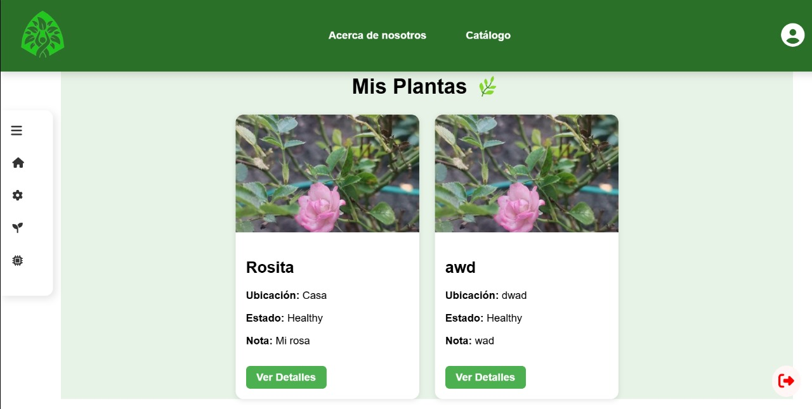
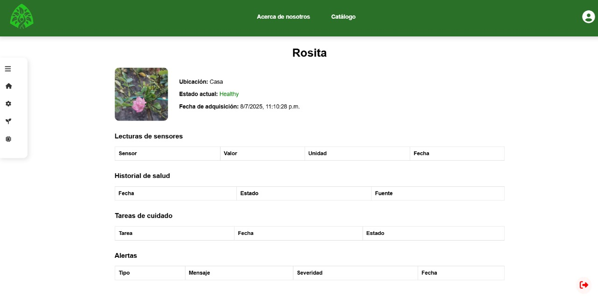
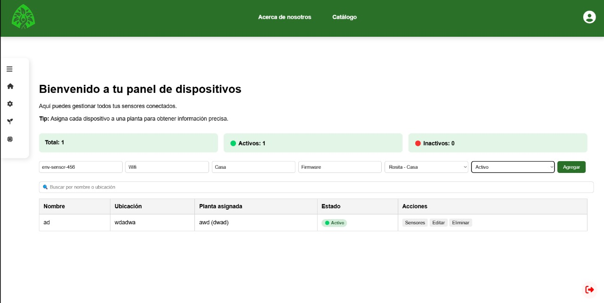
  
<div id='7.2'><h3><b>7.2. Continuous Delivery</b></h3>

La Entrega Continua (CD) extiende la Integración Continua (CI) asegurando que cada cambio validado pueda ser desplegado en producción de manera rápida, segura y confiable. En LlanterosTech, esta práctica permite reducir el tiempo de entrega al usuario final, garantizar la estabilidad del sistema y minimizar riesgos durante los despliegues.

Objetivos principales:

Automatizar el proceso de despliegue desde entornos de prueba hasta producción.
Reducir la intervención manual para minimizar errores humanos.
Asegurar que el software esté siempre en un estado desplegable.
Habilitar entregas frecuentes e incrementales al usuario final.
  
<div id='7.2.1'><h3><b>7.2.1. Tools and Practices.</b></h3>

Herramientas propuestas:

GitHub Actions / GitLab CI / Jenkins → Orquestación de pipelines con despliegue automático a entornos de staging y producción.
Docker + Kubernetes → Contenerización y orquestación de microservicios para despliegues escalables.
Ansible / Terraform → Automatización de infraestructura como código (IaC).
ArgoCD / Spinnaker → Despliegue continuo en entornos Kubernetes con control declarativo.
Monitoring & Logging (Prometheus, Grafana, ELK Stack) → Supervisión en tiempo real del estado de los despliegues.

Prácticas recomendadas:

Deploy automatizado a entornos intermedios (staging/pre-producción) antes de llegar a producción.
Canary Releases → Despliegues graduales en producción para un porcentaje limitado de usuarios.
Blue/Green Deployment → Dos entornos paralelos (blue y green) que permiten cambios sin downtime.
Rollback automático → Reversión rápida en caso de fallos críticos.
Pruebas automáticas post-deploy (Smoke Tests, Health Checks).
Feature Flags → Habilitar/deshabilitar funcionalidades sin necesidad de re-desplegar el sistema.
  
<div id='7.2.2'><h3><b>7.2.2. Stages Deployment Pipeline Components.</b></h3>

Stages :

Source (Control de versiones)

Código fuente almacenado en repositorio (GitHub/GitLab/Bitbucket).
Dispara el pipeline al detectar un commit o merge.

Build (Compilación / Empaquetado)

Compilar el código y empaquetar dependencias.
Generar artefactos listos para prueba (ej. contenedores Docker, archivos .jar/.war, bundles web).

Test (Validación automática)

Unit Tests: verifican entidades y métodos individuales.
Integration Tests: validan interacción entre módulos.
BDD Tests: validan escenarios escritos en Gherkin.
System Tests: prueban el sistema completo en un entorno aislado.

Deploy to Staging (Entrega en entorno intermedio)

Despliegue automático en entorno de staging o pre-producción.
Ejecución de Smoke Tests y validación manual opcional.

Approval / Gate (Revisión opcional)

Aprobación manual (cuando se requiera en proyectos críticos).
Validación de métricas de calidad (SonarQube, cobertura de pruebas).

Deploy to Production (Entrega continua)

Despliegue automatizado en producción con prácticas seguras:
Canary Releases (usuarios limitados).
Blue/Green Deployment (dos entornos paralelos).
Rollback automático en caso de fallo.

Monitoring & Feedback (Supervisión)

Monitoreo de rendimiento (Prometheus, Grafana).
Logging centralizado (ELK Stack).

Pipeline Components:
Repositorio de código: GitHub/GitLab/Bitbucket.
Orquestador de CI/CD: GitHub Actions, GitLab CI/CD, Jenkins, CircleCI.
Build Tools: Maven, Gradle, npm, Webpack, Docker.
Testing Frameworks: JUnit, Pytest, Jest, Cypress, Postman/Newman.
Contenerización y Orquestación: Docker, Kubernetes, Helm.
Infraestructura como código (IaC): Terraform, Ansible.
Despliegue continuo: ArgoCD, Spinnaker, FluxCD.
Monitoreo y Logging: Prometheus, Grafana, ELK Stack (Elasticsearch, Logstash, Kibana).
Notificaciones: Slack, Microsoft Teams, correo automatizado.
  
<div id='7.3'><h3><b>7.3. Continuous deployment</b></h3>

Objetivos principales:

Automatizar completamente el flujo desde commit hasta producción.
Minimizar tiempos de entrega y ciclos de retroalimentación.
Mantener el sistema siempre actualizado, seguro y en ejecución.
Garantizar despliegues confiables y reversibles en caso de error.


<div id='7.3.1'><h3><b>7.3.1. Tools and Practices.</b></h3>

Herramientas propuestas:

GitHub Actions / GitLab CI / Jenkins X → Automatización completa de pipelines con despliegue directo a producción.
Docker + Kubernetes → Contenerización y orquestación de microservicios con escalabilidad dinámica.
ArgoCD / FluxCD → Implementación de GitOps para despliegue automático en Kubernetes.
Helm Charts → Plantillas para desplegar aplicaciones consistentes en distintos entornos.
Monitoring Tools (Prometheus, Grafana, ELK Stack, Datadog) → Observabilidad y alertas tras cada despliegue.
Feature Flags (LaunchDarkly, Unleash) → Liberación controlada de funcionalidades en producción.

Prácticas recomendadas:

Commit → Deploy automático: Cada merge en la rama principal genera un despliegue inmediato a producción.
Canary Deployments: Liberar la actualización a un porcentaje limitado de usuarios antes de expandirla al 100%.
Blue/Green Deployment: Mantener dos entornos paralelos para alternar sin downtime.
Rollback automático: Si se detecta una falla crítica, el sistema revierte automáticamente al último estado estable.
Post-deployment checks: Ejecución de smoke tests y health checks tras cada despliegue.
Monitoring & Alerting: Supervisión en tiempo real y notificación inmediata al equipo en caso de anomalías.
  
<div id='7.1.2'><h3><b>7.3.2. Production Deployment Pipeline Components</b></h3>
  
Este componente se centra en la estabilidad, la seguridad y la escalabilidad del sistema en producción.

Objetivos:

-Garantizar despliegues seguros, reproducibles y auditables.
-Reducir el riesgo de errores en producción mediante pruebas automáticas.
-Asegurar la mínima interrupción para los usuarios finales.
-Proveer monitoreo y retroalimentación inmediata después de cada despliegue.

-Stages del Pipeline

-Build & Package

Compilación del código.
Empaquetado en artefactos (Docker images, contenedores).

-Automated Testing

Ejecución de pruebas unitarias, de integración, contract testing y smoke tests.

-Staging Deployment

Despliegue en entorno staging con datos simulados o enmascarados.
Validación de performance y pruebas de aceptación.

-Approval Gate

Revisión manual o automática antes de producción.
Validación de criterios de calidad y seguridad.

-Production Deployment

Estrategias de despliegue: Blue-Green, Canary Releases o Rolling Updates.
Despliegue progresivo para mitigar riesgos.

-Monitoring & Feedback

Logs centralizados, métricas de rendimiento y alertas.
Rollback automático en caso de fallo crítico.

Herramientas y Prácticas:

-CI/CD Tools: Jenkins, GitHub Actions, GitLab CI, CircleCI.
-Containerization: Docker, Kubernetes.
-Infrastructure as Code (IaC): Terraform, Ansible.
-Monitoring: Prometheus, Grafana, ELK Stack.
-Deployment Strategies: Blue-Green, Canary, Rolling updates.

Beneficios:

-Flujo de entrega más rápido y confiable.
-Mayor visibilidad y trazabilidad en el proceso.
-Mejor experiencia del usuario final gracias a despliegues estables y controlado


<div id='7.4'><h3><b>7.4. Continuous Monitoring</b></h3>

<div id='7.4.1'><h3><b>7.4.1. Tools and Practices</b></h3>

**Monitoreo de rendimiento y experiencia del usuario**

* Spring Boot Actuator + Micrometer → Prometheus & Grafana
Permiten exponer métricas de JVM (heap, GC), latencia por endpoint, errores 5xx y 2xx, y transacciones.
Los datos son recolectados por Prometheus y visualizados en Grafana mediante dashboards de rendimiento y consumo de recursos del backend.

* Firebase Performance Monitoring + Sentry Performance
En la app Flutter (Android/iOS) y en la PWA Angular, se integran SDKs para capturar tiempos de carga, FPS promedio, errores JavaScript y excepciones nativas, además de los flujos de navegación de los usuarios.

* Google Analytics 4 / Matomo Analytics
Recopilan datos sobre el comportamiento de los usuarios, duración de sesión, rebote y rutas de navegación para mejorar la interfaz UI y UX.

**Pruebas de carga y estrés**

* JMeter / Gatling
Se diseñan escenarios que simulan decenas o cientos de solicitudes concurrentes hacia los endpoints REST del backend (Spring Boot): autenticación, registro de plantas y sincronización de sensores.
Los resultados permiten identificar tiempos de respuesta, throughput y uso de CPU/memoria en el servidor y servicios IoT.

**Logging y trazas distribuidas**

* ELK Stack (Elasticsearch + Logstash + Kibana)
Centraliza los logs JSON del backend y los errores de Angular/Flutter para búsquedas por correlación de peticiones.

* Zipkin / Jaeger
Permiten trazar solicitudes desde la app móvil hacia el backend y los microservicios, detectando demoras en llamadas a la API IoT.

<div id='7.4.2'><h3><b>7.4.2. Monitoring Pipeline Components</b></h3>

El pipeline de monitoreo de Plantita se organiza en cuatro etapas:

**1. Recolección de métricas:**
Actuator y Micrometer envían datos de rendimiento a Prometheus, mientras Sentry y Firebase Performance monitorean errores de usuario final.

**2. Almacenamiento centralizado:**
Los logs se envían a Logstash para su indexación en Elasticsearch, asegurando consultas rápidas por fecha o servicio.

**3. Análisis automático:**
Dashboards de Grafana procesan las métricas de Prometheus y las muestran en tiempo real al equipo de DevOps.

**4. Visualización e insights:**
Se emplean paneles de rendimiento web (Google Lighthouse) y análisis de interacción (Matomo o GA4) para detectar problemas de rendimiento en el frontend Angular y la app Flutter.

<div id='7.4.3'><h3><b>7.4.3. Alerting Pipeline Components</b></h3>

El sistema de alertas permite una respuesta inmediata ante eventos críticos:

* **Prometheus Alertmanager + Grafana Alerts**
Dispara notificaciones por latencias > 500 ms, uso de CPU > 85 % o errores 5xx en los endpoints del API.

* **Sentry & Firebase Crashlytics**
Generan alertas instantáneas en Slack y correo cuando se detectan errores JavaScript, excepciones no controladas o crashes de la app móvil.

* **Postman Monitors**
Ejecutan colecciones de prueba cada 6 horas para verificar flujos clave (login, registro de sensor, actualización de datos) y notifican si alguna falla es detectada.

<div id='7.4.4'><h3><b>7.4.4. Notification Pipeline Components.</b></h3>

Las notificaciones mantienen informados a usuarios y administradores en tiempo real:

* **Firebase Cloud Messaging (FCM)**
Envía push notifications cuando un sensor detecta baja humedad, una planta requiere riego o se detecta una anomalía en el sistema.

* **Slack / Email Integrations (Jenkins + Grafana Alerts)**
Notifican a los desarrolladores ante fallas de pipeline, caídas del servidor o problemas de sincronización entre backend y IoT.

* **App Notifications in-App**
Los usuarios reciben alertas personalizadas dentro de la app según sus preferencias: riego, fertilización y problemas ambientales detectados.


 <div id='8'><h3><b>Capítulo VIII: Experiment-Driven Development</b></h3>

<div id='8.1'><h3><b>8.1. Experiment Planning</b></h3>

<div id='8.1.1'><h3><b>8.1.1. As-Is Summary.</b></h3>

Actualmente, la aplicación Plantita, desarrollada por la startup Vitalia, se encuentra en una fase funcional con versiones web y móvil implementadas. El sistema permite a los usuarios registrar sus plantas, recibir recordatorios de riego y acceder a guías de cuidado.  
Sin embargo, hasta el momento no se ha validado empíricamente el impacto de las funciones principales sobre el comportamiento y satisfacción de los usuarios.

El producto dispone de una arquitectura estable (frontend, backend y API) y una interfaz intuitiva construida con base en el enfoque Lean UX. Aun así, el equipo ha identificado la necesidad de diseñar y ejecutar experimentos que permitan comprobar las hipótesis de valor, entre ellas:

- Si los usuarios utilizan de forma constante las funciones de recordatorio y monitoreo.  
- Si dichas funciones reducen los errores comunes en el cuidado de plantas.  
- Si la experiencia de uso mejora la percepción de control y confianza de los usuarios novatos.

<div id='8.1.2'><h3><b>8.1.2. Raw Material: Assumptions, Knowledge Gaps, Ideas, Claims.</b></h3>

**Assumptions (Suposiciones)**
- Los usuarios principiantes en jardinería desean una aplicación simple y visual que los guíe paso a paso.  
- Los recordatorios automáticos y notificaciones visuales mejoran la constancia en el cuidado de las plantas.  
- El monitoreo mediante sensores (humedad, luz, temperatura) contribuye a mantener las plantas saludables.  
- Los usuarios están dispuestos a usar sensores físicos siempre que la instalación sea sencilla.  

**Knowledge Gaps (Brechas practicas)**
- Se desconoce la frecuencia de uso real de la app después de la primera semana.  
- No hay evidencia sobre el impacto directo de las alertas en la mejora de los hábitos de riego.  
- Falta comprobar si el nivel de satisfacción y compromiso del usuario mejora al usar las funciones IoT.  

**Ideas**
- Implementar un sistema de gamificación que premie la constancia en el cuidado de las plantas.  
- Crear una comunidad en la app donde los usuarios puedan compartir consejos o fotos.  
- Explorar un modelo freemium con funciones premium (diagnóstico automático o análisis avanzado).  

**Claims (Afirmaciones)**
- Plantita ayuda a reducir las muertes de plantas por descuido.  
- Plantita mejora la satisfacción de los cuidadores novatos al ofrecer acompañamiento y datos en tiempo real.  
- Plantita fomenta habitos sostenibles y responsables en el cuidado doméstico de plantas.  

<div id='8.1.3'><h3><b>8.1.3. Experiment-Ready Questions.</b></h3>

1. ¿El uso de recordatorios automáticos mejora la frecuencia de riego y la salud de las plantas?  
2. ¿Los usuarios principiantes comprenden fácilmente la interfaz y funciones sin necesidad de asistencia?  
3. ¿Las notificaciones y alertas aumentan la percepción de control y satisfacción del usuario?  
4. ¿Los datos obtenidos por los sensores son consultados con frecuencia por los usuarios?  
5. ¿Que funcionalidades son percibidas como más valiosas?  
6. ¿Los usuarios mantienen el uso de la app más allá de la primera semana? 

<div id='8.1.4'><h3><b>8.1.4. Question Backlog.</b></h3>

| **Prioridad** | **Pregunta** | **Métrica asociada** | **Estado** |
|----------------|---------------|------------------------|-------------|
| Alta | ¿Los recordatorios mejoran la constancia en el cuidado? | Prueba A/B con y sin notificaciones | Pendiente |
| Alta | ¿Los usuarios comprenden facilmente la interfaz? | Prueba de usabilidad con 5 participantes | Pendiente |
| Media | ¿El monitoreo con sensores motiva el uso frecuente? | Seguimiento de métricas (sesiones diarias) | Pendiente |
| Media | ¿Las alertas tempranas reducen perdidas de plantas? | Test controlado con grupos A/B | Pendiente |
| Baja | ¿La app genera interés en la comunidad? | Encuesta post-uso | Pendiente |
| Baja | ¿Que factores influyen en la retención semanal? | Analisis de comportamiento de uso | Pendiente |

<div id='8.1.5'><h3><b>8.1.5. Experiment Cards.</b></h3>

**Experiment Card 1 — “Recordatorios y hábito de riego”**
- **Hipotesis:** Creemos que al enviar recordatorios personalizados, los usuarios aumentarán su constancia en el riego.  
- **Metrica de exito:** Incremento del 25% en la tasa de cumplimiento de riego semanal.  
- **Metodo:** A/B Testing (grupo con recordatorios vs. grupo sin recordatorios).  
- **Duración:** 2 semanas.  
- **Criterio de validación:** Los usuarios con recordatorios muestran mayor constancia y menor abandono.  
---
**Experiment Card 2 — “Usabilidad e intuición del diseño”**
- **Hipotesis:** Creemos que una interfaz basada en íconos y lenguaje amigable reducirá la curva de aprendizaje.  
- **Metrica de exito:** 80% de los usuarios completan las tareas principales sin ayuda.  
- **Metodo:** Prueba de usabilidad moderada (5 usuarios representativos).  
- **Duración:** 3 días.  
- **Criterio de validación:** 4 de 5 usuarios logran completar las tareas sin asistencia.  
---
**Experiment Card 3 — “Monitoreo y satisfacción del usuario”**
- **Hipotesis:** Creemos que el monitoreo con sensores aumentará la satisfacción y la frecuencia de uso.  
- **Metrica de exito:** NPS ≥ 8 y aumento del 20% en la frecuencia de sesiones activas.  
- **Metodo:** Encuesta posterior + análisis de datos de uso.  
- **Duración:** 2 semanas.  
- **Criterio de validación:** Se observa mejora en la satisfacción y retención de usuarios.  


<div id='8.2'><h3><b>8.2. Experiment Design</b></h3>

<div id='8.2.1'><h3><b>8.2.1. Hypotheses.</b></h3>

H₀: La disponibilidad de datos en tiempo real sobre nutrientes, pH, temperatura, humedad y estado del cultivo no tiene efecto en la toma de decisiones ni en la productividad de los usuarios.

Integración de pagos:

H₀: La integración de pagos dentro de la plataforma no afecta el tiempo de reposición de insumos ni la satisfacción de los usuarios.

Automatización de alertas:

H₀: La notificación temprana de cambios críticos en los parámetros del cultivo no reduce las pérdidas ni mejora la capacidad de respuesta de los usuarios.
– Los usuarios necesitan monitorear sus cultivos en tiempo real.
Si la plataforma ofrece datos actualizados sobre nutrientes, pH, temperatura, humedad y estado general del cultivo, los usuarios podrán tomar mejores decisiones y mejorar la productividad.


<div id='8.2.2'><h3><b>8.2.2. Measures.</b></h3>

-Reducción de problemas detectados tardíamente

Nº de alertas generadas por condiciones críticas (pH, humedad, temperatura).

% de problemas detectados antes de afectar el crecimiento.

– Mejora en la salud y crecimiento del cultivo

Tasa de crecimiento promedio por periodo.

Variación en la vitalidad general medida por sensores.

Consumo optimizado de agua y nutrientes.

– Uso y adopción de la funcionalidad de monitoreo

Nº de sesiones activas por día.

Tiempo promedio de uso por usuario.

Nº de parámetros consultados por sesión.

– Eficiencia en procesos de compra dentro de la plataforma

Nº de compras realizadas desde la app.

Tiempo promedio para completar un proceso de pago.

Frecuencia de compras por usuario.


– Satisfacción del usuario

Calificación promedio (NPS, CSAT).

Nº de usuarios que completan una tarea sin ayuda.

Feedback positivo/negativo por funcionalidad.

– Estabilidad y desempeño del sistema

Tiempo de respuesta del sistema de monitoreo.

Disponibilidad del servicio (% uptime).

Fallos reportados por mes.


<div id='8.2.3'><h3><b>8.2.3. Conditions.</b></h3>

Acceso a sensores funcionales y datos en tiempo real
Los usuarios deben contar con sensores instalados y operativos para que la plataforma pueda recopilar datos precisos sobre el cultivo.

Conectividad estable
El sistema requiere conexión a internet para sincronizar datos, enviar alertas y permitir compras dentro de la plataforma.

Usuarios con interés en monitoreo continuo
Los cuidadores deben estar dispuestos a revisar la información y actuar según las alertas generadas por la aplicación.

Disponibilidad de insumos y proveedores integrados
Para que el sistema de compras funcione, se necesita una red de proveedores confiables que ofrezcan insumos compatibles con hidroponía.

Permisos y roles configurados correctamente
En cultivos grandes, el administrador debe asignar roles y accesos a los trabajadores para que el monitoreo y las tareas se gestionen eficientemente.

Ambiente de cultivo controlado
Las condiciones del sistema hidropónico (luz, agua, nutrientes) deben mantenerse dentro de rangos razonables para que las mediciones sean útiles y consistentes.


<div id='8.2.4'><h3><b>8.2.4. Scale Calculations and Decisions.</b></h3>

Cálculo de escala del experimento
Para validar las hipótesis de monitoreo y uso de la plataforma, se considerará un número mínimo de usuarios y dispositivos que permita observar variaciones reales en el comportamiento.

Nº mínimo de usuarios iniciales: 10–15 cuidadores con cultivos en operación.

Nº de sensores por usuario: 3–5 sensores esenciales (pH, humedad, temperatura, nivel).

Nº de ciclos de medición: 2–3 semanas para obtener tendencias significativas.

Escala en términos de complejidad del cultivo
Las pruebas se realizarán en cultivos de mediana escala para asegurar que el sistema responda adecuadamente en entornos con múltiples plantas y condiciones variables.

Rango de plantas monitoreadas: 20–50 plantas por usuario.

Frecuencia de medición: cada 15–30 minutos según el sensor.

Supervisión de alertas: tiempo máximo de respuesta del usuario < 12 horas.

Escalabilidad del sistema técnico
Se evaluará la capacidad de la plataforma para soportar un mayor volumen de datos y usuarios sin comprometer el desempeño.

Almacenamiento inicial estimado: 5–10 MB por usuario/día en datos de sensores.

Capacidad mínima del backend: soporte de 1000–2000 solicitudes/min cuando se escale.

Criterio de estabilidad: uptime mínimo de 99% durante el experimento.

Decisiones basadas en resultados
Los datos recopilados se utilizarán para determinar si el sistema está listo para escalar a una versión piloto más amplia.

Si las alertas son útiles y precisas → se ampliará la red de sensores compatibles.

Si los usuarios adoptan la función de compras → se integrarán más proveedores e inventarios.

Si el sistema muestra estabilidad → se planificará el despliegue para 100+ usuarios.

Si se detectan fallas críticas → se aplicarán mejoras antes de pasar a una siguiente fase.

Criterio de decisión final
Se considerará que el experimento ha tenido éxito si:

Las métricas de uso superan el 60% de adopción activa.

Las alertas generan acciones correctivas en más del 50% de los casos.

Al menos el 30% de los usuarios realiza una compra dentro de la plataforma.

El sistema mantiene un rendimiento aceptable bajo carga.


<div id='8.2.5'><h3><b>8.2.5. Methods Selection.</b></h3>

Para validar las hipótesis y medir el impacto de la solución propuesta, se seleccionarán métodos analíticos y metodológicos que permitan obtener datos confiables y accionables. La combinación de enfoques cuantitativos y cualitativos permitirá un análisis integral del comportamiento del sistema y de los usuarios.

Método de Observación Directa
Se observará cómo los usuarios interactúan con el sistema, evaluando tiempos de respuesta, uso de funciones clave y dificultades encontradas.

Análisis Cuantitativo de Datos de Sensores
Se recopilarán métricas de pH, temperatura, humedad, EC y otras variables relevantes generadas por los sensores instalados en el cultivo.
Esto permitirá identificar patrones, anomalías y niveles óptimos para el crecimiento.

Pruebas A/B en Funcionalidades de la Plataforma
Se evaluarán diferentes versiones de la interfaz, notificaciones, flujos de compra y alertas para determinar cuáles generan mayor adopción y satisfacción.

Encuestas y Retroalimentación del Usuario
Se aplicarán cuestionarios estructurados para recopilar información sobre la experiencia del usuario, usabilidad y percepción de valor de la solución.

Analítica de Comportamiento (Clickstream)
Se analizarán rutas de navegación, frecuencia de uso y eventos clave para identificar puntos de fricción y oportunidades de mejora.

Testing de Usabilidad
Se realizarán sesiones guiadas con usuarios reales para evaluar claridad del diseño, accesibilidad y facilidad de uso de la plataforma.

Monitoreo de Logs y Rendimiento del Sistema
Se analizarán logs generados por el backend para medir estabilidad, latencia, errores y capacidad de respuesta bajo distintas cargas.

Revisión Comparativa (Benchmarking)
Se compararán métricas clave con soluciones de la competencia o con referencias del sector para evaluar nivel de desempeño y competitividad.


<div id='8.2.6'><h3><b>8.2.6. Data Analytics: Goals, KPIs and Metrics Selection.</b></h3>

Goals (Objetivos Analíticos)

Optimizar el cuidado del cultivo hidropónico
Asegurar que los usuarios puedan tomar decisiones basadas en datos para mejorar el crecimiento y la salud de sus plantas.

Monitorear el comportamiento del usuario dentro de la plataforma
Identificar patrones de uso, funciones más utilizadas y puntos de fricción.

Incrementar la adopción de funcionalidades clave
Favorecer el uso continuo de monitoreo, alertas y compras dentro de la app.

Evaluar la eficiencia operativa del sistema
Medir estabilidad, velocidad y precisión del sistema en distintas cargas.

Impulsar la conversión y retención
Ver cómo el comportamiento del usuario impacta ciclos de compra y uso recurrente.

2. KPIs (Indicadores Clave de Desempeño)
KPIs de Monitoreo del Cultivo

Nivel de precisión de las mediciones (error ≤ 5%)

Nº de alertas generadas vs. atendidas

Tasa de detección temprana de problemas (%)

Tiempo promedio para que el usuario responda a una alerta

KPIs de Uso de la Plataforma

Usuarios activos diarios (DAU)

Usuarios activos mensuales (MAU)

Retención semanal (% de usuarios que regresan)

Tiempo promedio por sesión

KPIs de Compras / E-commerce integrado

Tasa de conversión (vista → compra)

Nº de transacciones completadas

Abandono de carrito (%)

Ticket promedio por usuario

KPIs de Sistema y Estabilidad

Uptime del sistema (objetivo 99%)

Latencia promedio (ms)

Errores por minuto (EPM)

Tiempos de respuesta del backend

3. Metrics Selection (Métricas Seleccionadas)
Métricas Técnicas

GB/MB de datos procesados por día

Frecuencia de envío de datos por sensor

Procesos fallidos vs. exitosos

Consumo de CPU/RAM en backend

Métricas de Comportamiento de Usuario

Rutas de navegación más frecuentes (clickstream)

Funciones más usadas (top 5)

Nivel de interacción con cada feature

Nº de usuarios que completan tareas clave (onboarding, monitoreo, compra)

Métricas de Valor

Ahorro de recursos (agua/nutrientes)

Reducción de pérdidas de cultivo (%)

Incremento de productividad (%)

Satisfacción del usuario (NPS, CSAT)


<div id='8.2.7'><h3><b>8.2.7. Web and Mobile Tracking Plan.</b></h3>

**Objetivo del Tracking Plan**
Monitorear el comportamiento de los usuarios dentro de la aplicación, identificar patrones de uso, puntos de abandono y evaluar el impacto de los recordatorios y alertas en la mejora del cuidado de plantas.

**Herramientas y Tecnologías**
- **Google Analytics:** seguimiento de eventos web y móvil.  
- **Firebase Analytics:** métricas de interacción movil y retención de usuarios.  
- **Mixpanel (opcional):** análisis de cohortes y flujo de eventos detallado.  
- **Backend Logging (Node.js/Express):** registro interno de eventos clave y métricas personalizadas.  

**Eventos a rastrear (Web & Mobile)**

| **Categoria** | **Evento** | **Descripción** | **Metrica asociada** | **Objetivo** |
|----------------|-------------|-----------------|----------------------|---------------|
| Onboarding | `signup_success` | Usuario completa el registro | Tasa de conversión de registro | Medir la facilidad de ingreso |
| Onboarding | `first_plant_added` | Usuario registra su primera planta | % de usuarios activos que completan la acción | Verificar adopción inicial |
| Interacción | `view_plant_dashboard` | Usuario ingresa al panel de su planta | Frecuencia de sesiones diarias | Analizar retención |
| Notificaciones | `notification_clicked` | Usuario abre notificación de riego o alerta | CTR de notificaciones | Validar efectividad de recordatorios |
| Riego | `watering_logged` | Usuario marca una planta como regada | Cantidad promedio de riegos semanales | Evaluar hábito de riego |
| Sensores | `sensor_data_viewed` | Usuario consulta lecturas de humedad/luz | % de usuarios que revisan datos IoT | Validar uso de funciones avanzadas |
| Comunidad | `community_post_created` | Usuario publica o comenta en la comunidad | Nº de publicaciones activas | Medir participación social |
| Sesión | `session_duration` | Duración promedio por sesión | Tiempo promedio de uso (minutos) | Determinar nivel de engagement |


**Frecuencia de monitoreo**
- **Recolección continua de datos:** diaria (Firebase / GA4).  
- **Revisión de métricas:** semanal.  
- **Reporte analítico:** cada 2 semanas.  


<div id='8.3'><h3><b>8.3. Experimentation</b></h3>

<div id='8.3.1'><h3><b>8.3.1. To-Be User Stories.</b></h3>


| **Story ID** | **Epic** | **Title** | **Description** | **Criterios de aceptación** |
|---------------|----------|-----------|------------------|-----------------------------------|
| US-E-01 | Recordatorios inteligentes | Implementación de recordatorios de riego automáticos | Como usuario, quiero recibir recordatorios personalizados según el tipo de planta para no olvidarme de regarlas. | **Given** que el usuario tiene una planta registrada,<br>**When** se cumpla la fecha de riego,<br>**Then** la app debe enviar una notificación con el recordatorio. |
| US-E-02 | Monitoreo IoT | Visualización de datos de sensores en tiempo real | Como usuario, quiero ver la humedad y temperatura de mis plantas para tomar mejores decisiones. | **Given** que el sensor esté conectado,<br>**When** el usuario abra el panel de planta,<br>**Then** debe visualizar los valores actualizados de humedad y temperatura. |
| US-E-03 | Experiencia de usuario | Mejora del diseño y flujo de navegación | Como usuario, quiero una interfaz más intuitiva para encontrar fácilmente mis plantas y sus datos. | **Given** que el usuario acceda a la app,<br>**When** busque una planta,<br>**Then** podrá acceder a su panel con máximo 2 clics. |
| US-E-04 | Comunidad | Espacio para compartir experiencias | Como usuario, quiero publicar consejos y fotos para aprender de otros cuidadores. | **Given** que el usuario esté logueado,<br>**When** ingrese al módulo de comunidad,<br>**Then** podrá crear, comentar o reaccionar a publicaciones. |


<div id='8.3.2'><h3><b>8.3.2. To-Be Product Backlog</b></h3>


| **Prioridad** | **User Story** | **Descripción / Tarea principal** | **Story Points** |
|----------------|----------------|----------------------------------|-------------------------------|
| Alta | US-E-01 | Implementar sistema de notificaciones automáticas y personalizables. | 5 |
| Alta | US-E-02 | Conectar sensores de humedad y temperatura al backend con actualización cada 30s. | 8 |
| Media | US-E-03 | Rediseñar dashboard principal con iconografía y accesos rápidos. | 3 |
| Media | US-E-04 | Crear modulo social básico (crear post, comentar, reaccionar). | 5 |


<!-- ============================ -->
<!--   8.3.3 Pipeline-supported   -->
<!-- ============================ -->

<div id="8.3.3">
  <h2><b>8.3.3. Pipeline-supported, Experiment-Driven To-Be Software Platform Lifecycle</b></h2>
</div>

<div id="8.3.3.1">
  <h3><b>8.3.3.1. To-Be Sprint Backlogs</b></h3>
</div>

| Task ID | Nombre Task                                               | Story Points | STATUS | Usuario   |
|---------|------------------------------------------------------------|--------------|--------|-----------|
| HUX-T01 | Implementar video demostrativo en la landing page          | 3            | Listo  | Visitante |
| HUX-T02 | Crear vista de historial de registros y alertas            | 3            | Listo  | Usuario   |
| HUX-T03 | Mostrar historial de variaciones de sensores (H/L/T)       | 2            | Listo  | Usuario   |
| HUX-T04 | Generar estadísticas de humedad, luz y temperatura         | 4            | Listo  | Usuario   |
| HUX-T05 | Generar reporte de evolución de plantas                    | 3            | Listo  | Usuario   |
| HUX-T06 | Configurar recordatorios personalizados por planta         | 5            | Listo  | Usuario   |
| HUX-T07 | Implementar recomendaciones basadas en historial y estado  | 3            | Listo  | Usuario   |
| HUX-T08 | Mostrar niveles estimados y sugerencias en tiempo real     | 5            | Listo  | Usuario   |
| HUX-T09 | Autenticación segura con cuenta registrada                 | 7            | Listo  | Usuario   |
| HUX-T10 | Monitorear métricas de actividad de usuarios               | 4            | Listo  | Developer |
| HUX-T11 | Monitorear métricas de actividad de plantas y alertas      | 3            | Listo  | Developer |

<div id="8.3.3.2">
  <h3><b>8.3.3.2. Implemented To-Be Landing Page Evidence</b></h3>
</div>

<div id="8.3.3.3">
  <h3><b>8.3.3.3. Implemented To-Be Frontend-Web Application Evidence</b></h3>
</div>

<div id="8.3.3.4">
  <h3><b>8.3.3.4. Implemented To-Be Native-Mobile Application Evidence</b></h3>

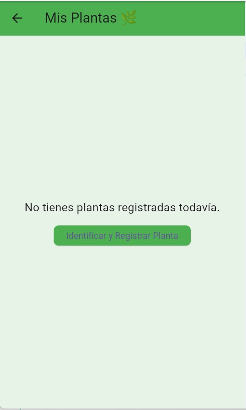
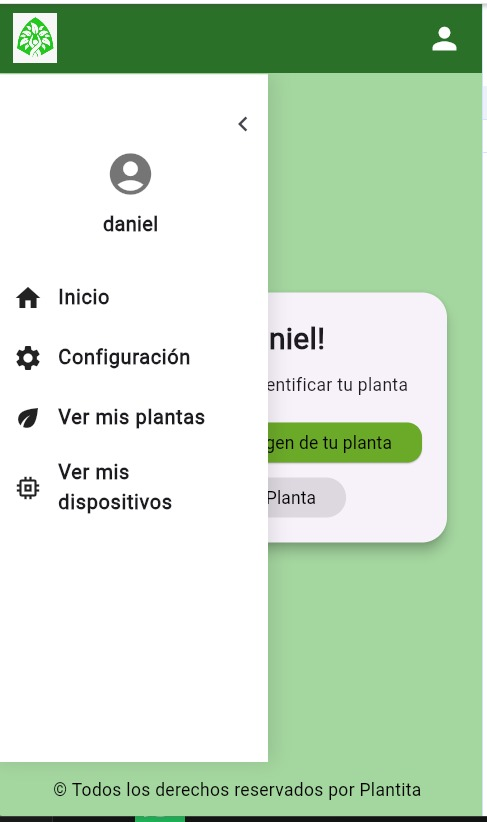
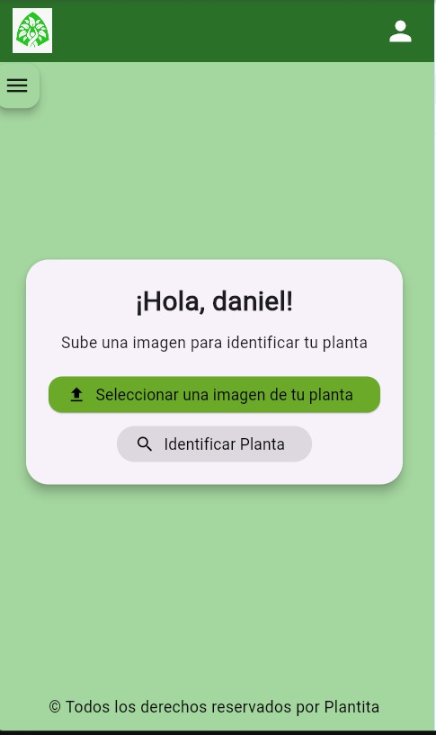
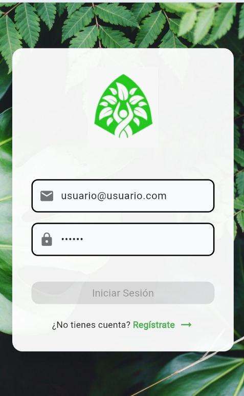


</div>


---
     - Lectura actual del sen

<div id="8.3.3.6">
  <h3><b>8.3.3.6. Team Collaboration Insights</b></h3>
</div>


| Categoría                          | Descripción                                                                                                      | Integrantes Involucrados                     |
|-----------------------------------|------------------------------------------------------------------------------------------------------------------|----------------------------------------------|
| **Distribución de Roles**         | Asignación equilibrada según fortalezas: análisis, diseño, integración y organización del repositorio.          | Andrea, Irving, Hernan, Anderson             |
| **Comunicación del Equipo**       | Coordinación constante mediante canales digitales para validar avances, resolver dudas y tomar decisiones.       | Todos                                         |
| **Trabajo Iterativo**             | Revisión continua de prototipos, mejoras visuales y funcionales basadas en feedback en cada sprint.             | Todos                                         |
| **Gestión del Repositorio**       | Organización de ramas, commits y PRs con estructura clara y reducción de conflictos.                             | Irving, Anderson                              |
| **Validación y Pruebas**          | Participación activa en pruebas internas, evaluación de flujos críticos y ajuste de componentes.                | Andrea, Irving, Hernan, Anderson             |
| **Responsabilidad Compartida**    | Compromiso con entregables, cumplimiento de tareas y apoyo cruzado entre miembros del equipo.                    | Todos                                         |


<!-- ============================ -->
<!--      8.3.4 Interviews        -->
<!-- ============================ -->

<div id="8.3.4">
  <h2><b>8.3.4. To-Be Validation Interviews</b></h2>
</div>

<div id="8.3.4.1">
  <h3><b>8.3.4.1. Diseño de Entrevistas</b></h3>
</div>

## **Preguntas para Validación de la App – Entrevista con Usuarios**

1. ¿La pantalla principal te parece clara para entender el estado general de tus plantas?
2. ¿Tuviste alguna dificultad para registrar una nueva planta en la aplicación?
3. ¿Los valores de los sensores (humedad, luz, temperatura) se entienden fácilmente?
4. ¿Las alertas o notificaciones sobre el estado de tus plantas te resultan útiles y oportunas?
5. ¿Las recomendaciones de cuidado son claras y te ayudan a tomar decisiones?
6. ¿La navegación entre las secciones (Inicio, Plantas, Historial, Perfil) es intuitiva?
7. ¿El diseño visual te parece agradable y fácil de usar en un dispositivo móvil?
8. ¿Qué parte de la app te resultó más difícil de entender o utilizar?


<div id="8.3.4.2">
  <h3><b>8.3.4.2. Registro de Entrevistas</b></h3>
</div>

<!-- ============================ -->
<!--     8.4 Experiment Aftermath -->
<!-- ============================ -->

<div id="8.4">
  <h2><b>8.4. Experiment Aftermath & Analysis</b></h2>
</div>

<div id="8.4.1">
  <h3><b>8.4.1. Analysis and Interpretation of Results</b></h3>
</div>

El proceso de validación, que incluyó evaluación heurística, pruebas de usuario y entrevistas, permitió obtener una visión clara de cómo los usuarios interactúan con las funcionalidades principales de Bliss App. A continuación, se presentan los hallazgos clave y su interpretación respecto a la efectividad del producto y la satisfacción del usuario.

### **1. Usabilidad y claridad de la interfaz**
La mayoría de usuarios encontró la interfaz visualmente agradable y fácil de navegar. Sin embargo, se observaron dificultades en elementos con bajo contraste y en acciones que no mostraban retroalimentación clara (por ejemplo, al actualizar datos del sensor o eliminar una planta).  
**Interpretación:** Mejorar la jerarquía visual y reforzar los mensajes de confirmación aumenta la confianza del usuario y reduce errores operacionales.

### **2. Efectividad en la visualización de datos de sensores**
Los usuarios comprendieron los indicadores de humedad, luz y temperatura, pero algunos expresaron dudas sobre los umbrales o niveles óptimos.  
**Interpretación:** La incorporación de ayudas contextuales (iconos, escalas de color, tooltips) facilita la interpretación de los datos IoT, apoyando decisiones informadas.

### **3. Valor percibido de las recomendaciones**
Las recomendaciones personalizadas fueron consideradas muy útiles, especialmente cuando se activaban frente a valores anómalos del sensor.  
**Interpretación:** Las sugerencias basadas en datos históricos y en tiempo real elevan el valor funcional de la aplicación y justifican el uso de sensores.

### **4. Eficiencia en la navegación**
La navegación general fue percibida como intuitiva. No obstante, el dashboard principal presentaba demasiadas opciones agrupadas, lo que generaba ligera sobrecarga cognitiva.  
**Interpretación:** Simplificar la distribución de acciones mejora la fluidez de uso y facilita la incorporación de nuevos usuarios.

### **5. Fiabilidad y confianza en las actualizaciones del sistema**
La falta de mensajes claros al actualizar datos, editar información o recibir registros del sensor provocó incertidumbre en algunos usuarios.  
**Interpretación:** En sistemas basados en IoT, la retroalimentación inmediata es clave para transmitir fiabilidad y asegurar la correcta interpretación de los datos recibidos.

### **6. Alineación con las necesidades del usuario**
Los usuarios destacaron que la aplicación mantiene el enfoque en tareas esenciales: monitoreo, alertas y recomendaciones.  
**Interpretación:** El alcance actual del producto coincide adecuadamente con las necesidades reales de los usuarios que cuidan plantas, evitando complejidad innecesaria.

---

### **Conclusión General**
Los resultados confirman que Bliss App cumple su propósito de facilitar el monitoreo de plantas mediante sensores y recomendaciones inteligentes. Con mejoras puntuales en accesibilidad, claridad visual y feedback del sistema, la aplicación puede ofrecer una experiencia altamente confiable, comprensible y centrada en el usuario.


<div id="8.4.2">
  <h3><b>8.4.2. Re-scored and Re-prioritized Question Backlog</b></h3>
</div>


| ID | Pregunta / Área Evaluada                                            | Puntaje Inicial | Puntaje Recalculado | Prioridad Nueva | Justificación                                                                 |
|----|---------------------------------------------------------------------|------------------|----------------------|------------------|-------------------------------------------------------------------------------|
| Q01 | ¿Los usuarios entienden los valores de sensores (H/L/T)?           | 2                | 4                    | Alta             | Usuarios mostraron confusión con umbrales → afecta decisiones de cuidado.    |
| Q02 | ¿La app muestra retroalimentación clara al actualizar datos?       | 3                | 5                    | Alta             | Problema recurrente → genera desconfianza en la lectura IoT.                 |
| Q03 | ¿El registro de plantas es intuitivo?                              | 1                | 3                    | Media            | Algunos usuarios no identificaron campos obligatorios.                        |
| Q04 | ¿Las recomendaciones son percibidas como útiles?                   | 3                | 5                    | Alta             | Funcionalidad clave que impacta satisfacción general.                         |
| Q05 | ¿El dashboard tiene buena jerarquía visual?                        | 2                | 4                    | Alta             | Sobrecarga en la pantalla principal detectada repetidamente.                 |
| Q06 | ¿Los usuarios encuentran fácilmente el historial de alertas?       | 1                | 2                    | Media            | Problema menor pero recurrente en pruebas.                                    |
| Q07 | ¿La navegación entre secciones es intuitiva?                       | 2                | 4                    | Alta             | Flujo confuso para nuevos usuarios → afecta onboarding.                      |
| Q08 | ¿Los textos cumplen estándares de accesibilidad (contraste)?       | 2                | 3                    | Media            | Algunos elementos no cumplen WCAG → afecta legibilidad.                      |
| Q09 | ¿Los usuarios comprenden la integración IoT y su funcionamiento?   | 1                | 4                    | Alta             | Se identificó desconocimiento general → afecta confianza en el sistema.      |
| Q10 | ¿El sistema alerta correctamente ante valores críticos?            | 3                | 5                    | Crítica          | Afecta directamente el propósito central de la app (cuidado de plantas).     |


<!-- ============================ -->
<!--     8.5 Continuous Learning  -->
<!-- ============================ -->

<div id="8.5">
  <h2><b>8.5. Continuous Learning</b></h2>
</div>

<div id="8.5.1">
  <h3><b>8.5.1. Shareback Session Artifacts: Learning Workflow</b></h3>
</div>

<!-- ============================ -->
<!--     8.6 Pre-launch           -->
<!-- ============================ -->

<div id="8.6">
  <h2><b>8.6. To-Be Software Platform Pre-launch</b></h2>
</div>

| Sección                       | Detalle |
|--------------------------------|--------|
| **Objetivo**                   | Optimizar el cuidado de las plantas mediante monitoreo inteligente, recomendaciones personalizadas y alertas en tiempo real. |
| **Funcionalidades Principales** | - Registro de plantas (especie, ubicación, necesidades) <br> - Monitoreo ambiental (temperatura, humedad, luz, suelo) <br> - Diagnóstico automático de problemas <br> - Recomendaciones de cuidado <br> - Historial y estadísticas de evolución <br> - Recordatorios inteligentes <br> - Integración con dispositivos IoT |
| **Beneficios Esperados**        | - Incremento de la salud y supervivencia de las plantas <br> - Reducción de errores de cuidado <br> - Experiencia personalizada <br> - Datos en tiempo real para decisiones informadas <br> - Plataforma preparada para escalabilidad |
| **UX/UI**                       | - Diseño intuitivo y minimalista <br> - Dashboard central con estado de plantas <br> - Alertas claras y accionables <br> - Secciones educativas sobre cuidado de plantas |
| **Requisitos Técnicos**         | - **Frontend:** Flutter o React Native <br> - **Backend:** Microservicios Java Spring Boot o Node.js con MySQL/PostgreSQL <br> - **IoT:** Comunicación vía MQTT o HTTP <br> - **Seguridad:** Autenticación JWT, cifrado <br> - **Integración:** API REST para servicios externos |
| **KPIs de Pre-lanzamiento**     | - Número de usuarios registrados <br> - Número de plantas registradas <br> - Frecuencia de uso de la app <br> - Tasa de alertas atendidas <br> - Satisfacción del usuario |

<div id="8.6.1">
  <h3><b>8.6.1. About-the-Product Intro Video</b></h3>
</div>


## **Conclusiones**

-El desarrollo del proyecto **Vitalia** permitió identificar una problemática real y relevante dentro del ámbito del cuidado de plantas, especialmente en el segmento de aficionados y principiantes que carecen de conocimientos técnicos o herramientas adecuadas para mantener sus cultivos saludables. A través del análisis de antecedentes y la aplicación del enfoque **Lean UX**, el equipo logró definir con claridad las necesidades de los usuarios y los objetivos de negocio, sentando las bases para una solución innovadora, práctica y sostenible.  

-La aplicación propuesta busca integrar sensores y una plataforma digital que centralice la información sobre el estado de las plantas, permitiendo a los usuarios monitorear variables clave como humedad, temperatura y posibles plagas. Esto no solo contribuye a mejorar la **eficiencia operativa** y la **calidad del cuidado de las plantas**, sino que también promueve un **uso responsable de los recursos** y una experiencia de usuario más satisfactoria.  

-Asimismo, el proceso de ideación y validación mediante Lean UX permitió formular hipótesis verificables que guiarán las siguientes etapas de desarrollo, asegurando que las decisiones de diseño se basen en datos y en el comportamiento real de los usuarios.  

