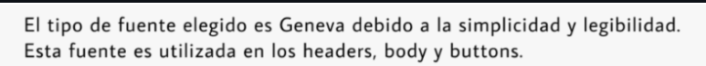

# Report

  

  <h1>Universidad Peruana de Ciencias Aplicadas</h1>
  
<strong>Carrera:</strong> Ingeniería de Software

  
<strong>Ciclo:</strong> 2025 - 2

  
<strong>Curso:</strong> Diseño de Experimentos de Ingeniería de Software

  
<strong>Sección: 7500</strong> 

  
<strong>Profesor:</strong> Ivan Robles Fernández

  
<strong>"Informe de Trabajo Final"</strong>

  
<strong>Startup: Vitalia</strong> 

  
<strong>Producto: Plantita </strong> 

<table align="center">
  <tr>
    <th>Integrantes</th>
    <th>Código</th>
  </tr>
  <tr>
    <td>Anderson Gonza Morales </td>
    <td>U202120836</td>
  </tr>
  <tr>
    <td>Andrea Cabanillas Gora</td>
    <td>U202211711</td>
  </tr>
  <tr>
    <td>Joan Fernando Teves Samaniego</td>
    <td>U202117303</td>
  </tr>
  <tr>
    <td>Hernán Emilio Morales Calderón</td>
    <td>U202216263</td>
  </tr>
  <tr>
    <td>Irving Allcca Guerrero</td>
    <td>u202213241</td>
  </tr>
</table>

<b>Septiembre 2025</b>

# Registro de versiones

<table>
  <thead>
    <tr>
        <th>Versión</th>
        <th>Fecha</th>
        <th>Autor</th>
        <th>Descripción de modificación</th>
    </tr>
  </thead>
  <tbody>
  <tr>
      <td><strong>TB1</strong></td>
      <td>21/07/25</td>
      <td>
        <ul>
          <li>Andrea Cabanillas Gora</li>
          <li>Anderson Gonza Morales</li>
          <li>Joan Fernando Teves Samaniego</li>
          <li>Irving Allcca Guerrero</li>
          <li>Hernan Emilio Morales Calderón</li>
        </ul>
      </td>
      <td>
        Se realizaron los siguientes puntos:
        <ul>
          <li>Capítulo I: Introducción</li>
          <li>Capítulo II: Requirements Elicitation & Analysis</li>
          <li>Capítulo III: Requirements Specification</li>
          <li>Capítulo IV: Product Design</li>
          <li>Capítulo V: Product Implementation</li>
        </ul>
      </td>
  </tr>
  </tbody>
</table>

# Project Report Collaboration Insights

# Tabla de Contenido

[Registro de Versiones](#registro-de-versiones)

[Student Outcome](#student-outcome)

**Part I: As-Is Software Project**

[Capítulo I: Introducción](#Capítulo-I-Introducción)
  - [1.1. Startup Profile](#11-startup-profile)
    - [1.1.1. Descripción de la Startup](#111-descripción-de-la-startup)
    - [1.1.2. Perfiles de integrantes del equipo](#112-perfiles-de-integrantes-del-equipo)
  - [1.2. Solution Profile](#12-solution-profile)
    - [1.2.1. Antecedentes y problemática](#121-antecedentes-y-problemática)
    - [1.2.2. Lean UX Process](#122-lean-ux-process)
      - [1.2.2.1. Lean UX Problem Statements](#1221-lean-ux-problem-statements)
      - [1.2.2.2. Lean UX Assumptions](#1222-lean-ux-assumptions)
      - [1.2.2.3. Lean UX Hypothesis Statements](#1223-lean-ux-hypothesis-statements)
      - [1.2.2.4. Lean UX Canvas](#1224-lean-ux-canvas)
  - [1.3. Segmentos objetivo](#13-segmentos-objetivo)

[Capítulo II: Requirements Elicitation & Analysis](#Capítulo-II-Requirements-Elicitation--Analysis)
  - [2.1. Competidores](#21-competidores)
    - [2.1.1. Análisis competitivo](#211-análisis-competitivo)
    - [2.1.2. Estrategias y tácticas frente a competidores](#212-estrategias-y-tácticas-frente-a-competidores)
  - [2.2. Entrevistas](#22-entrevistas)
    - [2.2.1. Diseño de entrevistas](#221-diseño-de-entrevistas)
    - [2.2.2. Registro de entrevistas](#222-registro-de-entrevistas)
    - [2.2.3. Análisis de entrevistas](#223-análisis-de-entrevistas)
  - [2.3. Needfinding](#23-needfinding)
    - [2.3.1. User Personas](#231-user-personas)
    - [2.3.2. User Task Matrix](#232-user-task-matrix)
    - [2.3.3. User Journey Mapping](#233-user-journey-mapping)
    - [2.3.4. Empathy Mapping](#234-empathy-mapping)
    - [2.3.5. As-is Scenario Mapping](#235-as-is-scenario-mapping)
  - [2.4 Ubiquitous Language](#24-ubiquitous-language)

[Capítulo III: Requirements Specification](#Capítulo-III-Requirements-Specification)
  - [3.1. To-Be Scenario Mapping](#31-to-be-scenario-mapping)
  - [3.2. User Stories](#32-user-stories)
  - [3.3. Product Backlog](#33-product-backlog)
  - [3.4. Impact Mapping](#34-impact-mapping)

[Capítulo IV: Product Design](#Capítulo-IV-Product-Design)
  - [4.1. Style Guidelines](#41-style-guidelines)
    - [4.1.1. General Style Guidelines](#411-general-style-guidelines)
    - [4.1.2. Web Style Guidelines](#412-web-style-guidelines)
    - [4.1.3. Mobile Style Guidelines](#413-mobile-style-guidelines)
        - [4.1.3.1. iOS Mobile Style Guidelines](#4131-ios-mobile-style-guidelines)
        - [4.1.3.2. Android Mobile Style Guidelines](#4132-android-mobile-style-guidelines)
  - [4.2. Information Architecture](#42-information-architecture)
    - [4.2.1. Organization Systems](#421-organization-systems)
    - [4.2.2. Labeling Systems](#422-labeling-systems)
    - [4.2.3. SEO Tags and Meta Tags](#423-seo-tags-and-meta-tags)
    - [4.2.4. Searching Systems](#424-searching-systems)
    - [4.2.5. Navigation Systems](#425-navigation-systems)
  - [4.3. Landing Page UI Design](#43-landing-page-ui-design)
    - [4.3.1. Landing Page Wireframe](#431-landing-page-wireframe)
    - [4.3.2. Landing Page Mock-up](#432-landing-page-mock-up)
  - [4.4. Mobile Applications UX/UI Design](#44-mobile-applications-uxui-design)
    - [4.4.1. Mobile Applications Wireframes](#441-mobile-applications-wireframes)
    - [4.4.2. Mobile Applications Wireflow Diagrams](#442-mobile-applications-wireflow-diagrams)
    - [4.4.3. Mobile Applications Mock-ups](#443-mobile-applications-mock-ups)
    - [4.4.4. Mobile Applications User Flow Diagrams](#444-mobile-applications-user-flow-diagrams)
  - [4.5. Mobile Applications Prototyping](#45-mobile-applications-prototyping)
    - [4.5.1. Android Mobile Applications Prototyping](#451-android-mobile-applications-prototyping)
    - [4.5.2. iOS Mobile Applications Prototyping](#452-ios-mobile-applications-prototyping)
  - [4.6. Web Applications UX/UI Design](#46-web-applications-uxui-design)
    - [4.6.1. Web Applications Wireframes](#461-web-applications-wireframes)
    - [4.6.2. Web Applications Wireflow Diagrams](#462-web-applications-wireflow-diagrams)
    - [4.6.3. Web Applications Mock-ups](#463-web-applications-mock-ups)
    - [4.6.4. Web Applications User Flow Diagrams](#464-web-applications-user-flow-diagrams)
  - [4.7. Web Applications Prototyping](#47-web-applications-prototyping)
  - [4.8. Domain-Driven Software Architecture](#48-domain-driven-software-architecture)
    - [4.8.1. Software Architecture Context Diagram](#481-software-architecture-context-diagram)
    - [4.8.2. Software Architecture Container Diagrams](#482-software-architecture-container-diagrams)
    - [4.8.3. Software Architecture Components Diagrams](#483-software-architecture-components-diagrams)
  - [4.9. Software Object-Oriented Design](#49-software-object-oriented-design)
    - [4.9.1. Class Diagrams](#491-class-diagrams)
    - [4.9.2. Class Dictionary](#492-class-dictionary)
  - [4.10. Database Design](#410-database-design)
    - [4.10.1. Relational/Non-Relational Database Diagram](#4101-relationalnon-relational-database-diagram)

[Capítulo V: Product Implementation](#Capítulo-V-Product-Implementation)
  - [5.1. Software Configuration Management](#51-software-configuration-management)
    - [5.1.1. Software Development Environment Configuration](#511-software-development-environment-configuration)
    - [5.1.2. Source Code Management](#512-source-code-management)
    - [5.1.3. Source Code Style Guide & Conventions](#513-source-code-style-guide--conventions)
    - [5.1.4. Software Deployment Configuration](#514-software-deployment-configuration)
  - [5.2. Product Implementation & Deployment](#52-product-implementation--deployment)
    - [5.2.1. Sprint Backlogs](#521-sprint-backlogs)
    - [5.2.2. Implemented Landing Page Evidence](#522-implemented-landing-page-evidence)
    - [5.2.3. Implemented Frontend-Web Application Evidence](#523-implemented-frontend-web-application-evidence)
    - [5.2.4. Implemented Native-Mobile Application Evidence](#524-implemented-native-mobile-application-evidence)
    - [5.2.5. Implemented RESTful API and/or Serverless Backend Evidence](#525-implemented-restful-api-andor-serverless-backend-evidence)
    - [5.2.6. RESTful API documentation](#526-restful-api-documentation)
    - [5.2.7. Team Collaboration Insights](#527-team-collaboration-insights)
  - [5.3. Video About-the-Product](#53-video-about-the-product)

**Part II: Verification, Validation & Pipeline**

[Capítulo VI: Product Verification & Validation](#Capítulo-VI-Product-Verification--Validation)
  - [6.1. Testing Suites & Validation](#61-testing-suites--validation)
    - [6.1.1. Core Entities Unit Tests](#611-core-entities-unit-tests)
    - [6.1.2. Core Integration Tests](#612-core-integration-tests)
    - [6.1.3. Core Behavior-Driven Development](#613-core-behavior-driven-development)
    - [6.1.4. Core System Tests](#614-core-system-tests)
  - [6.2. Static testing & Verification](#62-static-testing--verification)
    - [6.2.1. Static Code Analysis](#621-static-code-analysis)
        - [6.2.1.1. Coding standard & Code conventions](#6211-coding-standard--code-conventions)
        - [6.2.1.2. Code Quality & Code Security](#6212-code-quality--code-security)
    - [6.2.2. Reviews](#622-reviews)
  - [6.3. Validation Interviews](#63-validation-interviews)
    - [6.3.1. Diseño de Entrevistas](#631-diseño-de-entrevistas)
    - [6.3.2. Registro de Entrevistas](#632-registro-de-entrevistas)
    - [6.3.3. Evaluaciones según heurísticas](#633-evaluaciones-según-heurísticas)
  - [6.4. Auditoría de Experiencias de Usuario](#64-auditoría-de-experiencias-de-usuario)
    - [6.4.1. Auditoría realizada](#641-auditoría-realizada)
        - [6.4.1.1. Información del grupo auditado](#6411-información-del-grupo-auditado)
        - [6.4.1.2. Cronograma de auditoría realizada](#6412-cronograma-de-auditoría-realizada)
        - [6.4.1.3. Contenido de auditoría realizada](#6413-contenido-de-auditoría-realizada)
    - [6.4.2. Auditoría recibida](#642-auditoría-recibida)
        - [6.4.2.1. Información del grupo auditor](#6421-información-del-grupo-auditor)
        - [6.4.2.2. Cronograma de auditoría recibida](#6422-cronograma-de-auditoría-recibida)
        - [6.4.2.3. Contenido de auditoría recibida](#6423-contenido-de-auditoría-recibida)
        - [6.4.2.4. Resumen de modificaciones para subsanar hallazgos](#6424-resumen-de-modificaciones-para-subsanar-hallazgos)

[Capítulo VII: DevOps Practices](#Capítulo-VII-DevOps-Practices)
  - [7.1. Continuous Integration](#71-continuous-integration)
    - [7.1.1. Tools and Practices](#711-tools-and-practices)
    - [7.1.2. Build & Test Suite Pipeline Components](#712-build--test-suite-pipeline-components)
  - [7.2. Continuous Delivery](#72-continuous-delivery)
    - [7.2.1. Tools and Practices](#721-tools-and-practices)
    - [7.2.2. Stages Deployment Pipeline Components](#722-stages-deployment-pipeline-components)
  - [7.3. Continuous deployment](#73-continuous-deployment)
    - [7.3.1. Tools and Practices](#731-tools-and-practices)
    - [7.3.2. Production Deployment Pipeline Components](#732-production-deployment-pipeline-components)
  - [7.4. Continuous Monitoring](#74-continuous-monitoring)
    - [7.4.1. Tools and Practices](#741-tools-and-practices)
    - [7.4.2. Monitoring Pipeline Components](#742-monitoring-pipeline-components)
    - [7.4.3. Alerting Pipeline Components](#743-alerting-pipeline-components)
    - [7.4.4. Notification Pipeline Components](#744-notification-pipeline-components)

**Part III: Experiment-Driven Lifecycle**

[Capítulo VIII: Experiment-Driven Development](#Capítulo-VIII-Experiment-Driven-Development)
  - [8.1. Experiment Planning](#81-experiment-planning)
    - [8.1.1. As-Is Summary](#811-as-is-summary)
    - [8.1.2. Raw Material: Assumptions, Knowledge Gaps, Ideas, Claims](#812-raw-material-assumptions-knowledge-gaps-ideas-claims)
    - [8.1.3. Experiment-Ready Questions](#813-experiment-ready-questions)
    - [8.1.4. Question Backlog](#814-question-backlog)
    - [8.1.5. Experiment Cards](#815-experiment-cards)
  - [8.2. Experiment Design](#82-experiment-design)
    - [8.2.1. Hypotheses](#821-hypotheses)
    - [8.2.2. Measures](#822-measures)
    - [8.2.3. Conditions](#823-conditions)
    - [8.2.4. Scale Calculations and Decisions](#824-scale-calculations-and-decisions)
    - [8.2.5. Methods Selection](#825-methods-selection)
    - [8.2.6. Data Analytics: Goals, KPIs and Metrics Selection](#826-data-analytics-goals-kpis-and-metrics-selection)
    - [8.2.7. Web and Mobile Tracking Plan](#827-web-and-mobile-tracking-plan)
  - [8.3. Experimentation](#83-experimentation)
    - [8.3.1. To-Be User Stories](#831-to-be-user-stories)
    - [8.3.2. To-Be Product Backlog](#832-to-be-product-backlog)
    - [8.3.3. Pipeline-supported, Experiment-Driven To-Be Software Platform Lifecycle](#833-pipeline-supported-experiment-driven-to-be-software-platform-lifecycle)
        - [8.3.3.1. To-Be Sprint Backlogs](#8331-to-be-sprint-backlogs)
        - [8.3.3.2. Implemented To-Be Landing Page Evidence](#8332-implemented-to-be-landing-page-evidence)
        - [8.3.3.3. Implemented To-Be Frontend-Web Application Evidence](#8333-implemented-to-be-frontend-web-application-evidence)
        - [8.3.3.4. Implemented To-Be Native-Mobile Application Evidence](#8334-implemented-to-be-native-mobile-application-evidence)
        - [8.3.3.5. Implemented To-Be RESTful API and/or Serverless Backend Evidence](#8335-implemented-to-be-restful-api-andor-serverless-backend-evidence)
        - [8.3.3.6. Team Collaboration Insights](#8336-team-collaboration-insights)
  - [8.4. Experiment Aftermath & Analysis](#84-experiment-aftermath--analysis)
    - [8.4.1. Analysis and Interpretation of Results](#841-analysis-and-interpretation-of-results)
    - [8.4.2. Re-scored and Re-prioritized Question Backlog](#842-re-scored-and-re-prioritized-question-backlog)
  - [8.5. Continuous Learning](#85-continuous-learning)
    - [8.5.1. Shareback Session Artifacts: Learning Workflow](#851-shareback-session-artifacts-learning-workflow)
  - [8.6. To-Be Software Platform Pre-launch](#86-to-be-software-platform-pre-launch)
    - [8.6.1. About-the-Product Intro Video](#861-about-the-product-intro-video)

[Conclusiones](#conclusiones)
  - [Conclusiones y Recomendaciones](#conclusiones-y-recomendaciones)
  - [Video About the Team](#video-about-the-team)

[Bibliografía](#bibliografía)

[Anexos](#anexos)

# Student Outcome

**ABET – EAC - Student Outcome 4**

**Criterio:** La capacidad de reconocer responsabilidades éticas y profesionales en situaciones de ingeniería y hacer juicios informados, que deben considerar el impacto de las soluciones de ingeniería en contextos globales, económicos, ambientales y sociales.

<table>
    <thead>
        <tr>
            <th><strong>Criterio específico</strong></th>
            <th><strong>Acciones realizadas</strong></th>
            <th><strong>Conclusiones</strong></th>
        </tr>
    </thead>
    <tbody>
        <tr>
            <td>4.c.1  Reconoce responsabilidad ética y profesional en situaciones de ingeniería de software</td>
            <td>
                
<strong>Anderson Gonza Morales</strong>

                
<strong>TB1: me encarge del capitulo 1, me reuni con mi grupo e hice entrevistas </strong> .

                
<strong>Andrea Cabanillas</strong>

                
<strong>TB1: me encarge del capitulo 2 y me reuni con mi grupo </strong> .

                
<strong>Joan Fernando Teves Samaniego</strong>

                
<strong>TB1: me encarge del capitulo 3 y me reuni con mi grupo </strong> .

                
<strong>Hernán Emilio Morales Calderón</strong>

                
<strong>TB1: me encarge del capitulo 5 y me reuni con mi grupo </strong> .

                
<strong>Irving Allcca Guerrero</strong>

                
<strong>TB1: me encarge del capitulo 4 y me reuni con mi grupo </strong> .

            </td>
            <td>
              
<strong>TB1:Fue fundamental la capacidad del equipo para colaborar de forma eficaz para ejercer un liderazgo compartido. La toma de decisiones conjuntas, comunicación abierta y apoyo mutuo fueron claves para superar desafíos.</strong> .

            </td>
        </tr>
        <tr>
            <td>4.c.2 Emite juicios informados considerando el impacto de las soluciones de ingeniería de software en contextos globales, económicos, ambientales y sociales</td>
            <td>
                
<strong>Anderson Gonza Morales</strong>

                
<strong>TB1: Colaboré en el análisis de necesidades del segmento inicial y definición de pain points. Aporté a la integración de ideas para un enfoque sólido.</strong> .

                
<strong>Andrea Cabanillas</strong>

                
<strong>TB1: Me enfoqué en comprender la problemática del cuidado de plantas y los segmentos de usuarios. Realicé investigación sobre sus necesidades y colaboré en la definición de funcionalidades clave. </strong> .

                
<strong>Joan Fernando Teves Samaniego</strong>

                
<strong>TB1:Lideré la identificación de Domain Message Flows, Bounded Contexts y elaboración de Context Map. Promoví colaboración para entender los modelo</strong> .

                
<strong>Hernán Emilio Morales Calderón</strong>

                
<strong>TB1:Lideré la estructuración del To-Be Scenario Map, organización de épicas y backlog, y el diseño del customer journey estratégico.</strong> .

                
<strong>Alumno 5</strong>

                
<strong>TB1: Me enfoqué en comprender la problemática del cuidado de plantas y los segmentos de usuarios. Realicé investigación sobre sus necesidades y colaboré en la definición de funcionalidades clave</strong> .

            </td>
            <td>
              
<strong>TB1:Se demostró una fuerte capacidad para crear un entorno de trabajo colaborativo e inclusivo, con roles organizados, objetivos claros y planificación detallada.</strong> .

            </td>
        </tr>
    </tbody>
</table>

### 1.1.2. Perfiles de integrantes del equipo

<table>
  <tr>
    <th>
      
    </th>
    <td valign="top">
      
<b>Anderson Gonza Morales</b>

      

        Soy estudiante de la carrera de Ingeniería de Software, alguien muy curioso y entuasiasta.
      

    </td>
  </tr>
  <tr>
    <th>
      
    </th>
    <td valign="top">
      
<b>Andrea Cabanillas</b>

      

        Soy estudiante de ingieneria de software y me gusta trabajar en grupo
      

    </td>
  </tr>
  <tr>
    <th>
    
    </th>
    <td valign="top">
      
<b>Joan Fernando Teves Samaniego</b>

      

     soy estudiante de la carrera de Ingeniería de Software y me considero una persona dispuesta a ayudar en los trabajos de grupos y atento a los detalles.
      

    </td>
  </tr>
    <tr>
    <th>
      
    </th>
    <td valign="top">
      
<b>Irving Allcca Guerrero</b>

      
 estudio ingeniería de software, soy una persona sociable y siempre estoy dispuesta a escuchar nuevas ideas.
      

    </td>
  </tr>

<tr>
    <th>
      
    </th>
    <td valign="top">
      
<b>Emilio Morales Calderón</b>

      
Soy estudiante de ingeniería de software, actualmente en el octavo ciclo y tengo principales conocimientos en backend
      

  </tr>

<h1>1. Capítulo I: Introducción.</h1>

## **1.1 Startup Profile**

<h3> 1.1.1. Descripción de la Startup.</h3>

LlanterosTech es una startup conformada por estudiantes de la carrera de Ingeniería de Software de la Universidad Peruana de Ciencias Aplicadas. Juntos, somos un equipo comprometido con las necesidades y problemáticas que enfrentan los entusiastas del cuidado de plantas, quienes a menudo se ven afectados por la falta de información clara y herramientas eficientes para la gestión del bienestar de sus plantas. Es así como identificamos una oportunidad para proponer una solución innovadora que mejore la eficiencia y calidad en el cuidado de las plantas.

## **1.2 Solution Profile**

En esta sección se describe el problema que el proyecto tiene como objetivo resolver. Se detalla el enunciado del problema, descripción de los puntos importantes a resolver y considerar de la solución, objetivos, restricción y aplicación del Lean UX Process describiendo el cómo se resolverá el problema mediante el uso de modelo de negocio

### **1.2.1 Antecedentes y problemática.**

<h5><b>Antecedentes:</b></h5>

El mundo de la hidroponia presenta actualmente desafíos que requieren soluciones creativas. Uno de los principales retos es la creciente popularidad de tener plantas en casa, impulsada por el deseo de conectar con la naturaleza y mejorar nuestros espacios. Esta tendencia exige que aprendamos más sobre cómo cultivar y mantener nuestras plantas saludables, lo que a su vez nos enfrenta a desafíos como entender sus necesidades específicas y adaptarnos a diferentes entornos. Además, quienes cuidan plantas a menudo se encuentran con la dificultad de monitorear y optimizar el crecimiento de sus plantas, así como la necesidad de asegurar que estén libres de plagas y enfermedades. Estos factores combinados resaltan la importancia de desarrollar conocimientos y métodos que nos ayuden a cuidar nuestras plantas de manera eficiente y exitosa.

---

### **Problemática (5Ws y 2Hs)**

##### WHAT/QUÉ 
  
En este proyecto, el problema central que abordamos es la dificultad que enfrentan las personas al cuidar las plantas , especialmente aquellas que recién comienzan. Esta dificultad se manifiesta en la falta de información clara, el desconocimiento de las necesidades específicas de cada cultivo y la gestión ineficiente de los recursos necesarios para su cuidado, lo que puede llevar a la frustración y al abandono de esta actividad. 

##### WHERE/DÓNDE 
  
Este problema se da en granjas o cualquier lugar donde las personas intentan cultivar y cuidar plantas, especialmente principiantes, pueden enfrentar estas dificultades. 

##### WHY/POR QUÉ 

Este problema surge porque cada vez más personas quieren cuidar sus plantas, pero no siempre saben cómo cuidarlas correctamente. Esto puede deberse a la falta de información clara y accesible, o a que las necesidades de cada planta son diferentes y pueden ser difíciles de entender al principio. Además, a veces no contamos con el tiempo o los recursos necesarios para darles a nuestras plantas la atención que requieren 

##### WHEN/CUANDO

Este problema se manifiesta desde el momento en que decidimos traer una planta . Al inicio, no estamos seguros de cómo cuidarla y pueden surgir dificultades. También ocurre cuando las plantas experimentan cambios en su entorno, como trasplantes o cambios de estación, y no sabemos cómo adaptarnos a sus nuevas necesidades.

##### WHO/QUIÉN

Personas interesadas en el mundo de las plantas con poco conocimiento acerca del cuidado adecuado.

##### HOW/CÓMO

Las personas podrán acceder a nuestra aplicación a través de sus teléfonos móviles o computadoras. Encontrarán información clara y fácil de entender sobre el cuidado de plantas, consejos, recordatorios de riego y fertilización, e incluso la posibilidad de identificar plantas y problemas comunes.

##### HOW MUCH/CUÁNTO

“El nivel de dificultad para cuidar una planta depende de factores como humedad, iluminación, riego y control de plagas. Las exigencias pueden variar según las condiciones del hogar y las tendencias del cuidador.” (Infobae, 2024)

El problema de no saber cómo cuidar correctamente las plantas se manifiesta en la cantidad de plantas que mueren o se enferman en hogares y espacios de cultivo. Esto puede significar una pérdida económica, pero también una frustración emocional para quienes intentan mantenerlas con vida. A menudo, las personas gastan dinero en plantas y suministros sin obtener los resultados deseados, lo que lleva a un ciclo de compra y pérdida.

### **1.2.2 Lean UX Process.**

#### **1.2.2.1 Lean UX Problem Statements.**

Vitalia se sitúa en la intersección del cuidado de plantas, enfocándose específicamente en el nicho de los aficionados a la jardinería que buscan soluciones prácticas. Este segmento combina el deseo de tener plantas saludables con la necesidad de información clara y herramientas de monitoreo.

**Aficionados a la jardinería:** Cuidadores novatos que luchan por optimizar el cuidado de sus plantas debido a la falta de herramientas y conocimientos.

---

#### **1.2.2.2 Lean UX Assumptions.**

**Features**
- Herramientas de monitorización del crecimiento de plantas: Sensores para recopilar datos sobre condiciones ambientales, humedad del suelo, y salud de los cultivos.
- Plataforma integrada de gestión: Suite de herramientas que abarca la planificación de cultivos, gestión de la mano de obra, programación de riego, y funcionalidades de análisis de datos para identificar áreas de mejora y optimizar la eficiencia operativa en todas las etapas de crecimiento de las plantas.

**Business Outcomes**

* **Mejora de la eficiencia operativa:** Reducción de los tiempos de inactividad y los costos asociados con la gestión de cuidado y la resolución de problemas mediante la automatización y la aplicación de datos en tiempo real para la toma de decisiones.

* **Aumento de la rentabilidad:** Reducción de las pérdidas debido a enfermedades que no son detectadas, mejora de la productividad y la calidad de las plantas, lo que puede traducirse en mayores márgenes de beneficio para los cuidadores.

* **Reducción de riesgos y cumplimiento normativo:** Mayor capacidad para responder rápidamente a problemas emergentes, como brotes de enfermedades o eventos climáticos extremos, minimizando el impacto en la producción y la distribución.

**Users**

Los usuarios son personas interesadas en el cuidado de plantas.

**User Outcomes & Benefits**

* **Aficionados al jardín:** Personas que empezaron a cultivar plantas y están aprendiendo a cuidarlos.

**User assumptions**

**¿Quién es el usuario?**
El usuario es típicamente un aficionado a la jardinería busca mejorar la eficiencia y calidad de sus plantas.

* **¿Dónde encaja nuestro producto en sus trabajos o vidas?**
Nuestra aplicación encaja perfectamente en su día a día al facilitar el cuidado de sus plantas, desde entender sus necesidades básicas hasta identificar problemas y recibir consejos personalizados, optimizando así su experiencia como amantes de las plantas.

* **¿Qué problema resuelve nuestro producto?*
Nuestro producto resuelve problemas como dificultad para monitorear el crecimiento de cultivos, mejorando la eficiencia operativa y mejorar de la calidad de la plantas

* **¿Cuándo y cómo es usado nuestro producto?**
Nuestro producto es utilizado a lo largo de todo el ciclo de vida de las plantas, desde su plantación y crecimiento, a través de una plataforma digital accesible desde dispositivos móviles o computadoras.

* **¿Qué características son importantes?**
Las características de seguimiento de la cadena de suministro en tiempo real, gestión automatizada de las necesidades de la plantas, herramientas de monitorización de cultivos y análisis de datos para la toma de decisiones informadas.

* **¿Cómo debería verse y comportarse nuestro producto?**
Nuestro producto debe ser una interfaz intuitiva y fácil de usar, con visualizaciones claras de datos y esto de las plantas. Debería ser confiable, escalable y adaptable a las necesidades específicas de cada usuario.

**Business Assumptions**
1. Creemos que nuestros clientes necesitan una solución que les permita gestionar eficientemente el cuidado de las plantas, mejorando la eficiencia y la calidad.
2. Estas necesidades pueden ser satisfechas por una plataforma digital que integre sensores. Estos sensores proporcionarían información sobre el clima, la humedad, el monitoreo de cultivos y el análisis de datos. Esto proporcionaría herramientas poderosas para la toma de decisiones informadas.
3. El valor #1 que mi cliente quiere de mi servicio es la mejora en la eficiencia y la calidad de sus plantas, lo que les permite maximizar los rendimientos.
4. El cliente obtiene beneficios al tener un mejor manejo de sus plantas ya que se detectara el estado del clima y plagas y el propio sistema sabrán cómo tratarlas.
5. Voy a adquirir la mayoría de mis clientes a través de campañas de marketing y redes sociales.
6. Haré dinero a través de modelos de suscripción mensual por el acceso a mejor información de nuestra plataforma.
7. Mi competencia principal en el mercado son otras soluciones de cuidado de plantas, tanto tradicionales como digitales.
8. Los venceremos debido a la simplicidad y facilidad de uso de nuestra plataforma, así como a su capacidad para ofrecer una solución integral y altamente personalizable que se adapte a las necesidades específicas de cada cliente.
9. El mayor riesgo es que los clientes no adopten nuestra solución debido a la resistencia al cambio o a la falta de conocimiento tecnológico.
10. Resolveremos esto a través de demostraciones y pruebas gratuitas de nuestra plataforma, y proporcionando un sólido soporte al cliente para garantizar una implementación exitosa y una experiencia positiva del usuario.

---

#### **1.2.2.3 Lean UX Hypothesis Statements.**

**Hipótesis 1:**
**Creemos que** al implementar un sistema que muestre las condiciones en las que se encuentran las plantas optimizará su cuidado y permitirá tomar medidas preventivas. **Sabremos que** hemos tenido éxito cuando se detecten problemas significativos que afecten a la planta y se pueda brindar un mejor cuidado.

**Hipótesis 2:**
**Creemos que** el uso de sensores en el sistema brindará información sobre las condiciones de las plantas. **Sabremos que** hemos tenido éxito cuando observemos un aumento significativo en la salud y vitalidad general de las plantas, obteniendo un mayor crecimiento.

#### **1.2.2.4 Lean UX Canvas.**

<table style="width: 100%; border-collapse: collapse; font-family: Arial, sans-serif;">
  <tbody>
    <tr>
      <td colspan="2" rowspan="2" style="font-weight: bold; text-align: justify;">Lean UX Canvas</td>
      <td style="text-align: right; font-weight: bold;">Fecha: 21/09/2025</td>
    </tr>
    <tr>
      <td style="text-align: right; font-weight: bold;">Iteración 1</td>
    </tr>
    <tr>
      <td style="text-align: justify;"><strong>1. Problema de negocios:</strong> Los usuarios enfrentan dificultades para mantener sus plantas saludables y prósperas debido a la falta de información y herramientas adecuadas para su cuidado.</td>
      <td rowspan="2" style="text-align: justify;"><strong>5. Ideas de solución:</strong> Desarrollar una aplicación que informe sobre el estado de la planta y proporcione recomendaciones o acciones personalizadas para el cuidado óptimo de la planta.</td>
      <td rowspan="2" style="text-align: justify;"><strong>2. Resultados comerciales:</strong> - Mejora en la calidad de crecimiento de las plantas. - Reducción de pérdidas. - Aumento de la satisfacción del cliente.</td>
    </tr>
    <tr>
      <td style="text-align: justify;"><strong>3. Usuarios y Clientes:</strong> Personas interesadas en el cuidado de plantas.</td>
    </tr>
    <tr>
      <td rowspan="2" style="text-align: justify;"><strong>6. Hipótesis</strong> - Creemos que al implementar un sistema que muestre las condiciones en las que se encuentran las plantas optimizará su cuidado y permitirá tomar medidas preventivas. Sabremos que hemos tenido éxito cuando se detecten problemas significativos que afecten a la planta y se pueda brindar un mejor cuidado.  - Creemos que el esta app brindará información sobre las condiciones de las plantas. Sabremos que hemos tenido éxito cuando observemos un aumento significativo en la salud y vitalidad general de las plantas, obteniendo un mayor crecimiento.</td>
      <td rowspan="2" style="text-align: justify;"><strong>7. ¿Qué es lo más importante que debemos aprender primero?</strong> Lo más importante que debemos aprender primero es comprender a fondo las necesidades y desafíos específicos de nuestros usuarios y clientes. Esto incluye entender sus procesos operativos, identificar los problemas más urgentes que enfrentan en el cuidado de plantas y conocer sus expectativas y prioridades en cuanto a soluciones tecnológicas.</td>
      <td style="text-align: justify;"><strong>4. Beneficios del usuario:</strong> - Optimización del cuidado de las plantas a través del monitoreo y recomendaciones personalizadas. - Disminución de la pérdida de plantas debido a un cuidado inadecuado y a la falta de información.</td>
    </tr>
    <tr>
      <td style="text-align: justify;"><strong>8. ¿Cuál es la menor cantidad de trabajo que necesitamos para resolver las dudas y para hacer lo siguiente más importante?</strong> La menor cantidad de trabajo que necesitamos para resolver las dudas y avanzar en lo siguiente es realizar una investigación inicial centrada en los usuarios y clientes potenciales. Esto puede incluir entrevistas, encuestas u otros métodos de investigación para comprender mejor sus necesidades, desafíos y expectativas.  Una vez que tengamos una comprensión sólida de las necesidades de los usuarios, podemos priorizar el desarrollo de características y funcionalidades de nuestra solución que aborden directamente esos problemas identificados. Esto nos permitirá enfocarnos en lo más importante para nuestros usuarios y garantizar que nuestra solución sea relevante y útil desde el principio.</td>
    </tr>
  </tbody>
</table>

<h2> 1.3. Segmentos objetivo.</h2>

  
* **Aficionados a la jardinería que buscan mejorar sus habilidades y el éxito de sus plantas** Los usuarios utilizarán "Plantita" para acceder a información personalizada, herramientas de monitoreo y una comunidad de apoyo, con el fin de mejorar la salud y el crecimiento de sus plantas.

* **Características Demográficas:** Personas entre 20 y 50 años, que viven en áreas urbanas y suburbanas, con un interés en la jardinería y el cuidado de plantas pero con conocimientos limitados.  Posiblemente con un nivel educativo medio o superior y con acceso a dispositivos móviles y tecnología.

* **Características Geográficas:** Inicialmente enfocado en áreas urbanas y suburbanas en Perú, con potencial de expansión a otras regiones y países con un interés similar en la jardinería doméstica y el cuidado de plantas.

<h1><b>2. CAPÍTULO II: Needfinding</b></h1>

<h2> 2.1. Competidores</h2>

En el mercado al que buscamos ofrecer nuestra solución, identificamos diversos competidores que presentan propuestas similares orientadas a la gestión agrícola. A continuación, se detalla un resumen de sus soluciones de software:
  
* **Agrobit** : Es una plataforma enfocada en la gestión agrícola y ganadera, orientada a grandes empresas. Su objetivo es promover formas sustentables y rentables de producción de alimentos. Entre sus funcionalidades destacan el control de actividades, el seguimiento del desarrollo de cultivos, el monitoreo predictivo, la trazabilidad y el cálculo de la huella de carbono.
  
* **Efemis** : Esta herramienta digital para la gestión agrícola utiliza imágenes satelitales, pronósticos meteorológicos y sensores para optimizar las operaciones y reducir costos. Desarrollada por Hispatec, Efemis es su solución principal dentro de una serie de herramientas especializadas para diferentes áreas del sector agrícola.
  
* **Agri** : Es un software diseñado específicamente para el sector agrícola, que facilita la gestión de órdenes de aplicación, labores agrícolas, cosechas y sistemas de riego, entre otros. Para utilizar sus servicios, es necesario realizar una evaluación del terreno agrícola, la cual determina su clasificación por tamaño. En base a ello, se establece una tarifa mensual que varía entre 320 dólares para pequeñas empresas y 715 dólares para grandes explotaciones agrícolas.

<h3> 2.1.1. Análisis Competitivo</h3>
**¿Por qué realizar este análisis?**

Es fundamental realizar este análisis para comprender las áreas en las que se enfocan nuestros competidores directos. Esto nos permitirá identificar oportunidades para diferenciarnos y destacar en aspectos que capten el interés de nuestro público objetivo.

| Nombre | Plantita                         | Agrobit                                    | Afemis | Agri |
|--------|------------------------------|------------------------------------------------|--------|------|
| Overview   | Software de gestión agrícola centrado en la capacitación del usuario que puede adaptarse a sus necesidades | Software enfocado en la gestión de procesos agrícolas y ganaderos con ayuda de herramientas de alta gama | Software de hispatec que gestiona procesos agrícolas utilizando herramientas de alta gama | Agri es una solución de software latina que permite gestionar campos de cultivo de forma centralizada |
| Ventaja Competitiva   | Esta aplicación está entrada en el usuario y su adaptabilidad, brindándole a este una opción cómoda al alcance de sus manos | Uso de herramientas de alta gama como imágenes satelitales que son una alternativa que brinda una seguridad total | Este software modular, está diseñado para que el usuario quiera añadir más funcionalidades que se acoplen a sus necesidades | Empresa latinoamericana con la que los usuarios se sienten más cómodos |
| Mercado Objetivo   | Nos enfocaremos en los pequeños y grandes agricultores que no hayan implementado tecnología para aligerar su carga laboral | Se centra en el sector ganadero y agrícola que buscan implementar una solución tecnológica con herramientas de gama alta, como imágenes satelitales | Sector agrícola grande que busca una solución de software para agilizar procesos | Está centrado en pequeñas, medianas y grandes empresas agrícolas |
| Estrategias de Marketing   | Nos acercaremos a los empresarios agrícolas que no confían en la tecnología para que podamos demostrar la eficacia de esta | Se promociona mediante publicidad como google ads, correos,etc. | Utiliza publicidad y estrategias de marketing | Agri usa sus redes sociales como Instagram y Linkedin para poder difundir sus propuestas de valor |
| Productos y Servicios   | Ofrecemos una amplia variedad de recursos para el usuario como, control de inventario, predicciones del clima, sensores de humedad y temperatura, monitoreo de ventas, predicciones para las cosechas y un control de ventas | Cuenta con dos versiones, la ECO, una versión dedicada para una producción netamente sostenible, y la Enterprise, dedicada a conseguir el mayor beneficio económico para la empresa. Ambas opciones cuentan con planes de pago diferentes que varían, dando a las grandes empresas agrícolas más ventajas que a las más pequeñas | Efemis cuenta con un control de costos de operaciones, monitoreos de cumplimiento de normativas,gestión de actividades, tratamientos y riegos,entre otras | Agri cuenta con controles de faenas, compras y bodegaje, control de riego, entre otros. |
| Precios y Costos   | Planeamos cobrar una comisión por venta de productos, los usuarios podrán acceder a nuestros servicios sin mayor problema | Agrobit cuenta con planes mensuales que rondan los 250 hasta los 1100 dólares | Cuenta con planes principalmente desde los 300 hasta los 900 euros mensuales | Cuenta con 3 planes para los pequeños, medianos y grandes agricultores cuyos costos van desde los 320 hasta los 750 dólares |
| Fortalezas   | Contamos con un software ágil, que se verá sujetos a cambios rápidos para acomodarnos a las necesidades del usuario | Cuenta con una reputación y una clientela fiel | Es parte de una corporación grande que facilita acceso a herramientas de gama alta | Cuenta con clientes en todo latinoamérica sobre todo Chile y Perú |
| Debilidades   | Sujeta a pruebas | Está cerrada a sus clientes habituales y los clientes nuevos no parecen interesados en su producto  |No cuenta con una gran cantidad de clientes, las reseñas no son buenas y está siendo dejada de lado|No parece querer modernizarse más allá de su estado actual|
| Oportunidades   | Muchas de las gestiones agrícolas en nuestro país son deficientes y gran parte de las cosechas son desperdiciadas, por ello el Perú es un país ideal para implementar agroges  | Dadas sus herramientas presenta una estabilidad que les permitiría desarrollarse más  |Cuenta con acceso a herramientas de gama alta que permiten el recopilado de información detallada para beneficio del usuario|Cuenta con el apoyo de clientes de más de un país por ello pueden expandirse por todo latinoamérica|
| Amenazas   | La implementación de herramientas costosas por parte de la competencia | Dado que el proceso de cotización es lento, muchos clientes prefieren buscar otras opciones | Sus ventas se han visto reducidas |La creciente tecnología y el uso de la inteligencia artificial puede desplazar a muchas soluciones de software|

</table>

<h3> 2.1.2. Estrategias y tácticas frente a competidores </h3>

Nos dirigiremos al segmento del sector agrícola que aún no ha incorporado tecnología, ofreciendo una solución accesible y fácil de usar. El objetivo es que incluso quienes no tienen experiencia con herramientas tecnológicas puedan utilizarlas de forma eficaz para optimizar sus recursos. 
 
<b>Estrategia general:</b> Diferenciación 
 
<b>Objetivo principal:</b> Sobresalir frente a la competencia mediante un producto que responda a necesidades específicas de nuestros segmentos de mercado. 
 
<b>Estrategias clave:</b> 
<ul>
  <li><strong>Enfoque en el usuario</strong>: Priorizar mejoras basadas en las necesidades y sugerencias de los clientes.</li>
  <li><strong>Gestión de usuarios</strong>: La aplicación contará con una red interconectada que permitirá al usuario administrador supervisar y gestionar a los trabajadores bajo su responsabilidad.</li>
</ul>

 

<h2> 2.2. Entrevistas</h2>

<h3> 2.2.1. Diseño de entrevistas</h3>

<strong>Segmento 1:</strong> Aficionados al jardín

<strong>Pregunta general:</strong>

<ul>
  <li>¿Cuál es tu nombre, cuántos años tienes y a qué te dedicas?</li>
  <li>¿Cómo consideras que es tu personalidad (extrovertido, introvertido, racional, idealista, etc.)?</li>
</ul>

<strong>Preguntas:</strong>

<ul>
  <li>¿Qué te motivó a empezar a cuidar plantas?</li>
  <li>¿Cuáles son los mayores desafíos que enfrentas al cuidar tus plantas?</li>
  <li>¿Tienes algún problema recurrente con tus plantas? ¿Cómo saber cuándo regarlas o qué cantidad de luz necesitan?</li>
  <li>¿Actualmente usas alguna aplicación o herramienta para ayudarte a cuidar tus plantas? Si es asi, ¿Cuál es?</li>
  <li>¿Qué información te gustaría tener más clara o accesible sobre el cuidado de tus plantas?</li>
  <li>¿Te gustaría recibir notificaciones o recordatorios sobre el cuidado de tus plantas (por ejemplo, cuándo regarlas, cuándo podarlas)?</li>
  <li>Si pudieras tener una herramienta que te ayude a monitorear el estado de tus plantas, como la húmedad del suelo o la luz que reciben, ¿Te interesaría?</li>
  <li>¿Qué tan importante es para ti recibir consejos prácticos y fáciles de seguir sobre el cuidado de tus plantas?</li>
  <li>¿Qué funcionalidades te gustaría que tuviera una aplicación para facilitar el cuidado de tus plantas?</li>
  <li>¿Te sentirías cómodo utilizando sensores para monitorear las condiciones de tus plantas (por ejemplo, húmedad, temperatura, luz)?</li>
  <li>¿Qué tipo de apoyo o comunidad te gustaría encontrar dentro de una app para jardineros novatos?</li>
  <li>¿Qué tan importante es para ti que la aplicación sea fácil de usar y no requiera mucho tiempo para aprender?</li>
</ul>

<h3> 2.2.2. Registro de entrevistas</h3>

### Segmento objetivo - Aficionados al jardín

### Entrevista 1: https://drive.google.com/drive/folders/1arzj1cuxP2zOGmwTyb6uJWcws5smoYzF

### Entrevista 2: https://drive.google.com/file/d/16OVTi9H70ehYXRoyM_GTTVy8oNJL0jzy/view

### Entrevista 3:  https://drive.google.com/file/d/1RLscu2elUKj7_NeBrimIg_4-KcbLe1ZL/view

### Entrevista 4: https://drive.google.com/file/d/1-8lUwNBGObQRfc3t49UJP0Raytdzk0gt/view

### Entrevista 5: https://drive.google.com/drive/folders/1arzj1cuxP2zOGmwTyb6uJWcws5smoYzF

### Entrevista 6: https://drive.google.com/file/d/1p1jtIo70UHPi4DimgM6_pxEGnAHaXJ3S/view

<h3> 2.2.3. Análisis de entrevistas</h3>

**Segmento Objetivo:** Aficionados al jardín

**Características del segmento:**

* **Objetivas**

**1. Uso de tecnología**

- Norma enfatiza que no ha usaso alguna aplicación que la ayude con sus plantas, pero estaría dispuesta a probar alguna.
- Jorge señala que muchas aplicaciones actuales no están adaptadas para todo el público por la barrera del idioma y lo poco prácticos que son.
- Están dispuestos a usar sensores o aplicaciones que los ayuden al cuidado de plantas, pero con la condición de que sean accesibles, simples y funcionales.

**2. Necesidad de asistencia**

- Norma menciona que su inexperiencia con el cuidado de plantas ha afecta mucho al crecimiento de las mismas.
- Jorge enfrentan dificultades para cuidar adecuadamente sus plantas, especialmente en lo relacionado con el riego, enfermedades y condiciones del suelo o luz.

**3. Interés en aprender**

- Jorge menciona la utilidad de una sección para hacer preguntas y compartir experiencias.
- Norma valoran el aprendizaje continuo, desea el acompañamiento de un experto (como lo es su circulo cercano de amigos y vecinos) o una comunidad.
- Ambos desean una comunidad de usuarios o red de apoyo dentro de una aplicación para resolver dudas y aprender de otros.

* **Subjetivas**

**1. Experiencias**

- Norma se dedica al cuidado de plantas como una forma de aliviar el estrés y mejorar su bienestar personal.
- Jorge, aunque empezó por necesidad económica, ha desarrollado afecto al verla a sus plantas.
- Para los entrevistados, el cuidado vegetal representa algo más que una tarea práctica: es una fuente de satisfacción personal.

**2. Consideraciones**

- Norma ha buscado consejos de amigos, vecinos y cercanos, probando sus comendaciones y esperando que puedan ayudar al crecimiento de sus plantas.
- Jorge buscar ayuda externa para sentirse algo seguro en la toma de decisiones.
- No se consideran expertos y expresan dudas o limitaciones en su conocimiento, especialmente en aspectos como enfermedades, plagas o necesidades específicas de cada planta.

**3. Motivaciones**

- Norma pide una app sencilla que no requiera mucho tiempo de aprendizaje.
- Jorge quiere información clara y sin complicaciones.
- Los entrevistados desean aprender por sí mismos, pero con orientación práctica y comprensible, sin sentirse abrumados.

**Análisis por medio de herramientas estadísticas:**

<h2> 2.3. Needfinding</h2>

<h3> 2.3.1. User Personas</h3>

Los user persona que se muestran a continuación, fueron realizados a partir de la información recopilada de la sección de entrevistas. Estos nos ayudarán a describir de forma general nuestro segmento objetivo.
 
 
<b>Aficionados al jardín:</b>
 
 

<h3> 2.3.2. User Task Matrix</h3>

| User Task | Frecuencia | Importancia |
|:---|:---|:---|
| Monitorear la humedad del suelo | Alta | Alta |
| Verificar condiciones de luz y temperatura | Alta | Alta |
| Recibir alertas sobre posibles plagas o enfermedades | Media | Alta |
| Consultar recomendaciones personalizadas de cuidado | Alta | Alta |
| Planificar calendario de riego y fertilización | Media | Alta |
| Revisar la evolución y crecimiento de las plantas | Alta | Alta |
| Interactuar con la comunidad de usuarios (foros, tips) | Media | Media |
| Configurar o revisar sensores IoT | Baja | Alta |

<h3> 2.3.3. User Journey Mapping</h3>

 

<h3> 2.3.4. Empathy Maping</h3>
 

 

 <h3> 2.3.5. As-is Scenario Mapping</h3>

<h1><b>3. Capítulo III: Requirements Specification</b></h1>

<h2>3.1 To-Be Scenario Mapping</h2>

En esta sección se presenta el mapeo de los escenarios, realizando una tabla con la situación a mejorar del segmento objetivo, analizando que pasos se realizarán y cómo se siente.

<b>Para el segmento de aficionados a la jardinería que buscan mejorar sus habilidades y el éxito de sus plantas.:</b>

<h2>3.2 User Stories</h2>

| Epic ID | Título                             | Descripción                                                                 | Criterios de Aceptación | Relacionado con (Epic ID) |
|--------|-------------------------------------|-----------------------------------------------------------------------------|-------------------------|---------------------------|
| EP01   | Registro y Configuración de Plantas | Como usuario quiero registrar mis plantas y configurarlas en la app para recibir ayuda personalizada sobre su cuidado. | No corresponde          | No corresponde            |
| EP02   | Monitoreo de Condiciones Ambientales| Como usuario quiero monitorear la humedad, temperatura y luz para saber si mi planta está en condiciones óptimas. | No corresponde          | No corresponde            |
| EP03   | Diagnóstico y Prevención de Problemas| Como usuario quiero identificar problemas en mis plantas (hojas, color, plagas) para solucionarlos a tiempo. | No corresponde          | No corresponde            |
| EP04   | Guías y Recomendaciones de Cuidado  | Como usuario quiero acceder a contenido educativo adaptado a mi tipo de planta para aprender a cuidarla mejor. | No corresponde          | No corresponde            |
| EP05   | Recordatorios y Notificaciones      | Como usuario quiero recibir recordatorios para regar o fertilizar mis plantas para no olvidarme de su cuidado. | No corresponde          | No corresponde            |

| User Story ID | Título                             | Descripción                                                                                   | Criterios de Aceptación                                           | Epic Relacionado |
|---------------|-------------------------------------|-----------------------------------------------------------------------------------------------|-------------------------------------------------------------------|------------------|
| US01          | Registro de Planta                 | Como usuario quiero registrar una planta indicando su especie y nombre para seguimiento.      | Buscar especie, asignar nombre, guardar en perfil.                | EP01             |
| US02          | Edición de Datos de Planta          | Como usuario quiero editar los datos de una planta registrada.                               | Modificar datos y actualizar correctamente.                      | EP01             |
| US03          | Integración de Sensor de Humedad    | Como usuario quiero conectar un sensor para saber cuándo regar.                              | Conexión vía Bluetooth/WiFi y ver nivel en tiempo real.            | EP02             |
| US04          | Alertas por Condiciones Críticas    | Como usuario quiero recibir alertas si humedad, luz o temperatura no son adecuadas.           | Notificación y recomendaciones básicas.                          | EP02             |
| US05          | Escaneo de Hojas                    | Como usuario quiero escanear hojas dañadas para diagnóstico.                                 | Subir foto y recibir diagnóstico preliminar.                     | EP03             |
| US06          | Historial de Salud de Planta        | Como usuario quiero ver el historial de problemas y tratamientos.                            | Almacena diagnósticos, permite revisión de fechas y acciones.     | EP03             |
| US07          | Recomendaciones Personalizadas     | Como usuario quiero recibir consejos personalizados.                                         | Generar sugerencias, marcar como leído o hecho.                   | EP04             |
| US08          | Biblioteca de Guías                 | Como usuario quiero consultar guías de jardinería.                                            | Organizadas por tipo, búsqueda por palabra clave.                 | EP04             |
| US09          | Recordatorios de Riego              | Como usuario quiero recibir recordatorios de riego según planta y clima.                      | Notificaciones y posibilidad de posponer o marcar como hecho.     | EP05             |
| US10          | Notificaciones de Fertilización     | Como usuario quiero saber cuándo fertilizar mis plantas.                                      | Notificaciones programadas según fase de crecimiento.             | EP05             |
| US11          | Sugerencias ante Problemas Comunes  | Como usuario quiero recibir sugerencias para plagas y enfermedades comunes.                   | Identificación de problema y soluciones propuestas.               | EP03             |
| US12          | Videos Educativos                   | Como usuario quiero ver videos educativos sobre jardinería.                                  | Clasificación por tema y guardar como favoritos.                  | EP04             |
| US13          | Guardar Plantas Favoritas           | Como usuario quiero guardar especies favoritas.                                               | Añadir a lista personal.                                           | EP04             |
| US14          | Buscar por Tipos de Planta          | Como usuario quiero buscar información por categorías.                                        | Filtrado por tipo de planta.                                       | EP04             |
| US15          | Personalización de Notificaciones   | Como usuario quiero ajustar qué notificaciones recibo.                                        | Activar/desactivar notificaciones, ajustar frecuencia.             | EP05             |
| US16          | Notificaciones por Temporada        | Como usuario quiero recibir tareas según la estación.                                          | Uso de calendario y ubicación.                                     | EP05             |
| US17          | Modo Sin Conexión                   | Como usuario quiero usar la app sin conexión.                                                  | Guarda datos localmente, sincroniza después.                      | EP06             |
| US18          | Modo Oscuro                         | Como usuario quiero activar modo oscuro.                                                       | Activable en ajustes, cambio completo de interfaz.                 | EP06             |
| US19          | Idioma de la App                    | Como usuario quiero elegir el idioma de la app.                                                 | Opción de cambiar idioma.                                          | EP06             |
| US20          | Soporte por Chat                    | Como usuario quiero chatear con soporte si tengo problemas.                                   | Acceso a chat de ayuda, horarios visibles.                        | EP06             |
| US21          | Comparar el Estado entre Plantas    | Como usuario quiero comparar la salud de mis plantas.                                          | Comparar humedad, luz y progreso.                                  | EP02             |
| US22          | Descargar Reportes Mensuales        | Como usuario quiero obtener reportes mensuales de mis plantas.                                 | Generar PDF y opción de compartir.                                 | EP06             |
| US23          | Reconocimiento Automático de Planta | Como usuario quiero identificar plantas con una foto.                                          | IA que muestra nombre, cuidados y origen.                         | EP01             |
| US24          | Progreso con Fotos                  | Como usuario quiero subir fotos para ver el progreso de mis plantas.                           | Agrupar fotos por fecha, generar animaciones.                      | EP03             |
| US25          | Añadir Comentarios por Planta       | Como usuario quiero agregar notas personales a cada planta.                                   | Campo de texto por planta.                                         | EP01             |
| US26          | Recordatorio de Poda                | Como usuario quiero recordatorios de poda.                                                     | Calendario de fechas por especie.                                  | EP05             |
| US27          | Calendario de Actividades           | Como usuario quiero ver calendario con mis tareas.                                             | Visualizar tareas, agregar eventos propios.                        | EP05             |
| US28          | Compatibilidad de Plantas           | Como usuario quiero saber si dos plantas son compatibles.                                      | Comparar necesidades y dar recomendación.                         | EP04             |
| US29          | Modo Vacaciones                     | Como usuario quiero programar cuidados en vacaciones.                                          | Activar modo vacaciones, alertas y cuidados delegados.             | EP06             |
| US30          | Sugerencias de Nuevas Plantas       | Como usuario quiero sugerencias de nuevas plantas según mi historial.                         | Mostrar recomendaciones basadas en cuidados exitosos.              | EP04             |

<h2>3.3 Product Backlog</h2>

Para elaborar nuestro Product Backlog hemos utilizado la secuencia de Fibonacci (1,2,3,5,8). Aplicamos esto con el objetivo de evaluar la complejidad de las tareas.

# Product Backlog

| #Orden | User Story ID | Título                                | Descripción                                                                                                                                                      | Story Points |
|--------|----------------|----------------------------------------|------------------------------------------------------------------------------------------------------------------------------------------------------------------|---------------|
| 1      | EP01           | Registro y Configuración de Plantas   | Como usuario, quiero un sistema que registre y configure las plantas iniciales para comenzar a gestionar su cuidado y estado.                                  | 8             |
| 2      | US01           | Registro de Planta                    | Como usuario, quiero poder registrar nuevas plantas en el sistema para realizar un seguimiento adecuado de su cuidado.                                         | 5             |
| 3      | US23           | Reconocimiento Automático de Planta  | Como usuario, quiero que el sistema identifique automáticamente las plantas mediante fotos para agilizar su registro y seguimiento.                           | 13            |
| 4      | US02           | Edición de Datos de Planta            | Como usuario, quiero editar los datos de las plantas registradas para mantener la información actualizada.                                                     | 3             |
| 5      | US25           | Añadir Comentarios por Planta         | Como usuario, quiero agregar comentarios y notas personales en cada planta para hacer un seguimiento detallado de su cuidado.                                 | 2             |
| 6      | EP02           | Monitoreo de Condiciones Ambientales  | Como usuario, quiero monitorear las condiciones ambientales (humedad, luz, temperatura) de las plantas para asegurarme de que se encuentren en condiciones óptimas. | 8         |
| 7      | US03           | Integración de Sensor de Humedad      | Como usuario, quiero conectar sensores para medir la humedad de las plantas y recibir alertas si se desvían de los valores recomendados.                      | 8             |
| 8      | US04           | Alertas por Condiciones Críticas      | Como usuario, quiero recibir alertas cuando las condiciones ambientales sean críticas para poder tomar acción inmediata.                                       | 5             |
| 9      | US21           | Comparar el Estado entre Plantas      | Como usuario, quiero comparar el estado ambiental entre diferentes plantas para tomar decisiones informadas sobre su cuidado.                                 | 5             |
| 10     | EP03           | Diagnóstico y Prevención de Problemas | Como usuario, quiero que el sistema diagnostique problemas tempranos en las plantas y sugiera acciones preventivas para mantener su salud.                     | 8             |
| 11     | US05           | Escaneo de Hojas                      | Como usuario, quiero escanear las hojas de las plantas para identificar daños o plagas y recibir recomendaciones para su tratamiento.                         | 8             |
| 12     | US11           | Sugerencias ante Problemas Comunes    | Como usuario, quiero recibir sugerencias sobre cómo tratar problemas comunes como plagas o enfermedades en las plantas.                                       | 5             |
| 13     | US06           | Historial de Salud de Planta          | Como usuario, quiero tener un historial de salud para cada planta, con información sobre su evolución, tratamientos y problemas previos.                      | 5             |
| 14     | US24           | Progreso con Fotos                    | Como usuario, quiero seguir el progreso de mis plantas mediante fotos para ver su evolución a lo largo del tiempo.                                             | 5             |
| 15     | EP04           | Guías y Recomendaciones de Cuidado    | Como usuario, quiero acceder a contenido educativo sobre el cuidado de las plantas, adaptado a cada especie, para mejorar su bienestar.                       | 8             |
| 16     | US07           | Recomendaciones Personalizadas        | Como usuario, quiero recibir recomendaciones personalizadas de cuidado para cada planta según sus necesidades específicas.                                    | 5             |
| 17     | US31           | Desarrollo de Landing Page            | Como visitante o potencial usuario, quiero ver una landing page atractiva y funcional del sistema para conocer sus beneficios y registrarme fácilmente.       | 5             |
| 18     | US08           | Biblioteca de Guías                   | Como usuario, quiero una biblioteca con guías categorizadas sobre cuidado de plantas, para acceder fácilmente a la información que necesito.                  | 3             |
| 19     | US12           | Videos Educativos                     | Como usuario, quiero ver videos educativos sobre jardinería y cuidado de plantas para mejorar mis habilidades.                                                 | 3             |
| 20     | US13           | Guardar Plantas Favoritas             | Como usuario, quiero guardar mis plantas favoritas en una lista para poder acceder a ellas fácilmente cuando las necesite.                                    | 2             |
| 21     | US14           | Buscar por Tipos de Planta            | Como usuario, quiero buscar plantas por tipos para encontrar fácilmente las que mejor se adapten a mi espacio o necesidades.                                  | 3             |
| 22     | US28           | Compatibilidad de Plantas             | Como usuario, quiero recibir recomendaciones de plantas compatibles para poder crear un entorno armonioso.                                                    | 5             |
| 23     | US30           | Sugerencias de Nuevas Plantas         | Como usuario, quiero que el sistema me sugiera nuevas plantas basadas en mis preferencias y el historial de plantas que he registrado.                        | 5             |
| 24     | EP05           | Recordatorios y Notificaciones        | Como usuario, quiero recibir recordatorios y notificaciones para cuidar mis plantas de acuerdo a sus necesidades.                                              | 8             |
| 25     | US09           | Recordatorios de Riego                | Como usuario, quiero recibir recordatorios automáticos de riego para asegurarme de que mis plantas siempre reciban la cantidad de agua adecuada.             | 3             |
| 26     | US10           | Notificaciones de Fertilización       | Como usuario, quiero recibir alertas cuando sea el momento adecuado para fertilizar mis plantas.                                                              | 3             |
| 27     | US26           | Recordatorio de Poda                  | Como usuario, quiero recibir recordatorios para realizar tareas de poda a tiempo y mantener mis plantas saludables.                                           | 3             |

<h2>3.4 Impact Mapping</h2>

En esta sección se muestra un gráfico que incluye los business goals del negocio así como tiene un impacto en nuestras user personas.

#### Segmeto de aficionados a la jardinería que buscan mejorar sus habilidades y el éxito de sus plantas:

 

<h1><b>4. Capítulo IV: Solution Software Design</b></h1>

<h2><b>4.1. Style Guidelines</b></h2>

El branding de Llanteros refleja el espíritu innovador y comprometido de una startup tecnológica enfocada en el sector agrícola. Nuestra identidad visual y comunicacional está diseñada para transmitir confianza, eficiencia y conexión con las plantas.

<h3><b>4.1.1. General Style Guidelines</b></h3>

A continuación, se mostrará la paleta general de colores para la aplicación, iconos, logo y tipografía que hemos escogido para nuestra aplicación web.

### Paleta de colores:

### Tipografía:

### Tamaño de fuente:

Decidimos que para nuestra aplicación apliquemos una interfaz simple y fácil de entender con colores vivos que capten la atención del usuario.

<h3><b>4.1.2. Web Style Guidelines</b></h3>

<b> Principios generales de diseño </b> 

Coherencia visual: Se mantiene una identidad visual homogénea en todos los dispositivos mediante el uso de una paleta de colores, tipografía y componentes UI comunes.

Accesibilidad: Se consideran principios de accesibilidad como contraste suficiente, uso de íconos descriptivos, etiquetas claras y compatibilidad con tecnologías de asistencia.

Simplicidad y claridad: La interfaz evita la sobrecarga cognitiva, mostrando información clave de forma clara y evitando elementos decorativos innecesarios

<b> Estilo Web </b> 

Diseño responsivo: Compatible con múltiples tamaños de pantalla

Menú de navegación horizontal: Incluye secciones como “Inicio”, “Mis Plantas”, “Diagnóstico”, “Calendario” y “Ajustes”.

Componentes interactivos: Botones grandes, con íconos acompañantes.

Tipografía: Se usa una fuente legible y con buen tamaño 

Colores principales: Verde (para acciones positivas), blanco y gris claro (fondos neutros).

<b>  Estilo Mobile </b> 

Navegación inferior: Menú fijo con iconos para acceso rápido a funciones principales.

Notificaciones: Sistema de alertas push para recordatorios de riego, fertilización y monitoreo ambiental.

Modo oscuro: Opcional, con inversión de colores conservando la legibilidad.

<h3><b>4.1.2. Web Style Guidelines.</b></h3>

Uno de los aspectos más importantes en el desarrollo web es el usocorrecto del responsive design para que la aplicación se visualiceperfectamente sin importar el tamaño de la pantalla o dispositivo. Por esta razón, se decidió realizar el desarrollo de nuestra solucióntomando en cuenta los siguientes breakpoints para que el responsivedesign se muestre correctamente.

<h3><b>4.1.3. Mobile Style Guidelines.</b></h3>

Con respecto a los estándares visuales, se utilizarán los mismoselementos presentados en la sección anterior para lograr uniformidad entodo el uso de nuestra aplicación. Igualmente, las medidas y propiedadespresentadas son escalables, manejables y compatibles con el desarrollode responsive design.

<h3><b>4.1.3.1. iOS Mobile Style Guidelines.</b></h3>

<h3><b>4.1.3.2. Android Mobile Style Guidelines.</b></h3>

<h3><b>4.2. Information Architecture.</b></h3>

<h3><b>4.2.1. Organization Systems.</b></h3>

En lo referente a la disposición visual del contenido dentro de nuestro proyecto, se implementará el principio de jerarquía visual para estructurar la información en las diferentes secciones de la aplicación. Esto implica que la importancia de cada enunciado se reflejará mediante el tamaño de la fuente: los elementos más relevantes se destacarán con un tamaño de 32px (equivalente a 2rem), mientras que los de menor importancia utilizarán tamaños más reducidos. Asimismo, se adoptará un esquema de organización en forma de matriz ordenada para mostrar las características del producto, lo que permitirá una presentación clara y bien estructurada.

Respecto a la clasificación del contenido, se aplicará una categorización orientada a la audiencia, ya que el proyecto está dirigido a dos tipos de usuarios: clientes y administradores. Cada grupo tendrá acceso a secciones y funcionalidades diseñadas específicamente para sus necesidades. Además, se incorporará una organización cronológica para el manejo de registros, especialmente cuando los usuarios consulten bases de datos con información temporal. En estos casos, se dará prioridad a las entradas más recientes, mostrándolas primero para facilitar su consulta en orden temporal.

<h3><b>4.2.2. Labeling Systems.</b></h3>

1. Principios de etiquetado

Claridad: Evitar tecnicismos; usar términos comprensibles para el usuario promedio (ej. “Regar” en vez de “Humedad de sustrato”).

Consistencia: Usar el mismo término para la misma función en toda la aplicación (por ejemplo, si se usa “Mi planta” no alternar con “Planta registrada”).

2. Tipos de etiquetas utilizadas

Etiquetas de navegación: “Inicio”, “Mis plantas”, “Diagnóstico”, “Guías”, “Configuración”.

Etiquetas de funciones: “Agregar planta”, “Escanear hoja”, “Ver historial”, “Programar riego”.

Etiquetas informativas: “Humedad actual”, “Nivel de luz”, “Último riego”.

3. Convenciones lingüísticas

Idioma base: Español neutro.

Tono: Amigable y orientado a principiantes.

Verbos en infinitivo o sustantivos simples: “Agregar”, “Escanear”, “Diagnóstico”.

4. Adaptabilidad

Compatibilidad multilingüe (ej. posibilidad de cambiar el idioma de las etiquetas).

Inclusión de íconos junto con etiquetas para facilitar el reconocimiento visual.

5. Justificación de diseño

Las etiquetas están pensadas para usuarios sin conocimientos técnicos de jardinería.

Se realizaron entrevistas para determinar qué términos son más intuitivos (por ejemplo, “hojas dañadas” en vez de “signos de clorosis”).

<h3><b> </b>4.2.3. SEO Tags and Meta Tags</b></h3>

Para mejorar la visibilidad de la plataforma “Plantita” en motores de búsqueda, se implementaron etiquetas SEO y meta tags clave:

Título (Meta Title): Plantita

Descripción (Meta Description): App para cuidar plantas con sensores, recordatorios y guías personalizadas.

Palabras clave (Meta Keywords): jardinería, plantas, sensores, app de plantas, cuidado de plantas

<h3><b> 4.2.4. Searching Systems</b></h3>

La plataforma “Plantita” incluye un sistema de búsqueda para facilitar el acceso rápido a información relevante.

Botones de búsqueda: Disponible en la parte superior del menu .

Búsqueda por palabras clave: Permite buscar plantas, guías, problemas comunes, y funciones de la app.

Filtros: Se pueden aplicar filtros por tipo de planta (interior, exterior), nivel de cuidado, o categoría (riego, plagas, luz).

Sugerencias automáticas: A medida que el usuario escribe, se muestran resultados sugerid

<h3><b> 4.2.5. Navigation Systems.</b></h3>
  
Menú principal: Incluye secciones como funciones, Registro de plantas, Diagnóstico, Guías, Calendario y Ajustes.

Botones de acción rápida: Como “Agregar planta” o “Escanear hoja”, siempre visibles.

Navegación por tarjetas: Cada planta registrada se muestra como una tarjeta con acceso a detalles y acciones.

<h3><b> 4.3. Landing Page UI Design.</b></h3>

En esta parte, damos a conocer nuestra propuesta de diseño para la interfaz de usuario (UI) de la página de inicio. Detallamos cómo nuestras elecciones en cuanto al diseño y la estructura de la información se transforman en una experiencia visual atractiva y funcional. La página de inicio representa la primera impresión de nuestro sitio web, por lo que es fundamental que proyecte nuestra identidad de marca, comunique de manera clara los mensajes principales y oriente a los usuarios hacia las acciones que buscamos. Asimismo, resaltaremos los principios de diseño y los enfoques estratégicos que guiaron la creación de una experiencia de usuario eficaz y memorable

<h3><b> 4.3.1. Landing Page Wireframe</b></h3>

https://www.figma.com/design/43rOS1ADEUThlJXkrNxqQQ/Wireframe-landing-IOT?node-id=0-1&t=YtFMl95aoZ6wJgbk-1

<h3><b> 4.3.2. Landing Page Mock-up.</b></h3>

https://www.figma.com/design/43rOS1ADEUThlJXkrNxqQQ/Wireframe-landing-IOT?node-id=0-1&t=YtFMl95aoZ6wJgbk-1

<h3><b> 4.4. Mobile Applications UX/UI Design</b></h3>

<h3><b> 5.4.1. Mobile Applications Wireframes </b></h3>

Menú principal: Incluye secciones como funciones, Registro de plantas, Diagnóstico, Guías, Calendario y Ajustes.

Botones de acción rápida: Como “Agregar planta” o “Escanear hoja”, siempre visibles.

Navegación por tarjetas: Cada planta registrada se muestra como una tarjeta con acceso a detalles y accione

https://www.figma.com/design/h4H5bIZ22u1xrqhN0pGTsY/Untitled?node-id=0-1&p=f&t=iodvAit2xepMAZSM-0

<h3><b> 4.4.2. Mobile Applications Wireflow Diagrams.</b></h3>

https://www.figma.com/design/9P1UhGBP4ANiAl7ScpFSNj/wireflow?node-id=0-1&t=8fEeshhCXpyFgKIP-1

<h3><b> 4.4.3. Mobile Applications Mock-ups</b></h3>

https://www.figma.com/design/h4H5bIZ22u1xrqhN0pGTsY/Untitled?node-id=0-1&p=f&t=TkmWs9iKVckTPA0v-0

<h3><b>4.4.4. Mobile Applications User Flow Diagrams. </b></h3>

https://www.figma.com/design/9P1UhGBP4ANiAl7ScpFSNj/wireflow?node-id=0-1&t=8fEeshhCXpyFgKIP-1

<h3><b> 4.5. Mobile Applications Prototyping. </b></h3>

https://www.figma.com/design/FSdzGLrBhZPdrn6TDVch6n/prototipo?node-id=0-1&p=f&t=A680re8dypf6NtQz-0

<h3><b>4.5.1. Android Mobile Applications Prototyping.</b></h3>
  

<h3><b>4.5.2. iOS Mobile Applications Prototyping.</b></h3>

4.5.1. Android Mobile Applications Prototyping.
4.5.2. iOS Mobile Applications Prototyping.
4.6. Web Applications UX/UI Design.
4.6.1. Web Applications Wireframes.
4.6.2. Web Applications Wireflow Diagrams.
4.6.3. Web Applications Mock-ups.
4.6.4. Web Applications User Flow Diagrams.
4.7. Web Applications Prototyping.

<h3><b>4.8. Domain-Driven Software Architecture.</b></h3>

4.8.1. Software Architecture Context Diagram.
4.8.2. Software Architecture Container Diagrams.
4.8.3. Software Architecture Components Diagrams.
4.9. Software Object-Oriented Design
4.9.1. Class Diagrams.
4.9.2. Class Dictionary.
4.10. Database Design.
4.10.1. Relational/Non-Relational Database Diagram.

<h1><b>3. Capítulo V: Requirements Specification</b></h1>
  
5.1. Software Configuration Management.
5.1.1. Software Development Environment Configuration.
5.1.2. Source Code Management.
5.1.3. Source Code Style Guide & Conventions.
5.1.4. Software Deployment Configuration.
5.2. Product Implementation & Deployment.
5.2.1. Sprint Backlogs.
5.2.2. Implemented Landing Page Evidence
5.2.3. Implemented Frontend-Web Application Evidence
5.2.4. Implemented Native-Mobile Application Evidence
5.2.5. Implemented RESTful API and/or Serverless Backend Evidence
5.2.6. RESTful API documentation
5.2.7. Team Collaboration Insights
5.3. Video About-the-Product.

